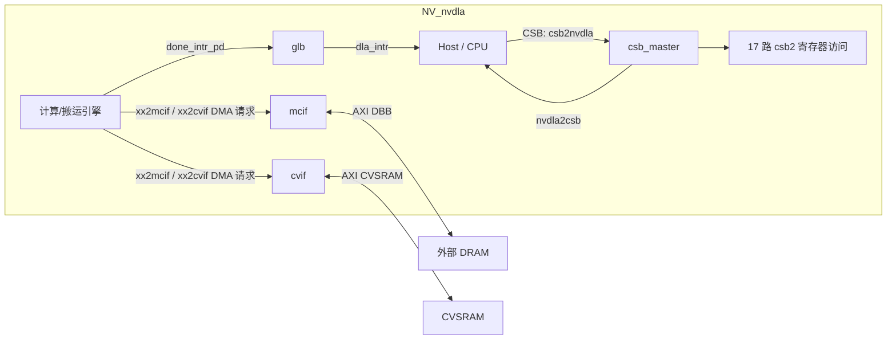
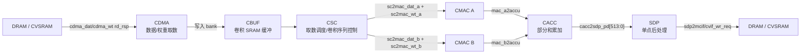
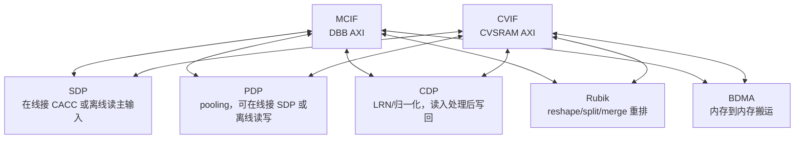

# NVDLA v1（nv_full）RTL 架构地图

> 这份文档按当前仓库 RTL 重写，目标是回答三个问题：每个模块做什么、数据怎样流、模块之间怎样连。
> 读代码时以 `vmod/nvdla/top/NV_nvdla.v` 和各 `NV_NVDLA_partition_*.v` 为入口；仿真/综合实际消费的是 `outdir/nv_full/vmod/` 生成后的 RTL。

## 构建流水线

```text
vmod/**/*.v|*.vlib ──vcp(宏展开)──► *.vcp ──eperl(插件展开)──► outdir/nv_full/vmod/**/*.v
                       ▲                        ▲
        outdir/nv_full/spec/defs/project.h   vmod/plugins/{assert,flop,pipe,retime}.pm
        （由 spec/defs/nv_full.spec 生成）
```

- 驱动器：`tools/bin/tmake`，按 `tools/etc/build.config` 的 sandbox 依赖图逐个构建。
- 规则实现：`tools/make/vmod_common.make`。
- `vmod/` 是源模板；`outdir/nv_full/vmod/` 是宏和 eperl 展开后的真实 RTL，VCS 与综合读取后者。

## 顶层外部接口

`NV_nvdla` 的外部世界只有三类功能接口，加上时钟/复位/测试/电源信号：

| 接口 | 方向 | 作用 | RTL 端口前缀 |
|---|---|---|---|
| CSB 配置口 | host → NVDLA → host | 软件读写寄存器，触发 layer，读取状态 | `csb2nvdla_*`、`nvdla2csb_*` |
| DBB AXI | NVDLA ↔ 外部 DRAM | MCIF 聚合后的外存读写 | `nvdla_core2dbb_*` |
| CVSRAM AXI | NVDLA ↔ 片上 SRAM | CVIF 聚合后的 CVSRAM 读写 | `nvdla_core2cvsram_*` |
| 中断 | NVDLA → host | GLB 聚合各引擎 done 中断 | `dla_intr` |
| 时钟复位 | SoC → NVDLA | core 域、CSB 域和测试控制 | `dla_core_clk`、`dla_csb_clk`、`dla_reset_rstn` 等 |

整体连接：



## 物理分区

顶层 `NV_nvdla.v` 例化 5 类分区、6 个实例。分区是物理/综合边界，也是很多跨分区 retiming 的边界。

| 分区实例 | RTL 文件 | 内部主模块 | 主要职责 |
|---|---|---|---|
| `u_partition_c` | `top/NV_NVDLA_partition_c.v` | `cdma`、`cbuf`、`csc` | 卷积前端：从内存取 feature/weight，写入 CBUF，再按卷积节拍送 CMAC |
| `u_partition_ma` | `top/NV_NVDLA_partition_m.v` | `cmac` | MAC 阵列 A 半，接收 CSC 的 data/weight，输出部分和到 CACC |
| `u_partition_mb` | `top/NV_NVDLA_partition_m.v` | `cmac` | MAC 阵列 B 半，接口同 A 半，承担另一半 MAC 计算 |
| `u_partition_a` | `top/NV_NVDLA_partition_a.v` | `cacc` | 卷积累加：合并 MAC A/B 输出，累加后送 SDP |
| `u_partition_p` | `top/NV_NVDLA_partition_p.v` | `sdp` | 单点后处理：接 CACC 或内存输入，做 bias/BN/activation/eltwise 等并写回 |
| `u_partition_o` | `top/NV_NVDLA_partition_o.v` | `csb_master`、`mcif`、`cvif`、`bdma`、`rubik`、`cdp`、`pdp`、`glb` | 配置分发、内存仲裁、独立引擎和中断聚合 |

`top/` 和 `retiming/` 下的 `NV_NVDLA_RT_*` 是跨分区打拍模块：例如 `csc2cmac_a/b`、`cmac_a/b2cacc`、`csb2cmac`、`csb2cacc`、`cacc2glb`。它们改变时序边界，不改变功能语义。

## 控制流：CSB 配置网络

软件经 CSB 写寄存器。NVDLA 内部路径是：

```text
Host APB/CSB
  -> apb2csb（若从 APB 入口使用）
  -> csb2nvdla 单口
  -> csb_master（CDC + 地址译码 + 响应合并）
  -> csb2<unit>_req_pd[62:0]
  -> 单元 regfile / reg 模块
  -> <unit>2csb_resp_pd[33:0]
  -> csb_master
  -> nvdla2csb_data / nvdla2csb_wr_complete
```

`csb_master` 按 4KB 页把 16-bit word address 分给 17 路目标。当前 `verif/ut/csb_master` 就是在测这张表对应的 fanout 行为。

| CSB 目标 | 典型端口名 | 所在分区 | 说明 |
|---|---|---|---|
| GLB | `csb2glb_*` | O | 全局寄存器、中断状态/屏蔽等 |
| GEC | `csb2gec_*` | O/生成逻辑 | 全局错误/异常相关寄存器目标 |
| MCIF | `csb2mcif_*` | O | DRAM NoC 接口配置和性能计数 |
| CVIF | `csb2cvif_*` | O | CVSRAM NoC 接口配置和性能计数 |
| BDMA | `csb2bdma_*` | O | 独立搬运引擎寄存器 |
| CDMA | `csb2cdma_*` | C | 卷积取数引擎寄存器 |
| CSC | `csb2csc_*` | C | 卷积序列控制寄存器 |
| CMAC_A | `csb2cmac_a_*` | M(A) | MAC A 半寄存器，经 retiming 到 MA 分区 |
| CMAC_B | `csb2cmac_b_*` | M(B) | MAC B 半寄存器，经 C/O retiming 到 MB 分区 |
| CACC | `csb2cacc_*` | A | 累加器寄存器，经 retiming 到 A 分区 |
| SDP_RDMA | `csb2sdp_rdma_*` | P | SDP 辅助数据读 DMA 寄存器 |
| SDP | `csb2sdp_*` | P | SDP 主 datapath/WDMA 寄存器 |
| PDP_RDMA | `csb2pdp_rdma_*` | O | PDP 离线读 DMA 寄存器 |
| PDP | `csb2pdp_*` | O | PDP core/WDMA 寄存器 |
| CDP_RDMA | `csb2cdp_rdma_*` | O | CDP 读 DMA 寄存器 |
| CDP | `csb2cdp_*` | O | CDP datapath/WDMA 寄存器 |
| RUBIK | `csb2rbk_*` / rubik | O | Rubik 数据重排寄存器 |

大多数计算引擎使用 single + dual 寄存器结构：single 寄存器放全局配置、producer 指针和状态；dual 寄存器有 D0/D1 两组 layer 配置。软件写 producer 指向的组，写 `D_OP_ENABLE` 后 producer 翻转；硬件按 consumer 指向执行，done 后清 `op_en` 并翻 consumer。

## 主数据流：卷积流水线

卷积路径是 NVDLA 的主干。RTL 连接从 `partition_c` 到 `partition_m`，再到 `partition_a`，最后进入 `partition_p`：



各段职责：

| 模块 | RTL 顶层 | 数据入口 | 数据出口 | 作用 |
|---|---|---|---|---|
| CDMA | `cdma/NV_NVDLA_cdma.v` | `mcif2cdma_*_rd_rsp` / `cvif2cdma_*_rd_rsp` | CBUF 写口、done 中断 | 为卷积读取 feature data 和 weight。内部有 `dc/img/wt/wg/cvt/dma_mux/shared_buffer/status/regfile`，分别处理 direct/image 数据模式、权重读取、格式转换、DMA 请求选择和状态上报。 |
| CBUF | `cbuf/NV_NVDLA_cbuf.v` | CDMA 写入 | CSC 读取 | 卷积专用 SRAM bank 缓冲，承接 CDMA 拉回的数据/权重，给 CSC 随机/按序读取。 |
| CSC | `csc/NV_NVDLA_csc.v` | CBUF 读数据 | `sc2mac_dat_*`、`sc2mac_wt_*` | Convolution Sequence Controller。根据 layer 参数组织 stripe/block/channel 调度，向 CMAC A/B 发 activation 和 weight。内部含 `sg/wl/dl/regfile` 等。 |
| CMAC A/B | `cmac/NV_NVDLA_cmac.v` | CSC data/weight | `mac_*2accu_*` | 乘加阵列。A/B 两个实例共同承担 MAC 计算，输出部分和、mask、mode、packet 到 CACC。 |
| CACC | `cacc/NV_NVDLA_cacc.v` | `mac_a2accu_*`、`mac_b2accu_*` | `cacc2sdp_*`、done 中断 | Accumulator。汇聚 A/B MAC 部分和，处理精度/截断/饱和相关路径，向 SDP 输出 514-bit packet，并给 CSC 返回 credit。 |
| SDP | `sdp/NV_NVDLA_sdp.v` | `cacc2sdp_*` 或 MRDMA | `sdp2mcif/cvif_wr_req`、done 中断 | Single Data Processor。执行 bias、batch norm、element-wise、activation/LUT、格式转换，结果通过 WDMA 写回。 |

CACC 到 CSC 还有一条反向信用：`accu2sc_credit_vld/size`。它告诉 CSC/C buffer 消费端 CACC 能继续接收多少累加输出，防止 MAC/CACC 后端堵塞时前端继续发数。

## 后处理和独立引擎数据流

SDP、PDP、CDP、Rubik、BDMA 都通过 MCIF/CVIF 访问内存，但使用方式不同。



| 模块 | RTL 顶层 | 内部主块 | 数据行为 |
|---|---|---|---|
| SDP | `sdp/NV_NVDLA_sdp.v` | `rdma`、`core`、`wdma`、`reg` | 在线模式从 `cacc2sdp` 接卷积结果；离线/辅助路径有 MRDMA 主输入、BRDMA bias、NRDMA batch-norm、ERDMA eltwise 四类读通道；core 做 X/Y/C 处理和 LUT；WDMA 写回 MCIF/CVIF。 |
| PDP | `pdp/NV_NVDLA_pdp.v` | `rdma`、`core`、`wdma`、`reg` | Pooling Data Processor。可接 SDP 输出做在线池化，也可 RDMA 从内存读输入，core 做 1D/2D pooling，WDMA 写回。 |
| CDP | `cdp/NV_NVDLA_cdp.v` | `rdma`、`dp`、`wdma`、`reg` | Channel Data Processor。RDMA 取输入，DP 内部 `cvtin -> buffer/sum -> LUT/intp/mul -> cvtout` 做跨通道归一化，WDMA 写回。 |
| Rubik | `rubik/NV_NVDLA_rubik.v` | `dma`、`seq_gen`、`rf_core/rf_ctrl`、`wrdma`、`regfile` | 数据重排引擎，做 reshape、contract、split/merge 一类地址/布局变换；读写都走 MCIF/CVIF。 |
| BDMA | `bdma/NV_NVDLA_bdma.v` | `csb`、`load`、`store`、`cq`、`gate` | Block DMA，纯搬运，不做算子；从一个内存空间读，再写到另一个内存空间，可用于 DRAM 与 CVSRAM 之间搬运。 |

## 内存网络：MCIF / CVIF 和 DMA 客户端

`mcif` 和 `cvif` 位于 O 分区，结构对称：read path + write path + CSB 寄存器。它们把多个客户端的 `xx2mcif` / `xx2cvif` 请求仲裁、拆包、转换成 AXI，再把 AXI 响应分发回客户端。

| 接口 | 外部目标 | RTL 顶层 | AXI 端口 |
|---|---|---|---|
| MCIF | DBB / 外部 DRAM | `nocif/NV_NVDLA_mcif.v` | `nvdla_core2dbb_*` |
| CVIF | CVSRAM | `nocif/NV_NVDLA_cvif.v` | `nvdla_core2cvsram_*` |

常见 DMA 客户端：

| 客户端 | 读请求 | 写请求 | 说明 |
|---|---|---|---|
| CDMA data | `cdma_dat2mcif/cvif_rd_req` | 无 | 卷积 feature 读取 |
| CDMA weight | `cdma_wt2mcif/cvif_rd_req` | 无 | 卷积 weight 读取 |
| SDP main | `sdp2mcif/cvif_rd_req` | `sdp2mcif/cvif_wr_req` | SDP 主输入和输出写回 |
| SDP B/N/E | `sdp_b/n/e2mcif/cvif_rd_req` | 无 | bias、BN、eltwise 辅助输入 |
| PDP | `pdp2mcif/cvif_rd_req` | `pdp2mcif/cvif_wr_req` | pooling 离线路径 |
| CDP | `cdp2mcif/cvif_rd_req` | `cdp2mcif/cvif_wr_req` | LRN 输入/输出 |
| Rubik | `rbk2mcif/cvif_rd_req` | `rbk2mcif/cvif_wr_req` | 重排读写 |
| BDMA | `bdma2mcif/cvif_rd_req` | `bdma2mcif/cvif_wr_req` | 搬运读写 |

协议共性见 `docs/spec/common/dma-if.md`：读请求通常是 `{size, addr}`，读响应是 514-bit `{mask[1:0], data[511:0]}`；写请求是 515-bit cmd/data 复用 packet；读响应无 ID，必须按请求顺序返回；`ram_type` 约定在相关单元中通常是 `1=MCIF`、`0=CVIF`。

## 中断路径

各引擎完成 layer 后输出 2-bit done packet 到 GLB，GLB 再聚合成顶层 `dla_intr`。

```text
cdma_dat2glb_done_intr_pd / cdma_wt2glb_done_intr_pd
cacc2glb_done_intr_pd
sdp2glb_done_intr_pd
pdp2glb_done_intr_pd
cdp2glb_done_intr_pd
rbk2glb_done_intr_pd
bdma2glb_done_intr_pd
  -> glb
  -> dla_intr
```

GLB 还挂在 CSB 网络上，软件通过 GLB 寄存器读取/清除中断状态。

## 时钟、复位、RAM 和库单元

- 顶层有两个主要时钟域：`dla_core_clk` 给计算、DMA、NoC 侧；`dla_csb_clk` 给外部 CSB 接口侧。`csb_master` 内有 falcon/core 之间的异步 FIFO。
- `car/` 提供 reset 与 sync 单元，例如 `NV_NVDLA_reset`、`NV_NVDLA_core_reset`、`NV_NVDLA_sync3d`。
- `vmod/rams/model` 是仿真行为 RAM，`vmod/rams/synth` 是综合包装。
- `vmod/vlibs` 放 FIFO、pipe、retiming、assertion、同步器等公共库单元。

## 编程模型

一个 layer 的典型执行顺序：

1. 软件通过 CSB 配置相关引擎的 producer 寄存器组。
2. 写该组 `D_OP_ENABLE`，硬件开始按 consumer 指针执行。
3. 引擎通过 MCIF/CVIF 读取输入、权重或辅助数据。
4. 数据沿计算流水线或独立引擎 datapath 处理。
5. 结果通过 WDMA 写回 MCIF/CVIF，或在线送给下一引擎。
6. 引擎向 GLB 上报 done，中断到 host。
7. 软件读状态、清中断，配置下一组寄存器。

## 验证环境（verif/）

- `verif/ut/`：团队自建 UVM 单元验证平台。复用层在 `verif/ut/common/`，当前已跑通 `verif/ut/csb_master/`；用法见 `verif/ut/README.md`，进度见 `docs/ut-progress.md`。
- `docs/spec/`：团队自写协议和单元 spec。公共 CSB/DMA 协议已经在 `docs/spec/common/`。
- `verif/dut/dut.f`：上游 VCS 文件列表，编译 `outdir` RTL 和 `verif/synth_tb` 测试台。
- `verif/sim/`：上游 trace 流程入口，`checktest.pl` 判定 PASS/FAIL，运行产物 gitignored；团队只把它作为回归工具和数据来源。
- 上游 `verif/sim_vivado`、`verif/verilator` 备选流程已删除，团队不用 Vivado/Verilator 路线。

## 其他目录

- `cmod/`：SystemC C-model，可作为参考模型来源；依赖 SystemC，本机未实测。
- `spec/manual/`：Ordt 生成寄存器手册的输入/产物入口。
- `perf/`：性能估算表。
- `syn/`：综合约束和分区相关脚本。
