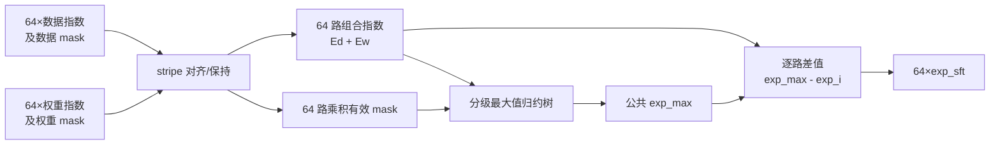
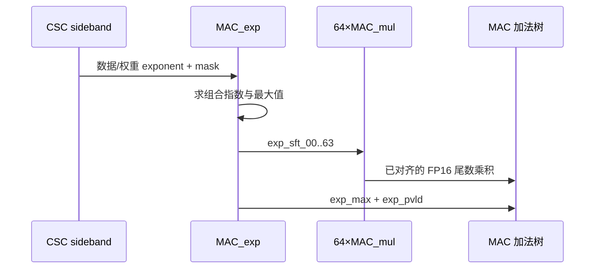

# NV_NVDLA_CMAC_CORE_MAC_exp

## 1. 模块定位

`NV_NVDLA_CMAC_CORE_MAC_exp` 是单个 CMAC kernel lane 内的 FP16 指数处理单元。它与 64 个尾数乘法单元并行工作：先为每个有效乘积计算数据指数与权重指数之和，再找出本拍的公共最大指数，并给出 64 路右移量，使所有 FP16 乘积在进入加法树前对齐到同一指数域。

整数模式不需要指数对齐；`cfg_is_fp16` 用于限定这条路径的有效性和寄存器活动。

## 2. 接口摘要

| 接口 | 位宽 | 作用 |
| --- | ---: | --- |
| `dat_pre_exp` | 192 | 64 路数据指数，每路 3 bit |
| `dat_pre_mask` | 64 | 数据元素有效掩码 |
| `dat_pre_pvld` | 1 | 数据指数有效 |
| `dat_pre_stripe_st/end` | 1/1 | stripe 边界 |
| `wt_sd_exp` | 192 | 64 路权重指数，每路 3 bit |
| `wt_sd_mask` | 64 | 权重元素有效掩码 |
| `wt_sd_pvld` | 1 | 权重指数有效 |
| `exp_max` | 4 | 本组有效乘积的最大组合指数 |
| `exp_sft_00..63` | 64×4 | 各乘积相对最大指数的右移量 |
| `exp_pvld` | 1 | 指数结果有效 |

## 3. 架构图

## 4. 数据通路

1. 数据指数随 activation stripe 输入，权重指数随 weight sideband 输入；模块利用 valid、mask 和 stripe 边界使两类信息在乘法拍对齐。
2. 对第 `i` 个有效乘积形成组合指数 `exp_i = dat_exp_i + wt_exp_i`。
3. mask 无效的元素不参与最大值竞争，避免 padding 或稀疏位置改变公共指数。
4. 归约树从 64 路组合指数选出 `exp_max`。
5. 输出 `exp_sft_i = exp_max - exp_i`，供对应 `MAC_mul` 的 FP16 尾数乘积右移对齐。

## 5. 阅读要点

- `exp_max` 是整条 kernel lane 本拍共享的尺度，不是 64 路独立结果。
- `exp_sft` 只描述指数差；符号、尾数相乘和舍入/截断位由乘法与后续加法路径处理。
- activation 指数具有 stripe 生命周期，不能只把本模块理解为无状态的 64 输入最大值组合逻辑。
- `cfg_reg_en` 用于在新 layer 配置装载时更新精度状态，避免运行中配置漂移。

