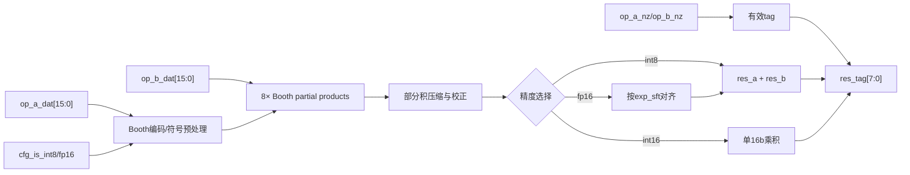

# NV_NVDLA_CMAC_CORE_MAC_mul

源码：`vmod/nvdla/cmac/NV_NVDLA_CMAC_CORE_MAC_mul.v`

## 1. 模块定位

`NV_NVDLA_CMAC_CORE_MAC_mul` 是单个kernel lane中的基础乘法单元。每个`CORE_mac`实例化64份。它复用一套16-bit Booth部分积硬件，支持：

- 两个并行有符号int8乘积；
- 一个有符号int16乘积；
- 一个FP16尾数乘积及指数差移位。

本文件末尾还定义了内部模块 `NV_NVDLA_CMAC_CORE_MAC_booth`，没有独立 `.v` 文件。

## 2. 架构图



## 3. 接口

```verilog
cfg_is_fp16
cfg_is_int8
cfg_reg_en
exp_sft[3:0]

op_a_dat[15:0]
op_a_nz[1:0]
op_a_pvld
op_b_dat[15:0]
op_b_nz[1:0]
op_b_pvld

res_a[31:0]
res_b[31:0]
res_tag[7:0]
```

`op_*_nz[1:0]`对应16-bit物理操作数中的两个8-bit子lane；int16/fp16模式会按整元素重新解释。

## 4. Booth乘法

内部8个 `MAC_booth` 处理16-bit源数据的8组Booth code。单个booth模块输入：

```verilog
code[2:0]
is_8bit
sign
src_data[15:0]
```

输出17-bit部分积和反相/校正信息。外层对8组部分积进行符号扩展、校正和压缩，得到最终乘积。

Booth编码降低需要相加的部分积数量；它是乘法器实现方式，不改变上层有符号乘法语义。

## 5. int8双乘法

int8模式把两个16-bit输入分别解释为：

```text
op_a = {a1[7:0], a0[7:0]}
op_b = {b1[7:0], b0[7:0]}
```

逻辑结果为两组独立有符号乘法：

```text
res_a <- signed(a0) * signed(b0)
res_b <- signed(a1) * signed(b1)
```

RTL通过分段Booth、符号校正和结果选择避免交叉项污染，而不是把16-bit拼接值直接相乘。

## 6. int16与FP16

int16模式把完整16-bit操作数按有符号整数相乘，结果送一条主要结果路径，另一条子结果不作为独立int8乘积使用。

FP16模式下输入已经由active拆解/预处理为尾数相关编码；本模块完成尾数乘法，并依据 `exp_sft` 将乘积移到共同指数位置。NaN和最大指数选择由同级的`MAC_nan/MAC_exp`处理。

## 7. valid与非零优化

`op_a_pvld/op_b_pvld`控制流水有效，`nz`允许零操作数跳过无意义翻转并产生正确tag。`res_tag`随结果进入上层加法树，用于区分有效子结果和精度分组。

## 8. 阅读 RTL 的方法

1. 看端口与配置延迟；
2. 找8个 `u_booth_*`；
3. 跟踪一个code对应的部分积、符号扩展和inv校正；
4. 看int8如何拆成`res_a/res_b`；
5. 看int16选择；
6. 最后看FP16 `exp_sft`路径；
7. 阅读文件末尾 `MAC_booth`，无需寻找独立文件。

## 9. 容易误解的点

1. int8模式不是普通16×16乘法后切两半，而是两组独立8×8乘法。
2. `res_a/res_b`在不同精度下含义不同，不能始终视为两个独立乘积。
3. `exp_sft`只服务FP16指数对齐。
4. `nz`既用于功能有效，也用于降低零乘法翻转。
5. Booth模块定义在本文件中，因此一份 `.v` 包含两个RTL module定义。
