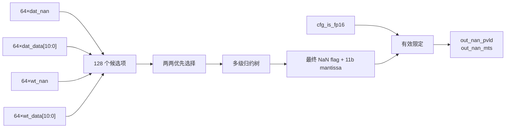

# NV_NVDLA_CMAC_CORE_MAC_nan

## 1. 模块定位

`NV_NVDLA_CMAC_CORE_MAC_nan` 是单个 CMAC kernel lane 的 FP16 NaN 旁路处理单元。它检查 64 个 activation 与 64 个 weight 的 NaN 标记，并通过优先归约树选择一个 NaN 的 11-bit 尾数载荷，供 lane 最终结果传播 NaN 信息。

## 2. 输入与输出

| 接口 | 位宽 | 作用 |
| --- | ---: | --- |
| `dat_actv_data` | 1024 | 64×16-bit activation 原始数据 |
| `dat_actv_nan` | 64 | activation NaN 标志 |
| `wt_actv_data` | 1024 | 64×16-bit weight 原始数据 |
| `wt_actv_nan` | 64 | weight NaN 标志 |
| `out_nan_mts` | 11 | 被选中 NaN 的尾数载荷 |
| `out_nan_pvld` | 1 | 本拍存在 NaN，且当前为 FP16 模式 |

## 3. 架构与数据通路



归约节点同时传递两类信息：候选是否为 NaN，以及候选的 `data[10:0]`。多级树最终保留一个确定优先级的 NaN payload。顶层有效条件可概括为：

```text
out_nan_pvld = cfg_is_fp16_d1 && (|dat_actv_nan || |wt_actv_nan)
```

## 4. 阅读要点

- 本模块不参与正常数值乘加；它是 FP16 异常值的旁路传播路径。
- 检查范围是 64 个数据操作数加 64 个权重操作数，而不是只检查乘积结果。
- 输出只保留一个 NaN payload；当多个输入同时为 NaN 时，由 RTL 固定的优先树决定选择项。
- 非 FP16 模式下即使输入位型碰巧像 NaN，`out_nan_pvld` 也不会置位。

