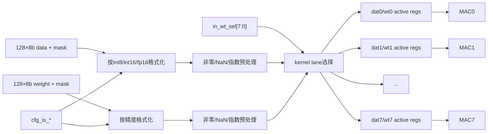

# NV_NVDLA_CMAC_CORE_active

源码：`vmod/nvdla/cmac/NV_NVDLA_CMAC_CORE_active.v`

## 1. 模块定位

`NV_NVDLA_CMAC_CORE_active` 是 CMAC 输入操作数的格式化、有效筛选和8-kernel分发级。它接收 rt_in 的128-byte activation/weight，在精度控制下生成64组16-bit操作数及非零/NaN/指数metadata，并为8个MAC lane维护独立的activation与weight副本。

该模块的主要目的既有功能组织，也有功耗控制：无效元素和未被 `in_wt_sel` 选中的 kernel lane不更新宽数据寄存器。

## 2. 架构图



## 3. 输入与输出

输入主要为：

```verilog
cfg_is_int8/int16/fp16
cfg_reg_en
in_dat_pvld/mask/data0...127
in_dat_stripe_st/end
in_wt_pvld/mask/data0...127
in_wt_sel[7:0]
```

每个 kernel lane `k` 输出两组接口：

```verilog
datk_actv_data[1023:0]
datk_actv_nz[127:0]
datk_actv_nan[63:0]
datk_actv_pvld[103:0]
datk_pre_exp[191:0]/mask[63:0]/pvld/stripe_st/end

wtk_actv_data[1023:0]
wtk_actv_nz[127:0]
wtk_actv_nan[63:0]
wtk_actv_pvld[103:0]
wtk_sd_exp[191:0]/mask[63:0]/pvld
```

这些宽valid向量服务于分段寄存与局部时钟门控，不应理解为104条独立外部事务。

## 4. 精度重组

### 4.1 int8

每两个8-bit byte进入一个16-bit乘法单元，但保留为两组独立有符号8-bit操作数：

```text
byte[2i]   -> sub-lane A
byte[2i+1] -> sub-lane B
```

因此64个乘法单元覆盖128个int8元素。

### 4.2 int16

相邻两个byte组合成一个16-bit有符号数，64个乘法单元覆盖64个元素。对应两个byte mask共同决定该16-bit元素是否有效。

### 4.3 fp16

同样组合为64个16-bit值，但进一步拆出sign、exponent、mantissa，生成NaN标志、非零标志和指数预处理信息，供`MAC_nan/MAC_exp/MAC_mul`使用。

## 5. mask与非零门控

功能有效通常由 data mask、weight mask、precision分组和kernel select共同决定。active级把无效操作数标记为非活动，并仅在需要时更新宽寄存器：

```text
element_active = data_mask && weight_mask && lane_selected/loaded
```

具体data与weight并非总在同拍相与；weight先按select装入各lane，后续activation到达时再由MAC使用该lane保存的weight状态。

## 6. stripe控制

`in_dat_stripe_st/end`随activation进入每个kernel lane：

- stripe start用于建立一段计算的有效边界；
- stripe end用于结束当前点积输出节拍；
- FP16 exponent预处理也以stripe边界归并共同指数；
- 未选中的lane不应产生对应`mac_out_pvld`。

## 7. lane分发

`in_wt_sel[k]`决定本拍weight写入/激活第k个MAC lane。activation逻辑上广播，但active为每个lane形成独立副本和valid，从而：

- 支持不同kernel lane分时装载weight；
- 只让需要计算的lane翻转；
- 让每个`CORE_mac`看到统一接口，无需自己解析`sel`。

## 8. 阅读 RTL 的方法

1. 先找 precision配置延迟；
2. 选择输入byte0/1，观察int8、int16、fp16三种重组；
3. 追 `in_wt_sel[0]` 到 `wt0_actv_*`；
4. 追同一activation到 `dat0_actv_*`；
5. 对比lane0与lane1，确认其余6份同构；
6. 最后读FP16 exponent/NaN预处理。

不要逐行阅读八份×128元素展开；文件四万多行主要来自结构复制。

## 9. 容易误解的点

1. active不是ReLU activation；这里的active表示操作数有效/活动化。
2. activation逻辑广播到8个kernel lane，weight由`sel`定向更新。
3. int8仍使用64个16-bit物理乘法单元，每单元承载两个8-bit乘法。
4. `nz`是非零/有效优化信息，不是最终输出mask。
5. `*_pvld[103:0]`是内部细粒度门控向量，不是104拍数据。
6. active保存weight状态，因此data/weight输入不要求严格同拍。
