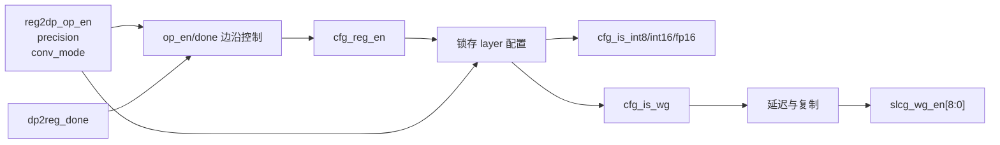
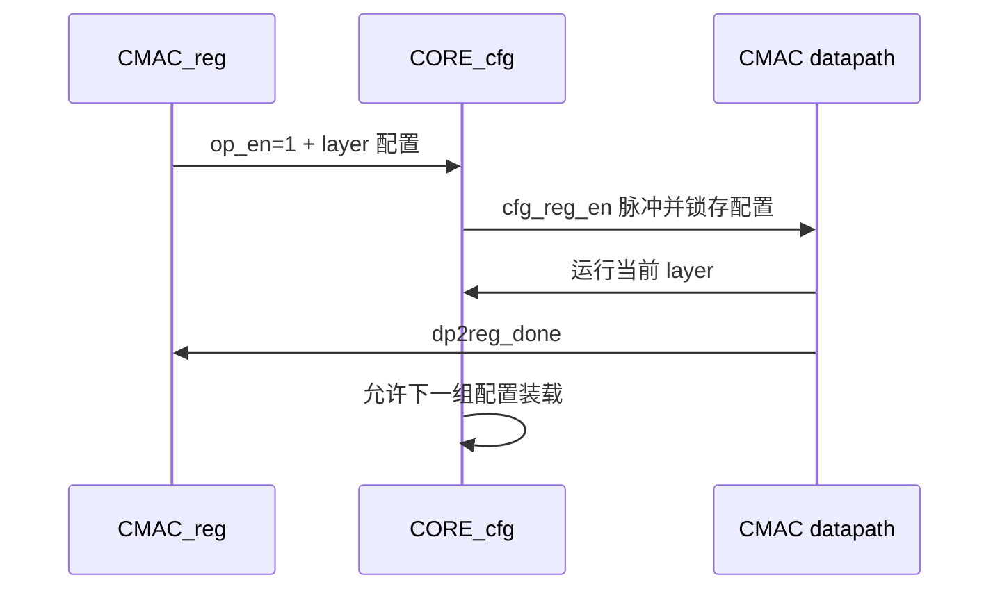

# NV_NVDLA_CMAC_CORE_cfg

## 1. 模块定位

`NV_NVDLA_CMAC_CORE_cfg` 把寄存器组给出的 layer 配置转换成 CMAC core 内部使用的稳定模式信号，并生成 Winograd 专用时钟门控使能。它还根据 `op_en` 和 `dp2reg_done` 产生一次性的配置装载脉冲 `cfg_reg_en`。

## 2. 配置译码

| 寄存器输入 | 内部输出 | 含义 |
| --- | --- | --- |
| `reg2dp_proc_precision == 0` | `cfg_is_int8` | INT8 |
| `reg2dp_proc_precision == 1` | `cfg_is_int16` | INT16 |
| `reg2dp_proc_precision == 2` | `cfg_is_fp16` | FP16 |
| `reg2dp_conv_mode == 1` | `cfg_is_wg` | Winograd 模式 |

复位默认精度为 INT16，与 dual register 的 `proc_precision=2'b01` 一致。

## 3. 控制架构



## 4. `cfg_reg_en` 生命周期

核心生成条件为：

```text
cfg_reg_en_w = (~op_en_d1 | op_done_d1) & reg2dp_op_en
```

因此新配置只在操作刚启动，或前一操作完成后下一组已经使能时装载。运行中的 layer 使用本模块锁存的模式信号，不直接跟随 CSB 可见寄存器变化。



## 5. 阅读要点

- `cfg_reg_en` 是配置快照的装载使能，不等同于整条数据通路的逐拍 valid。
- `slcg_wg_en[8:0]` 只在 Winograd 下打开额外后加路径；普通 op 时钟使能另由 reg 模块生成。
- 精度译码是 one-hot 语义，非法精度编码不会被解释成某个合法模式。

