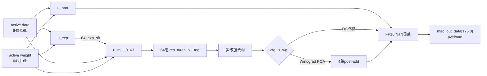

# NV_NVDLA_CMAC_CORE_mac

源码：`vmod/nvdla/cmac/NV_NVDLA_CMAC_CORE_mac.v`

## 1. 模块定位

`NV_NVDLA_CMAC_CORE_mac` 实现一个 kernel lane 的完整乘加树。一个 `NV_NVDLA_CMAC_core` 实例化8份该模块，每份使用同一组activation与各自kernel weight，产生一路176-bit部分和。

本模块内部包含：

- 64个 `NV_NVDLA_CMAC_CORE_MAC_mul`；
- 1个 FP16 NaN归并模块；
- 1个 FP16指数对齐模块；
- 多级部分积/符号加法树；
- Winograd POA（Post-Addition）；
- 结果valid、NaN与176-bit打包。

## 2. 架构图



int8/int16不会使用FP16的指数/NaN数值语义，但相关接口保持统一。

## 3. 接口

输入配置：

```verilog
cfg_is_int8/int16/fp16
cfg_is_wg
cfg_reg_en
```

输入操作数分为：

```verilog
dat_actv_data[1023:0]/nz[127:0]/nan[63:0]/pvld[103:0]
wt_actv_data[1023:0]/nz[127:0]/nan[63:0]/pvld[103:0]
```

FP16预处理附加接口：

```verilog
dat_pre_exp[191:0]/mask[63:0]/pvld/stripe_st/end
wt_sd_exp[191:0]/mask[63:0]/pvld
```

输出：

```verilog
mac_out_pvld
mac_out_nan
mac_out_data[175:0]
```

## 4. 64个乘法单元

物理组织是64组16-bit操作数：

```text
mul_i(op_a_dat[15:0], op_b_dat[15:0])
```

精度解释：

| 模式 | 单个mul的有效计算 | 64个mul合计 |
| --- | --- | --- |
| int8 | 低/高两个8-bit子乘积 | 128个8b乘积 |
| int16 | 一个16b乘积 | 64个16b乘积 |
| fp16 | 对齐后的尾数乘积 | 64个FP16尾数乘积 |

每个mul输出 `res_a[31:0]`、`res_b[31:0]` 和 `res_tag[7:0]`。int8需要两路结果；int16/fp16只启用适合本精度的组合。`res_tag`携带非零/分组信息，帮助后级加法树只汇总有效部分积。

## 5. 整数点积

DC整数模式可以抽象为：

```text
int8 : sum_{i=0..127}(signed(data[i]) * signed(weight[i]))
int16: sum_{i=0..63} (signed(data[i]) * signed(weight[i]))
```

mask和非零标志在active/mul级把无效元素变为零贡献。多级 `DW02_tree/NV_DW02_tree` 将大量乘积压缩、相加，并保留足够guard位形成44-bit结果。

## 6. FP16路径

FP16不能直接把IEEE编码当整数相乘：

1. `MAC_exp`计算一组有效乘积的最大指数；
2. 为每个元素产生 `exp_sft_i`；
3. `MAC_mul`计算尾数并按指数差右移对齐；
4. 加法树在共同指数域中累加尾数；
5. `MAC_nan`归并NaN输入并形成输出NaN payload；
6. 结果以CMAC/CACC约定的44-bit内部浮点部分和格式输出。

CMAC输出不是普通IEEE FP16，而是供CACC继续累加的扩展中间格式。

## 7. Winograd POA

源码顶部给出Winograd post-add矩阵。乘法树先产生中间块，随后用加减法做两级矩阵变换，形成4个空间域结果：

```text
mac_out_data[43:0]
mac_out_data[87:44]
mac_out_data[131:88]
mac_out_data[175:132]
```

DC模式只需要第一段点积结果，其余段由模式门控为0。Winograd路径使用独立 `nvdla_wg_clk`，DC下可关闭。

## 8. 结果valid与NaN

`mac_out_pvld`来自乘法/加法树valid流水，不代表其他7个kernel lane也有效；core会把8份valid汇总为 `out_mask[7:0]`。

FP16检测到NaN时，NaN构造值可覆盖普通数值结果，并置 `mac_out_nan`。该NaN状态在core内部参与结果编码，顶层没有单独的`mac2accu_nan`端口。

## 9. 阅读 RTL 的方法

1. 看文件顶部POA注释；
2. 看配置延迟；
3. 看 `u_nan/u_exp`；
4. 只追 `u_mul_0`，再确认另外63份同构；
5. 找 `NV_DW02_tree`，按层看加法树；
6. 直接跳到 `mac_out_data_w` 看4×44-bit打包；
7. 最后再深入FP16和Winograd。

## 10. 容易误解的点

1. 一个`CORE_mac`对应一个kernel，不是整个8-kernel半阵列。
2. 64个mul在int8下完成128个乘法，因为每个mul包含两个8-bit子结果。
3. 176-bit不是一个普通176-bit整数；它按模式分成4个44-bit结果槽。
4. CMAC只算当前操作拍点积，不保存跨channel group历史和。
5. FP16输出是扩展中间格式，不是直接舍入成FP16。
6. 文件中大量tag和符号树用于多精度复用，不能只按普通无符号加法树理解。
