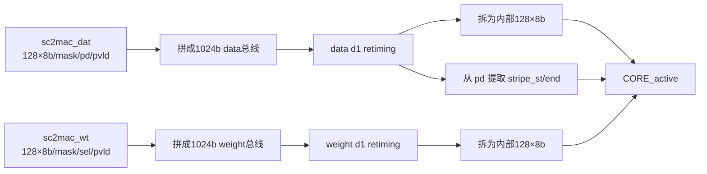

# NV_NVDLA_CMAC_CORE_rt_in

源码：`vmod/nvdla/cmac/NV_NVDLA_CMAC_CORE_rt_in.v`

## 1. 模块定位

`NV_NVDLA_CMAC_CORE_rt_in` 是 CMAC core 的输入重定时模块。它把端口展开的128个 data byte和128个 weight byte分别拼成1024-bit总线，连同 mask、`pd`、`sel` 和 valid打一拍，再拆回规范化内部接口交给 active模块。

它不做乘法，也不按 kernel select分发权重。

## 2. 架构图



## 3. 接口分组

输入 data：

```verilog
sc2mac_dat_pvld
sc2mac_dat_mask[127:0]
sc2mac_dat_data0...127
sc2mac_dat_pd[8:0]
```

输入 weight：

```verilog
sc2mac_wt_pvld
sc2mac_wt_mask[127:0]
sc2mac_wt_data0...127
sc2mac_wt_sel[7:0]
```

输出保持相同语义，前缀改为 `in_dat_*` 和 `in_wt_*`，并额外给出：

```verilog
in_dat_stripe_st  = in_dat_pd[5]
in_dat_stripe_end = in_dat_pd[6]
```

## 4. data 与 weight 独立流水

data和weight分别有自己的 valid及保持寄存：

- data只有在相关 valid窗口时更新 data/mask/pd；
- weight只有在相关 valid窗口时更新 data/mask/sel；
- 两类输入不要求同拍到达；
- active模块负责把某个 kernel的已装载weight与后续activation拍配对。

这正是卷积中“weight可复用多个输出位置”的硬件基础之一。

## 5. 固定重定时

本模块只有一级核心输入寄存。外部 partition中的 `RT_csc2cmac_a/b` 还可能在模块之前增加两拍；两者职责不同：partition RT解决长连线，本模块 rt_in解决core入口物理/时序切分。

## 6. 数据通路

```text
外部展开端口
  -> {data127,...,data0} 拼总线
  -> d1寄存
  -> {in_data127,...,in_data0} 拆总线
  -> active
```

lane0始终对应总线最低8 bit，lane127对应最高8 bit；拼接/拆分不会改变lane顺序。

## 7. 容易误解的点

1. rt_in不把int16组合成16-bit；精度重组在active/MAC路径完成。
2. data和weight可以独立valid，不能用data valid去采样weight。
3. `pd`只属于data路径，`sel`只属于weight路径。
4. stripe start/end只是从`pd`提取，没有在此重新计算。
5. 文件大部分内容是128个端口的机械展开，理解拼接、d1和拆分三处即可。
