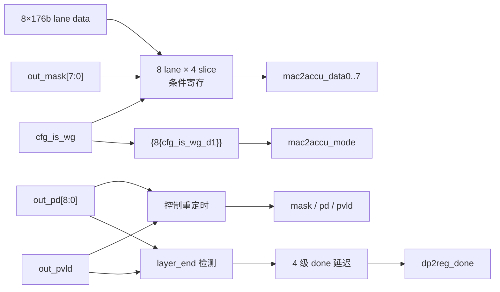
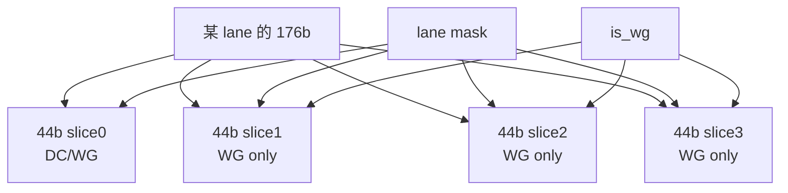

# NV_NVDLA_CMAC_CORE_rt_out

## 1. 模块定位

`NV_NVDLA_CMAC_CORE_rt_out` 位于 8 个 kernel lane 与 CACC 之间，完成结果、mask、描述符和模式位的输出重定时，同时从最后一个 layer 数据包产生 `dp2reg_done`。

## 2. 接口摘要

| 接口 | 位宽 | 作用 |
| --- | ---: | --- |
| `out_data0..7` | 8×176 | 8 个 kernel lane 的乘加结果 |
| `out_mask` | 8 | kernel lane 有效掩码 |
| `out_pd` | 9 | 输出位置/边界描述符 |
| `out_pvld` | 1 | 输入结果有效 |
| `mac2accu_data0..7` | 8×176 | 送往 CACC 的结果 |
| `mac2accu_mask` | 8 | 输出 lane mask |
| `mac2accu_pd` | 9 | 输出描述符 |
| `mac2accu_mode` | 8 | 每 lane 的 Winograd 模式标志 |
| `mac2accu_pvld` | 1 | 输出有效 |
| `dp2reg_done` | 1 | layer 完成脉冲 |

CMAC 到 CACC 的接口只有 valid，没有 ready；因此输出级必须按固定流水延迟连续接收。

## 3. 架构图



## 4. 176-bit 数据组织与门控

每个 lane 的 176 bit 被拆成四个 44-bit slice：

```text
lane_result = {slice3, slice2, slice1, slice0} = 4 × 44 bit
```

- `slice0` 在 Direct Convolution 和 Winograd 中都需要。
- `slice1..3` 只在 Winograd 模式下开启寄存，因此 RTL 用 `cfg_is_wg_d1` 生成 `out_dat_en_1..3`。
- 每个 lane 还受 `out_mask[lane]` 控制，无效 lane 不翻转大位宽结果寄存器。



## 5. 完成条件

RTL 在 `out_pvld` 有效且 `out_pd[8]`、`out_pd[6]` 同时为 1 时识别最后一个 layer 数据包：

```text
out_layer_done = out_pvld & out_pd[8] & out_pd[6]
```

该脉冲再延迟四拍形成 `dp2reg_done`，使完成通知与内部/外部固定流水时序匹配。阅读时不要把 `dp2reg_done` 误认为输出 valid 的同拍信号。

