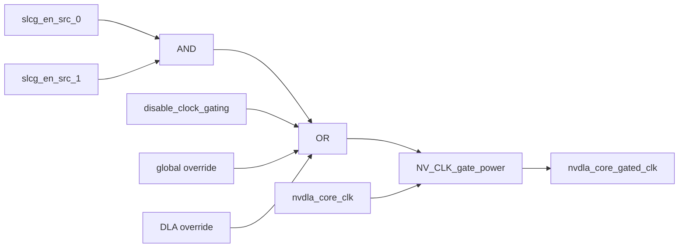

# NV_NVDLA_CMAC_CORE_slcg

## 1. 模块定位

`NV_NVDLA_CMAC_CORE_slcg` 是 CMAC core 的局部时钟门控封装。core 共实例化 20 个：11 个普通 operation 时钟组，以及 9 个 Winograd 专用时钟组。

## 2. 门控逻辑



正常功能使能为：

```text
enable = slcg_en_src_0 & slcg_en_src_1
```

测试、全局 override 或禁用时钟门控信号会强制时钟通过。两个 source 是“与”关系，不是任选其一即可开启。

## 3. 在 CMAC core 中的分组

| 分组 | 数量 | `src_0` | `src_1` | 用途 |
| --- | ---: | --- | --- | --- |
| `u_slcg_op_0..10` | 11 | `slcg_op_en[i]` | 常量 1 | layer 运行期间的通用流水 |
| `u_slcg_wg_0..8` | 9 | `slcg_op_en[i]` | `slcg_wg_en[i]` | 仅 Winograd 使用的后加/扩展流水 |

这种二级条件使 Winograd 专用逻辑只有在“操作正在运行”且“当前模式是 Winograd”时才获得时钟。

## 4. 阅读要点

- SLCG 只控制时钟，不负责数据 valid 或寄存器内容清零。
- `slcg_op_en` 来自寄存器模块的延迟使能，覆盖流水灌入和排空窗口。
- `slcg_wg_en` 来自 `CORE_cfg`，用于进一步收窄 Winograd 专用逻辑的翻转范围。
- override 信号属于 DFT/调试通路，功能仿真时通常保持关闭。

