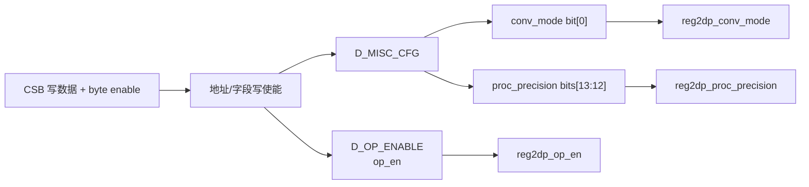
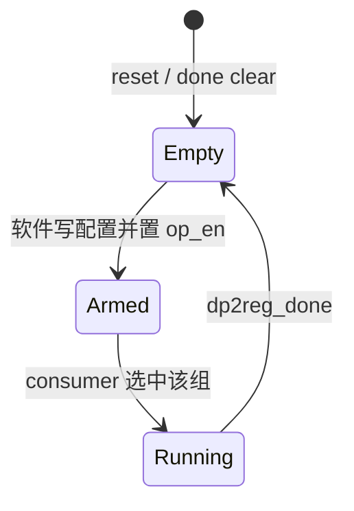

# NV_NVDLA_CMAC_REG_dual

## 1. 模块定位

`NV_NVDLA_CMAC_REG_dual` 保存一组可被 producer/consumer 机制切换的 layer 配置。`NV_NVDLA_CMAC_reg` 实例化两份该模块，分别作为 D0 和 D1。

## 2. 寄存器字段

| 寄存器 | 字段 | 复位值 | 说明 |
| --- | --- | ---: | --- |
| `D_OP_ENABLE` | `op_en[0]` | 0 | 写 1 后表示该组配置可执行 |
| `D_MISC_CFG` | `conv_mode[0]` | 0 | 0=Direct，1=Winograd |
| `D_MISC_CFG` | `proc_precision[13:12]` | 1 | 0=INT8，1=INT16，2=FP16 |

## 3. 读写行为

- 普通字段按地址译码和 byte write enable 更新。
- `op_en` 具有启动触发语义；上级 reg 模块还可通过完成事件清除它。
- 当本组正在作为 consumer 执行时，上级生成的写保护会阻止软件修改配置。
- 读通路按地址返回当前组寄存器值，供上层 CSB mux 选择。

## 4. 阅读要点

- 本模块本身不决定 D0/D1 谁是 producer 或 consumer；选择逻辑位于 `NV_NVDLA_CMAC_reg`。
- 配置字段很少，因为 CMAC 只需知道卷积模式与运算精度；尺寸、步长等控制由 CSC 产生的数据描述符携带。
- INT16 是硬件复位默认值，但只有 `op_en` 置位后该组才会启动。

