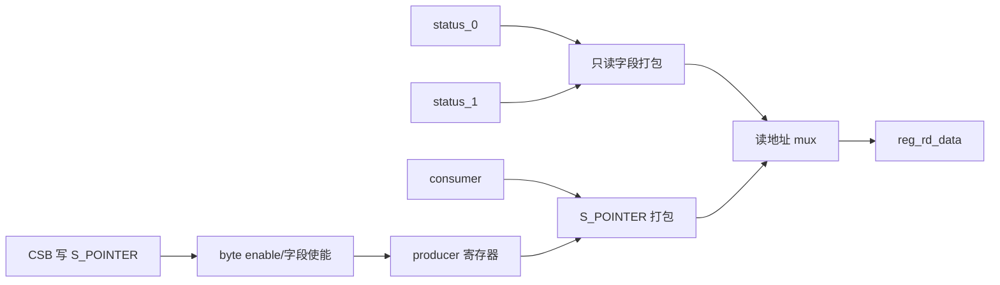
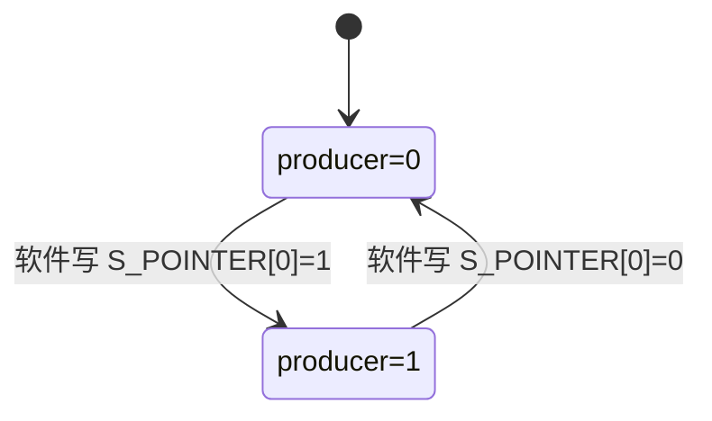

# NV_NVDLA_CMAC_REG_single

## 1. 模块定位

`NV_NVDLA_CMAC_REG_single` 保存不随 D0/D1 切换的全局寄存器：两组运行状态和 producer/consumer 指针。它是软件观察 CMAC 双缓冲状态并选择下一配置组的入口。

## 2. 寄存器布局

| 地址 | 字段 | 位 | 访问 | 作用 |
| --- | --- | ---: | --- | --- |
| `S_STATUS` (`0x7000`) | `status_0` | `[1:0]` | RO | D0 状态 |
|  | `status_1` | `[17:16]` | RO | D1 状态 |
| `S_POINTER` (`0x7004`) | `producer` | `[0]` | RW | 软件下一写入组 |
|  | `consumer` | `[16]` | RO | 硬件当前执行组 |

状态编码由上级 reg 模块提供：`0=IDLE`、`1=BUSY`、`2=PENDING`。

## 3. 数据通路

## 4. Producer/Consumer 关系

`producer` 只表示软件希望访问哪一份 dual register；它不会直接启动运算。`consumer` 由硬件在 layer 完成时翻转，软件只能读取。

## 5. 阅读要点

- 复位后 `producer=0`，软件通常先配置 D0。
- 软件应通过 `S_STATUS` 确认目标组空闲，再改变 producer 并写 dual 配置。
- single register 没有运算数据通路，它解决的是双缓冲配置的所有权与可见性。

