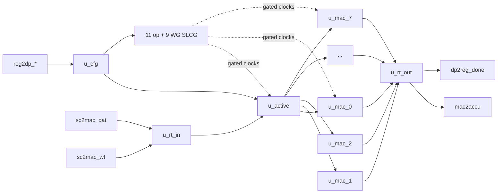
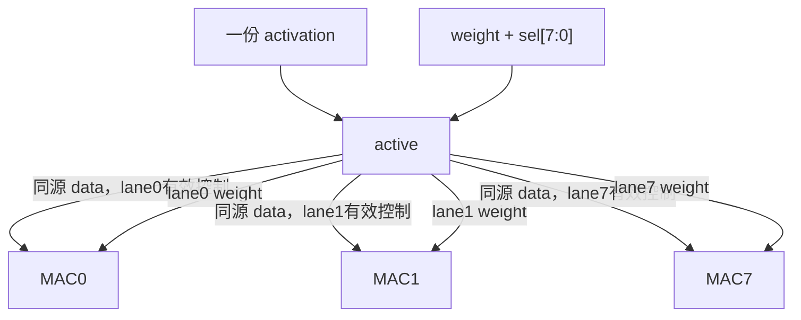

# NV_NVDLA_CMAC_core

源码：`vmod/nvdla/cmac/NV_NVDLA_CMAC_core.v`

## 1. 模块定位

`NV_NVDLA_CMAC_core` 是一个 CMAC 半阵列的计算核心。它实例化配置锁存、输入重定时、active 数据组织、8个相同 MAC kernel lane、输出重定时以及20个细粒度时钟门控单元。

顶层 `NV_NVDLA_cmac` 只负责连接该 core 与 CSB reg block；真正的乘加数据通路全部位于本模块。

## 2. 层级架构



## 3. 子模块职责

| 子模块 | 数量 | 职责 |
| --- | ---: | --- |
| `CORE_cfg` | 1 | 层开始锁存 precision/mode，生成 WG 门控 |
| `CORE_rt_in` | 1 | data/weight 汇总成总线并打一拍 |
| `CORE_active` | 1 | 按精度重组、mask、非零检测、保存并分发8路操作数 |
| `CORE_mac` | 8 | 每个 kernel lane 完成一次点积/Winograd后加 |
| `CORE_rt_out` | 1 | 汇合8路结果、延迟 metadata、产生 done |
| `CORE_slcg` | 20 | 11组普通操作时钟、9组Winograd时钟 |

## 4. 控制与 metadata 路径

activation 的 `pd[8:0]` 走独立固定流水：

```text
sc2mac_dat_pd
  -> rt_in
  -> core 内 metadata 延迟
  -> out_pd/out_pvld
  -> rt_out
  -> mac2accu_pd
```

计算 lane 不重新生成 batch/stripe/channel/layer 信息。`layer_end` 随最后一拍结果进入 `rt_out`，在那里形成 CMAC 自身的 `dp2reg_done`。

## 5. data/weight 分工



weight可只更新一个或多个被 `sel` 选中的 kernel lane；activation在后续 stripe拍被广播到相应已激活 lane。active模块为每个 lane建立独立寄存和门控副本，以降低无关 lane 翻转。

## 6. 输出汇合

8个 `CORE_mac` 各产生：

```verilog
mac_out_pvld
mac_out_nan
mac_out_data[175:0]
```

core把8个 valid组成 `out_mask[7:0]`，数据形成 `out_data0..7`；`rt_out` 将它们与公共 `out_pd/out_pvld` 对齐后送 CACC。FP16 NaN内部会影响对应 lane 的数据编码，但顶层 `mac2accu` 没有独立 NaN 端口。

## 7. 时钟域/门控

模块同时使用：

- `nvdla_core_clk`：配置、输入、DC/int主流水；
- 多组 `nvdla_op_gated_clk_*`：普通操作局部流水；
- 多组 `nvdla_wg_gated_clk_*`：Winograd post-addition。

20个 SLCG 不是20套独立功能单元，而是为宽阵列的不同物理区域提供细粒度门控。

## 8. 阅读 RTL 的方法

1. 看 `u_cfg/u_rt_in/u_active` 例化；
2. 只追 `u_mac_0` 的所有连接；
3. 确认 `u_mac_1..7` 完全同构；
4. 看 `out_mask/out_pd/out_pvld` 如何形成；
5. 看 `u_rt_out`；
6. 最后看 SLCG，勿逐个阅读20份同构例化。

## 9. 容易误解的点

1. 8个 MAC 实例是8个 kernel，不是8个 channel组。
2. 每个 `CORE_mac` 内部已经包含64个乘法单元。
3. active输出给8个 lane的大总线看似复制，实质是为了 lane级有效筛选与门控。
4. `out_pvld`是公共节拍，`out_mask`才表示哪些 kernel lane有结果。
5. `dp2reg_done`来自输出 metadata流水，不来自算术结果数值。
