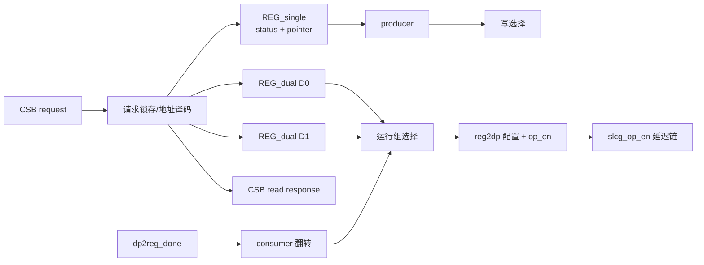
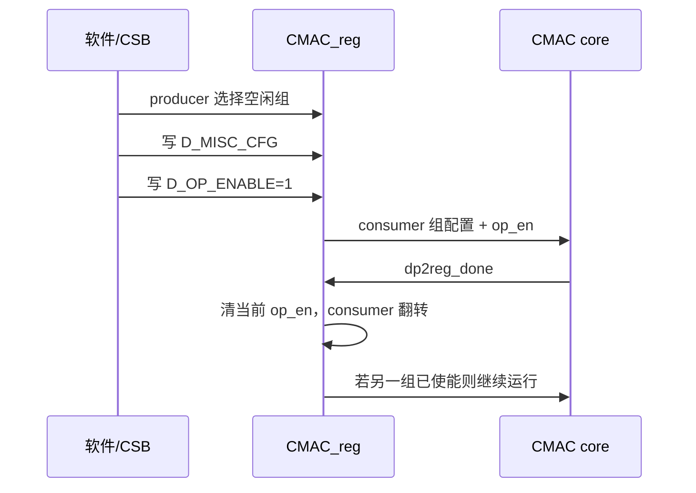

# NV_NVDLA_CMAC_reg

## 1. 模块定位

`NV_NVDLA_CMAC_reg` 是 CMAC 的 CSB 寄存器前端和双组配置管理器。它实例化一份 single register 与两份 dual register，在 producer/consumer 机制下允许软件配置下一层、硬件执行当前层。

模块端口使用 `csb2cmac_a_*`/`cmac_a2csb_*` 命名；同一 RTL 也可在 CMAC-B 实例中接到对应的 B 侧 CSB 目标。

## 2. 寄存器组织

| 地址偏移 | 寄存器 | 类型 | 关键字段 |
| --- | --- | --- | --- |
| `0x7000` | `S_STATUS` | 只读 | 两组状态 |
| `0x7004` | `S_POINTER` | 读写/只读 | producer、consumer |
| `0x7008` | `D_OP_ENABLE` | 双组 | `op_en` |
| `0x700c` | `D_MISC_CFG` | 双组 | `conv_mode`、`proc_precision` |

地址比较使用低 12 bit，因此 A/B 的顶层 CSB 路由负责选择目标，模块内部看到同一套寄存器偏移。

## 3. 架构图

## 4. Ping-pong 生命周期

正在运行的 consumer 组禁止被软件重写；软件只应修改 producer 指向的空闲组。状态编码为：`0=IDLE`、`1=BUSY`、`2=PENDING`。当前 consumer 且已使能的组为 BUSY，另一已使能组为 PENDING。

## 5. 时钟使能与完成处理

- `reg2dp_op_en` 经过多级同步/延迟后送往数据通路配置控制。
- 11-bit `slcg_op_en` 由操作使能复制并流水化，用于覆盖 CMAC 各阶段的时钟需求。
- `dp2reg_done` 到来时清除当前 dual 组的 `op_en`，并翻转 consumer。
- 若另一组已经由软件置为 enable，可在组切换后衔接下一 layer。

## 6. 阅读要点

- single register 是全局状态；dual register 才是每个 layer 的 shadow 配置。
- `producer` 由软件控制，`consumer` 由硬件完成事件控制，两者不能混用。
- CSB 应答、寄存器读写和 data-path 配置输出属于不同流水边界。

