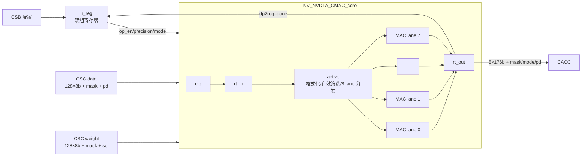
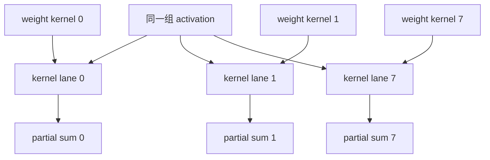
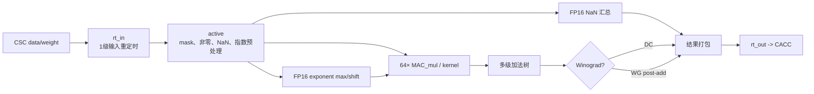

# NV_NVDLA_cmac

源码：`vmod/nvdla/cmac/NV_NVDLA_cmac.v`

## 1. 模块定位

`NV_NVDLA_cmac` 是 CMAC（Convolution Multiply-Accumulate）半阵列顶层。完整 NVDLA 卷积核心实例化两份相同模块：CMAC_A 计算一组8个 kernel，CMAC_B 计算另一组8个 kernel。A/B 语义由顶层连线赋予，数据端口本身没有 `_a/_b` 后缀。

CMAC 接收 CSC 发来的128个 activation byte、128个 weight byte、逐元素 mask、kernel select 和 stripe metadata，对每个被选中的 kernel lane 完成点积，输出8路176-bit部分和给 CACC。

它不从 CBUF 取数，不跨 channel group 保存最终累加结果，也不处理下游反压。跨 C 轮累加、截断和输出属于 CACC。

## 2. 总体架构



顶层只有两个主要实例：

| 实例 | 模块 | 职责 |
| --- | --- | --- |
| `u_core` | `NV_NVDLA_CMAC_core` | 输入处理、8路点积、输出重定时 |
| `u_reg` | `NV_NVDLA_CMAC_reg` | CSB、乒乓配置、`op_en` 和 SLCG |

## 3. 外部接口

### 3.1 CSB

```verilog
csb2cmac_a_req_pvld/prdy/pd[62:0]
cmac_a2csb_resp_valid/pd[33:0]
```

模块定义中的 CSB 端口固定带 `_a`，但 CMAC_B 实例也复用同一端口名，只在上层接到 B 的地址块。CMAC_A 基址为 `0x7000`，CMAC_B 基址为 `0x8000`；模块内部寄存器 offset 语义相同。

### 3.2 CSC activation 输入

```verilog
sc2mac_dat_pvld
sc2mac_dat_mask[127:0]
sc2mac_dat_data0...data127  // 128×8 bit
sc2mac_dat_pd[8:0]
```

`pd` 位域：

| 位 | 字段 |
| ---: | --- |
| `[4:0]` | batch index |
| `[5]` | stripe start |
| `[6]` | stripe end |
| `[7]` | channel end |
| `[8]` | layer end |

CMAC 使用 stripe start/end 做内部 active 流水控制，并把完整 `pd` 延迟到输出；`channel_end/layer_end` 的主要消费者是 CACC。

### 3.3 CSC weight 输入

```verilog
sc2mac_wt_pvld
sc2mac_wt_mask[127:0]
sc2mac_wt_data0...data127  // 128×8 bit
sc2mac_wt_sel[7:0]
```

`sel[k]=1` 表示本拍权重更新/激活本 CMAC 实例内的 kernel lane `k`。`sel` 是 kernel 维度，`mask` 是点积元素维度。

### 3.4 CACC 输出

```verilog
mac2accu_pvld
mac2accu_mask[7:0]
mac2accu_mode[7:0]
mac2accu_data0...data7  // 每路176 bit
mac2accu_pd[8:0]
```

- `mask[k]`：第 k 个 kernel lane 结果有效；
- `mode={8{is_winograd}}`：每 lane 的176-bit数据按 DC 或 Winograd 解释；
- `pd`：与输入 activation metadata 对齐；
- 接口没有 ready，CACC 必须在 CSC 发数前完成使能。

## 4. 阵列组织



一个 CMAC 实例的逻辑计算可写为：

```text
for k in 0..7:
    partial_sum[k] = sum_i(data[i] * weight[k][i])
```

CMAC_A/B 收到相同 activation，但 CSC 用不同 weight select 把 kernel 组分给两份实例。

## 5. 精度映射

外部始终是128个8-bit lane，内部64个16-bit乘法单元：

| 精度 | 每个 `MAC_mul` | 每个物理 kernel lane 的吞吐 |
| --- | --- | --- |
| int8 | 两组8b×8b | 两个逻辑 kernel × 每个64个元素 |
| int16 | 一组16b×16b | 64个 int16 元素 |
| fp16 | 尾数乘法 + 指数对齐 | 64个 fp16 元素 |

INT16/FP16 使用相邻两个 byte 组成一个16-bit元素。Direct INT8 使用上下两个64-byte half：DL复制同一组64个 activation，WL分别放入两个逻辑 kernel的权重，一个物理 lane并行产生两组部分和。

## 6. 数据通路



int8/int16 主路径可以忽略 `nan/exp`。FP16 需要先找共同指数并对齐尾数，再进入乘法/加法树。

## 7. 176-bit结果

每个 kernel lane 输出 `176 = 4×44 bit`：

- DC 模式主要使用低44-bit点积结果，其余段按模式门控；
- Winograd 模式在乘积阵列后执行 post-addition，形成4路44-bit结果；
- CACC 根据 `mac2accu_mode` 选择正确的解包和累加方式。

该结果是当前 CSC 操作拍的部分和，不是整层最终 output。

## 8. 无反压流水

CSC→CMAC 和 CMAC→CACC 均无 ready。CMAC 内部也没有事务 FIFO：

- data 和 weight 可以分拍到达，active 级负责保存/选择权重与 activation；
- 一旦结果进入计算流水，后续各级按固定时序推进；
- 系统反压由 CACC credit 反馈给 CSC，在发射前停止新的工作；
- 软件必须按 CACC→CMAC_B→CMAC_A→CSC 的顺序置 `op_en`。

## 9. A/B 实例关系

两份 CMAC RTL 完全相同：

- A 接 CSC `dat_a/wt_a`，通常对应当前16-kernel组的低8个 kernel；
- B 接 CSC `dat_b/wt_b`，对应高8个 kernel；
- A/B 必须配置相同 `conv_mode` 和 `proc_precision`；
- 两份 `mac2accu` 由 CACC 同拍接收并合并。

## 10. 阅读顺序

1. `NV_NVDLA_cmac.v`：接口和 core/reg 边界；
2. `NV_NVDLA_CMAC_core.v`：8-lane层级；
3. `CORE_rt_in.v`；
4. `CORE_active.v`；
5. 只看一个 `CORE_mac.v`；
6. `CORE_MAC_mul.v`；
7. `CORE_rt_out.v`；
8. 需要FP16时再看 `MAC_exp.v/MAC_nan.v`；
9. 最后看寄存器和 SLCG。

## 11. 容易误解的点

1. 一个 `NV_NVDLA_cmac` 只有8个 kernel lane，完整卷积核心有A/B两份。
2. A/B不是两个不同 RTL模块，模块数据端口也不带A/B后缀。
3. 128个输入 byte 不等于始终有128个不同输入：Direct INT8会复制64个activation，INT16/FP16则每两个byte组成一个数。
4. `sc2mac_wt_sel` 选择 kernel lane，`sc2mac_*_mask` 选择点积元素。
5. `mac2accu_mask` 是8个结果 lane 的有效位，不是输入元素 mask。
6. CMAC不跨 C 轮累加；历史部分和保存在 CACC。
