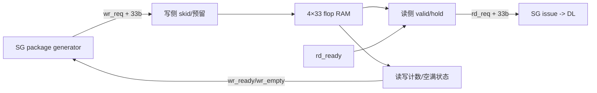

# NV_NVDLA_CSC_SG_dat_fifo

源码：`vmod/nvdla/csc/NV_NVDLA_CSC_SG_dat_fifo.v`

## 1. 模块定位

`NV_NVDLA_CSC_SG_dat_fifo` 是 SG 到 DL 之间的浅命令 FIFO。它保存4条33-bit记录：31-bit data package 加2-bit package index。它不缓存 activation 数据。

## 2. 架构图



## 3. 接口语义

```verilog
wr_ready
wr_empty
wr_req
wr_data[32:0]

rd_ready
rd_req
rd_data[32:0]
```

该 fifogen 接口命名不同于普通 valid/ready：

- 写侧仅在 `wr_ready` 时接受新的 `wr_req`；
- `rd_req` 表示当前存在可供读取的记录；
- `rd_ready` 表示下游接受当前记录；
- `rd_req && rd_ready` 完成一次 pop；
- `wr_empty` 供 SG 判断层末命令是否全部排空。

## 4. 存储组织

内部 RAM 为 `4×33`，读写地址各2 bit，计数器3 bit，可区分0～4条记录。文件中还包含该小 RAM 的 wrapper/module 定义。

数据格式：

```text
wr_data[32:31] = package index
wr_data[30:0]  = data package
```

## 5. 时钟门控

内部实例化 `NV_CLK_gate_power`，在无 push/pop 时关闭 RAM 与相关状态寄存器时钟。`pwrbus_ram_pd` 传入 RAM wrapper，但不参与 FIFO 数据协议。

## 6. 设计作用

FIFO 将 SG 的多维计数/package生成与 DL 的实际发射时机解耦，并允许 SG 预生成少量操作。data FIFO 与 weight FIFO 联动写入，使同一 package index 的 activation/weight 命令保持配对。

## 7. 容易误解的点

1. 它保存命令，不保存1024-bit CBUF data。
2. 深度只有4，不能承担长时间下游阻塞。
3. `rd_req` 相当于输出 valid，不是上游发出的读脉冲。
4. `wr_empty` 是写侧观察到的空状态，SG 用它参与层末 drain 判断。
5. package index 是FIFO记录的一部分，但对 DL 外部可见的 `sg2dl_pd` 仍是31 bit。
