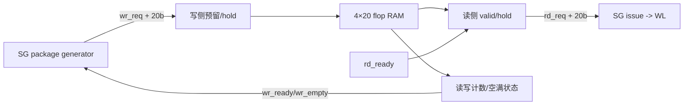

# NV_NVDLA_CSC_SG_wt_fifo

源码：`vmod/nvdla/csc/NV_NVDLA_CSC_SG_wt_fifo.v`

## 1. 模块定位

`NV_NVDLA_CSC_SG_wt_fifo` 是 SG 到 WL 之间的浅命令 FIFO。它保存4条20-bit记录：18-bit weight package 加2-bit package index。结构与 data FIFO相同，区别只有记录宽度。

## 2. 架构图



## 3. 接口语义

```verilog
wr_ready
wr_empty
wr_req
wr_data[19:0]

rd_ready
rd_req
rd_data[19:0]
```

`rd_req` 相当于输出 valid，`rd_req && rd_ready` 表示当前 weight package 被 WL 接收。写侧必须观察 `wr_ready`。

数据格式：

```text
wr_data[19:18] = package index
wr_data[17:0]  = weight package
```

## 4. 与 data FIFO 的联动

SG 只有在两个 FIFO 都具备写条件时才提交一对 package：

```text
dat_push_req = pkg_vld && wt_push_ready
wt_push_req  = pkg_vld && dat_push_ready
```

这避免只写入 activation 命令或只写入 weight 命令。两个 FIFO 可根据 DL/WL 的发射条件分别 pop，但 index 和 SG issue 条件用于维持配对。

## 5. 存储与门控

内部为 `4×20` flop RAM、2-bit读写地址和3-bit计数。`NV_CLK_gate_power` 在空闲时门控内部时钟；`pwrbus_ram_pd` 只服务 RAM 电源控制。

## 6. 容易误解的点

1. FIFO 保存 `weight_size/kernel_size/end/release` 等命令，不保存 weight 数据。
2. 它与 data FIFO 同构但不能合并，因为 DL/WL 的发射条件和延迟不同。
3. `rd_req` 不是软件式“发起读取”，而是 FIFO 声明当前输出有效。
4. 深度4主要用于小规模时序解耦。
