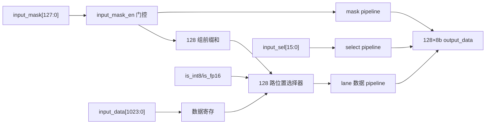

# NV_NVDLA_CSC_WL_dec

源码：`vmod/nvdla/csc/NV_NVDLA_CSC_WL_dec.v`

## 1. 模块定位

`NV_NVDLA_CSC_WL_dec` 是 Weight Loader 内的128-lane权重展开与对齐流水。它接收一条1024-bit紧凑权重数据、128-bit位置 mask、16-bit kernel select 和精度信息，输出128个8-bit weight lane、有效 mask 与保持对齐的 select。

压缩权重模式下，它根据 mask 为每个输出位置选择正确的非零权重；非压缩模式下，WL 构造等价的连续 mask，使该模块成为统一的 weight 输出流水。

## 2. 架构图



源码自身把主要过程分为：

```text
phase I   : calculate sums for mux
phase II  : register / select compact data
phase III : output registers
```

## 3. 接口

输入：

```verilog
input_pipe_valid
input_data[1023:0]
input_mask[127:0]
input_mask_en[9:0]
input_sel[15:0]
is_int8
is_fp16
```

输出：

```verilog
output_pvld
output_data0...output_data127  // 每项8 bit
output_mask[127:0]
output_sel[15:0]
```

没有 ready。输入有效后按固定寄存流水产生输出，WL 必须保证输入不会超过该流水的固定吞吐能力。

## 4. 压缩展开原理

设位置 mask 为 `m[0:127]`，紧凑数据为 `w_compact[]`。逻辑关系可抽象为：

```text
rank(i) = sum(m[0:i])

if m[i] == 1:
    output_weight[i] = w_compact[rank(i)-1]
else:
    output_mask[i] = 0
```

源码为每个位置展开了显式前缀和与 mux，而不是共享一个循环式 popcount 单元。这样能在固定流水内同时产生128个位置，但也造成文件超过两万行。

`input_mask_en` 对不同分段的 mask 参与计算进行门控，用于处理跨 entry 拼接、精度分组和尾部不足；不能把它简单当成另一份输出 mask。

## 5. 精度影响

物理输出始终是128个8-bit lane：

- int8：每个 lane 是一个独立8-bit weight；
- int16/fp16：相邻两个8-bit lane共同组成一个16-bit weight；
- 精度会影响压缩 mask 的分组、选择下标和符号/字节组织，但不会改变外部端口宽度。

`output_mask` 必须与精度一起解释。CMAC 的 active 级会用它关闭无效元素。

## 6. select 对齐

`input_sel[15:0]` 不参与 weight 数据值计算，它表示当前数据属于哪个 kernel lane。模块将其与 valid、mask、data 一起打拍为 `output_sel`。WL 随后将：

```text
output_sel[7:0]  -> CMAC_A
output_sel[15:8] -> CMAC_B
```

## 7. 阅读 RTL 的方法

1. 先看端口和文件顶部 decoder 注释图；
2. 选择位置0、1、2和127，观察 `vec_sum_*`；
3. 选一个 int8 lane 和一个16-bit lane，看 mux 下标如何形成；
4. 找 `valid_d1/d2/d3`；
5. 确认 mask、select 与128个 data lane 在 d3 同拍输出；
6. 不要逐行阅读128份同构逻辑。

## 8. 容易误解的点

1. decoder 的“解压”是位置恢复，不是数值编码解码。
2. 输入 weight 数据是紧凑非零序列，mask 决定它们落回哪个原始位置。
3. 非压缩模式仍使用该模块，但 mask 使数据表现为直通排列。
4. `input_sel/output_sel` 选择 kernel，不选择128个元素。
5. 输出没有 ready；`output_pvld` 是固定流水 valid。
6. 源码的大部分行是128 lane 的生成展开，理解少数代表 lane 即可。
