# NV_NVDLA_CSC_dl

源码：`vmod/nvdla/csc/NV_NVDLA_CSC_dl.v`

## 1. 模块定位

`NV_NVDLA_CSC_dl` 是 CSC 的 Data Loader。它把 SG 给出的一个高层 data package 展开成一串 activation 访问和 CMAC 数据拍：计算卷积窗口对应的 CBUF 地址，接收固定延迟返回，完成跨 entry 对齐、padding/dummy、Direct 或 Winograd 格式化，最后把同一份 activation 广播给 CMAC_A 和 CMAC_B。

DL 不选择 kernel，也不做乘法。kernel 分工由 WL 的 weight `sel` 决定。

理解本模块最有用的模型是：

```text
SG package 描述“接下来要做哪一个 stripe”
DL 内部计数器把它展开成“每一拍从哪里取 activation”
CBUF 返回的 entry 经重排后变成“CMAC 当前计算拍”
```

## 2. 总体数据通路

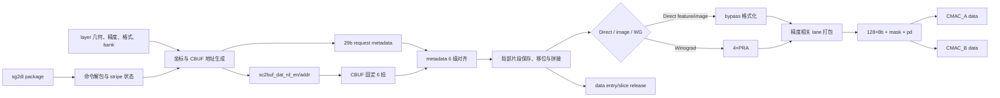

这条主线里始终并行存在三类信息：

- 1024-bit activation 数据；
- 128-bit lane mask；
- 9-bit stripe metadata `pd`。

只追数据总线而不追 mask、valid 和 metadata，会无法判断当前字节是否真正参与计算，也无法判断 CACC 应继续累加还是结束一个输出。

## 3. 主要接口

### 3.1 SG 命令

```verilog
sg2dl_pvld
sg2dl_pd[30:0]
sg2dl_reuse_rls
sc_state[1:0]
```

`sg2dl_pd` 位域：

| 位 | 字段 | DL 中的作用 |
| ---: | --- | --- |
| `[4:0]` | `w_offset` | stripe 起始水平窗口偏移 |
| `[9:5]` | `h_offset` | 垂直窗口偏移 |
| `[16:10]` | `channel_size` | 本轮 channel 范围 |
| `[23:17]` | `stripe_length` | 需要展开的连续输出位置数 |
| `[25:24]` | `cur_sub_h` | 子行/Winograd 位置 |
| `[26]` | `block_end` | 局部 data block 结束 |
| `[27]` | `channel_end` | 当前输出 C 方向最终轮 |
| `[28]` | `group_end` | 当前操作组结束 |
| `[29]` | `layer_end` | 整层最后一个 package |
| `[30]` | `dat_release` | 允许归还 data 资源 |

一个 package 通常会在 DL 内展开成多拍，而不是只对应一个 `sc2buf_dat_rd_en` 或一个 `sc2mac_dat_pvld`。

### 3.2 CBUF data 读口

```verilog
sc2buf_dat_rd_en
sc2buf_dat_rd_addr[11:0]
sc2buf_dat_rd_valid
sc2buf_dat_rd_data[1023:0]
```

CBUF 无 request ready。`rd_en` 发出后，返回 valid 固定晚 6 拍。地址结构为：

```text
addr[11:8] = bank
addr[7:0]  = bank 内 entry
```

### 3.3 CMAC data 输出

A/B 两路均包含：

```verilog
sc2mac_dat_{a,b}_pvld
sc2mac_dat_{a,b}_mask[127:0]
sc2mac_dat_{a,b}_data0...data127  // 128×8 bit
sc2mac_dat_{a,b}_pd[8:0]
```

A/B 的 data、mask、`pd` 和 valid 完全相同。它们是广播关系，不是把 activation 切成低/高两半。

## 4. Layer 启动与配置快照

DL 在 layer start 锁存本层使用的配置，包括：

- 输入/权重/输出尺寸；
- `entries_per_slice`、data bank 数与 data 区环形起点；
- Direct/Winograd、feature/image 格式；
- INT8/INT16/FP16 精度；
- stride、dilation、zero padding、pad value；
- batch、y-extension、PRA truncate。

这些配置在 layer 内保持稳定。DL 的地址、计数和格式选择都使用锁存后的版本，不能把 CSB 寄存器理解成逐拍控制信号。

data 区读指针也不是每层无条件回到 bank0/entry0：连续层若沿用同一 CBUF 分配，指针按双方账本环形推进；pending 清账或相应 reset 场景才重新建立一致起点。

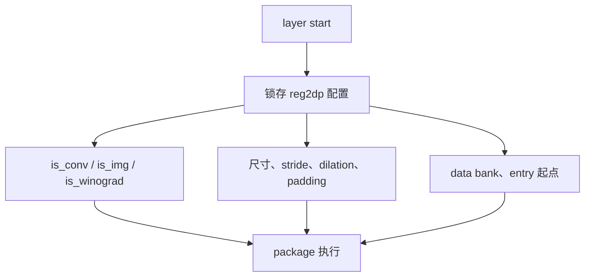

## 5. 逐阶段 activation 数据通路

### 5.1 Stage A：package 解包和 stripe 展开

收到 `sg2dl_pvld` 后，DL 锁存 package，并用内部计数器推进当前：

- stripe 中的 output x；
- batch；
- filter 子宽/子高 `sub_w/sub_h`；
- channel 子组 `sub_c`；
- 当前 package 剩余长度。

抽象关系为：

```text
package 起始坐标
  + stripe 内位置
  + filter R/S 位置
  + channel group
  -> 当前需要的 input x/y/channel
```

一个 stripe 的第一拍和最后一拍分别生成 `stripe_start`、`stripe_end`。package 自带的 `channel_end/layer_end` 只会在该 package 的正确末拍进入输出 `pd`。

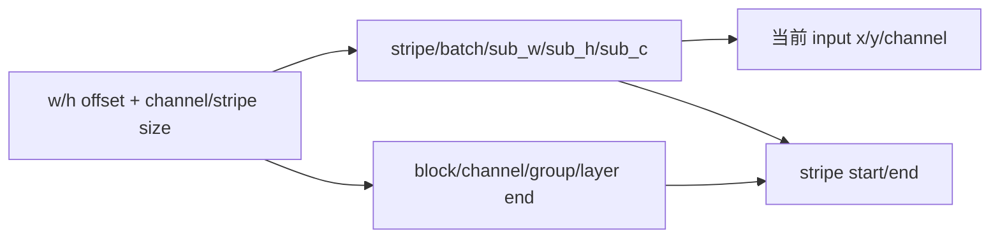

### 5.2 Stage B：判断真实读取、padding 和 dummy

对每个展开位置，DL 先判断它属于哪一种情况：

| 类型 | 是否读 CBUF | 输出数据 | mask 语义 |
| --- | --- | --- | --- |
| 真实输入 | 是，或复用本地已有 entry | CBUF activation | 真实 channel 有效 |
| 卷积 padding | 通常不需要真实数据 | `pad_value` | padding 值作为卷积输入 |
| 内部 dummy | 否 | 占位值 | 对应 lane 清零，不参与 MAC |

padding 和 dummy 不能混为一谈。padding 是数学卷积窗口的一部分；dummy 只是硬件调度为了保持固定阵列或子循环对齐插入的无效位置。

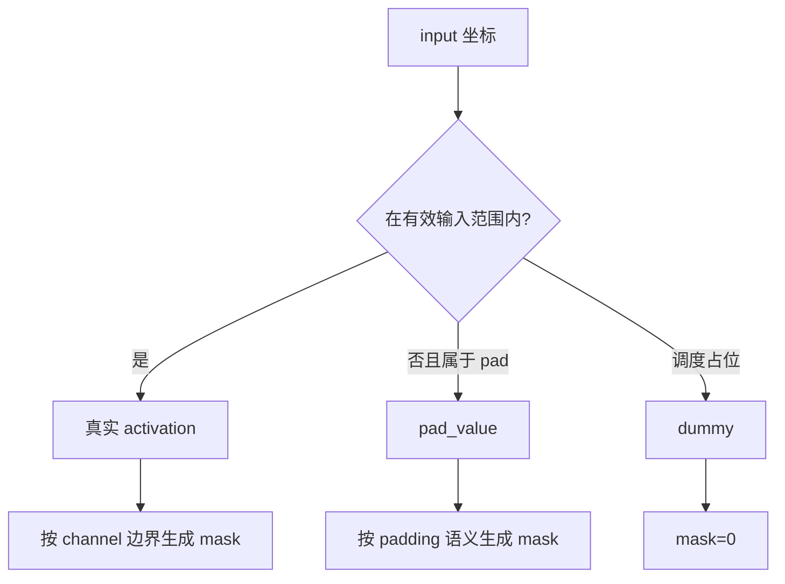

### 5.3 Stage C：CBUF 地址生成与请求抑制

真实输入坐标被换算成 CBUF 环形地址。主要组成量包括：

```text
slice 基址
+ 当前 y 对应的 slice 偏移
+ entry_per_slice 下的 x/channel entry 偏移
+ data 区环形起点
```

最终结果再拆成 bank 和 bank 内 entry。

DL 会保存最近读取的地址与数据片段。若相邻窗口仍可从本地片段得到所需字节，可以不重新访问 CBUF；只有地址变化或 image/Winograd 的强制 fetch 条件成立时才发请求。因此：

```text
CMAC 有效拍数 != CBUF 读请求数
```

相邻卷积窗口的数据复用正是 DL 存在局部移位/拼接状态的原因。

### 5.4 Stage D：29-bit request metadata

CBUF 只返回数据，不会返回“这是哪个窗口的 entry”。DL 在请求侧构造 `dat_req_pipe_pd[28:0]`，并与请求一起进入 6 级控制流水。

RTL 中该 metadata 的确切布局是：

| 位 | 字段 | 返回时的用途 |
| ---: | --- | --- |
| `[1:0]` | `sub_w` | 选择窗口子宽位置 |
| `[3:2]` | `sub_h` | 选择局部子行槽 |
| `[4]` | `sub_c` | channel 半组/子组选择 |
| `[5]` | `ch_end` | channel 边界 |
| `[6]` | `ch_odd` | 奇偶 channel 处理 |
| `[14:7]` | `bytes` | 本次真实 byte 数/移位范围 |
| `[16:15]` | `cur_sub_h` | 当前子高位置 |
| `[17]` | `dummy` | 返回路径按 dummy 处理 |
| `[18]` | `sub_w_st` | 子宽开始/强制 fetch 相关边界 |
| `[19]` | `rls` | 数据释放边界 |
| `[28:20]` | `flag[8:0]` | 最终 `sc2mac_dat_pd` 候选 |

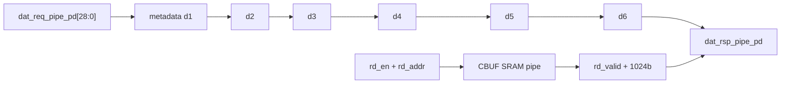

`dat_rsp_pipe_pvld` 与 CBUF `rd_valid` 必须符合固定时序合同。RTL 还包含断言，检查 CBUF 不会在没有预期 response execution 的情况下突然返回 valid。

### 5.5 Stage E：返回 entry 的局部保存

1024-bit CBUF entry 到达后，DL 根据 `sub_h/sub_c/ch_odd/bytes/dummy` 把数据写入相应的局部片段寄存器。RTL 中可看到 `dat_l0`、`dat_l1`、`dat_l2`、`dat_l3` 以及 high/low 片段，它们服务于：

- 不同 `sub_h` 的窗口行；
- 跨 entry 的前后半段拼接；
- image channel packing 的奇偶片段；
- Winograd 4×4 tile 的四组输入准备。

这些 `l0..l3` 不是四层 feature map，也不是四个 batch；它们是 DL 为窗口重排设置的局部数据槽。

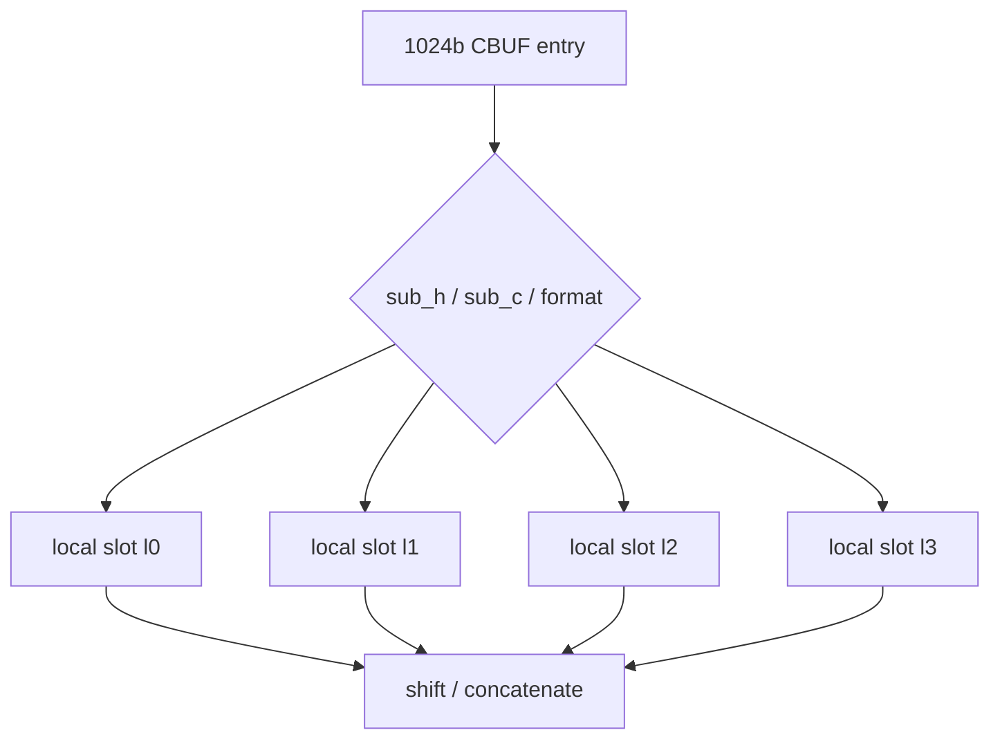

### 5.6 Stage F：跨 entry 移位与 Direct feature 路径

即使 CBUF entry 与 CMAC 接口都是 1024 bit，它们的逻辑边界也不一定一致。当前 channel 起点可能落在 entry 中间，所需数据可能由当前 entry 的尾部和下一 entry 的头部组成。

Direct feature 主路径可以概括为：

```text
局部保存的相邻 entry 片段
  -> 按 channel/byte offset 右移或左移
  -> 拼成当前 atomic-C 数据窗口
  -> 应用真实 channel mask、padding 或 dummy mask
  -> bypass_data / bypass_mask
```

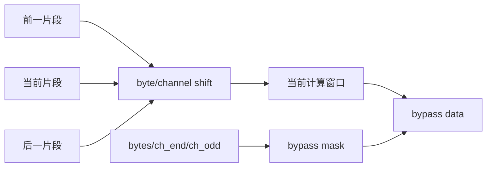

mask 是计算有效性的最终依据。无效 lane 的 data 寄存器可以保持旧值或 don't-care；CMAC 必须结合 mask 使用。

### 5.7 Stage F 的 image/pixel 分支

`datain_format=1` 时，CBUF 中的数据按 image/pixel 布局组织，而不是普通 feature slice 布局。DL 使用专门的：

- pixel 宽度计数；
- pixel byte stride；
- channel odd/even；
- `pixel_force_fetch/pixel_force_clr`；
- y-extension 对应的初始偏移。

把像素存储顺序转换成 CMAC 仍然可见的 128×8-bit lane。


image 分支改变的是地址和拼接方法，不改变 DL 的外部输出协议。

### 5.8 Stage G：Winograd PRA

Winograd 模式下，局部 `l0..l3` 数据用于组成 tile。DL 将待变换数据拆给四个 `NV_NVDLA_CSC_pra_cell`，执行 CMAC 之前的 pre-addition transform。

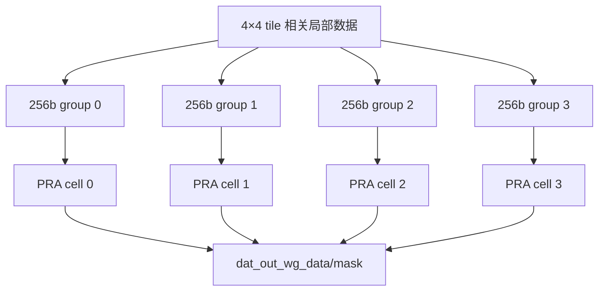

PRA 路径比 Direct bypass 多流水。RTL 将 bypass 的 `valid/flag` 延迟到 `l5`，再依据 `is_winograd` 选择延迟后的控制，保证两种模式在最终 `dat_out_*` 处对齐。

### 5.9 Stage H：精度相关 lane 打包

最终 mux 的 RTL 行为值得单独看：

```text
Winograd:
    dat_out_data = dat_out_wg_data
Direct + INT8:
    dat_out_data = {2{dat_out_bypass_data[511:0]}}
Direct + INT16/FP16:
    dat_out_data = dat_out_bypass_data[1023:0]
```

mask 采用同样的选择关系：Direct INT8 把低 64-bit mask 复制到上下两个 64-lane half。

这反映物理阵列的 INT8 双结果组织：

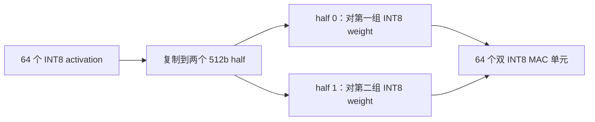

因此在 Direct INT8 下，物理接口虽然有 128 个 byte lane，但这里不是 128 个不同 activation channel，而是 64 个 activation 被复制后与 WL 组织的两组 INT8 权重并行计算。INT16/FP16 下，128 bytes 组成 64 个 16-bit activation，不进行这种 bypass 复制。

### 5.10 Stage I：输出寄存与 A/B 广播

`dat_out_data/mask/flag/pvld` 再进入 `dl_out_*` 输出寄存器。128 个 data byte 按 lane mask 分别使能寄存，减少无效 lane 翻转。

随后 A/B 输出都由同一份 `dl_out_*` 驱动：

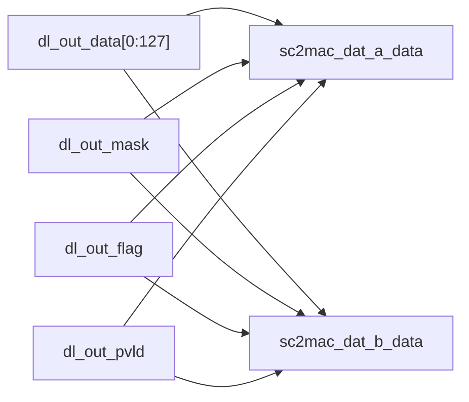

不要把 A/B 误解成 activation 的两个 64-byte half；它们是送往两个 CMAC 实例的两份完全相同的广播副本。

### 5.11 `sc2mac_dat_pd` 的生成

最终 `pd[8:0]` 为：

| 位 | 字段 | 产生时机 |
| ---: | --- | --- |
| `[4:0]` | batch index | 当前 batch |
| `[5]` | stripe start | stripe 第一有效拍 |
| `[6]` | stripe end | stripe 最后一有效拍 |
| `[7]` | channel end | 最终 channel round 的对应末拍 |
| `[8]` | layer end | 整层最后 package 的最终输出拍 |

`pd` 从请求 metadata 的 `flag` 一路随数据对齐，最终只在 `dl_out_pvld` 有效时有语义。CMAC 将它固定延迟透传给 CACC；CACC 根据 `channel_end` 决定继续部分和累加还是进入最终输出。

### 5.12 data release

DL 同时维护 CBUF data 的可用 slice/entry 和读指针。package 中的 `dat_release`、局部 release 边界或 `sg2dl_reuse_rls` 到来时，产生：

```verilog
sc2cdma_dat_updt
sc2cdma_dat_entries[11:0]
sc2cdma_dat_slices[11:0]
```

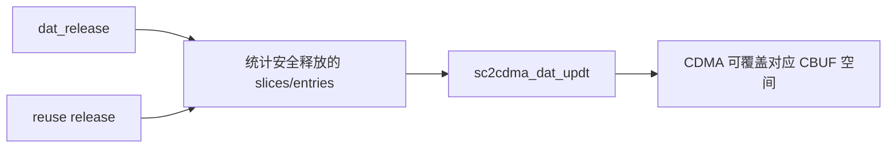

这条接口归还的是资源所有权，不是 activation 数据。普通读取完成不代表 entry 立刻可覆盖；必须等 DL 判定后续窗口不再复用。

### 5.13 固定流水时序

下面是一条真实 CBUF 读取的概念时序；内部地址生成和输出格式化可能还有额外级：

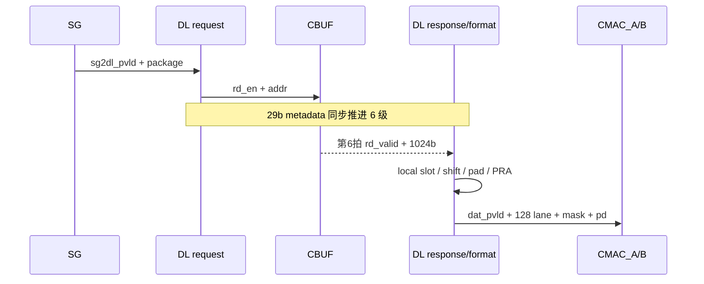

DL 不能反压 CBUF 返回，也收不到 CMAC ready。SG 必须在 package 发射前依据资源、FIFO 和 CACC credit 保证整条固定流水可继续。

## 6. 建议沿 RTL 阅读的信号链

Direct feature 主路径建议按下面顺序搜索：

```text
sg2dl_pd
-> dl_in_pd / package unpack
-> dat_req_* / sc2buf_dat_rd_en / addr
-> dat_req_pipe_pd
-> dat_rsp_pipe_pd_d0..d6
-> dat_l0/l1/l2/l3
-> dat_rsp_data/mask/flag
-> dat_out_bypass_data/mask
-> dat_out_data/mask
-> dl_out_data/mask/flag
-> sc2mac_dat_a/b
```

Winograd 再追加：

```text
dat_pra_dat_ch0..3
-> u_pra_cell_0..3
-> dat_out_wg_data/mask
```

资源释放单独追：

```text
dat_req_pipe_rls / dat_rsp_pipe_rls
-> dat_rls
-> sc2cdma_dat_updt
```

## 7. 容易误解的点

1. 一个 SG package 会展开成多拍访问和输出，不是一包一拍。
2. CBUF entry 与 CMAC 总线同为 1024 bit，不代表无需移位和跨 entry 拼接。
3. `dat_req_pipe_pd` 是 DL 内部请求 metadata，不是最终 `sc2mac_dat_pd`；其中只有 `flag[8:0]` 最终成为下游 `pd`。
4. `dat_l0..l3` 是窗口重排局部槽，不是 feature map 层编号。
5. padding 是卷积输入，dummy 是无效调度占位，二者 mask 语义不同。
6. Direct INT8 bypass 会复制低 512-bit activation；128 个物理 byte lane 不等于 128 个不同 activation channel。
7. A/B 输出是完全相同的 activation 广播，不是 INT8 的两个复制 half。
8. Winograd PRA 有额外延迟，RTL 专门延迟 bypass valid/flag 后再做模式选择。
9. 空闲时 data 总线可能保留旧值，只有 `pvld/rd_valid` 有效时才能解释。
10. entry 被读过不等于能立即释放；release 要等所有潜在复用结束。
