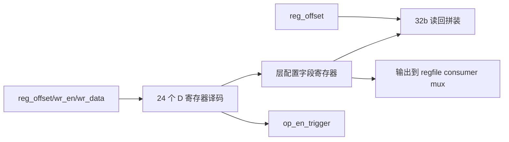

# NV_NVDLA_CSC_dual_reg

源码：`vmod/nvdla/csc/NV_NVDLA_CSC_dual_reg.v`

## 1. 模块定位

`NV_NVDLA_CSC_dual_reg` 实现一份 CSC D 组层配置寄存器。`NV_NVDLA_CSC_regfile` 实例化两份完全相同的 block，分别作为 D0 和 D1，实现乒乓配置。

本模块负责地址译码、字段写入、复位值和读回拼装，不决定当前实例是否可写；运行组写保护由上层 regfile 的 `reg_wr_en` 门控完成。

## 2. 架构图



## 3. 寄存器表

| offset | 寄存器 | 关键字段 |
| ---: | --- | --- |
| `0x008` | `D_OP_ENABLE` | `op_en` |
| `0x00c` | `D_MISC_CFG` | conv mode、input/proc precision、reuse、skip release |
| `0x010` | `D_DATAIN_FORMAT` | feature/image |
| `0x014` | `D_DATAIN_SIZE_EXT_0` | input width/height |
| `0x018` | `D_DATAIN_SIZE_EXT_1` | input channel |
| `0x01c` | `D_BATCH_NUMBER` | batch 数减一 |
| `0x020` | `D_POST_Y_EXTENSION` | image y-extension |
| `0x024` | `D_ENTRY_PER_SLICE` | 每 slice entry 数减一 |
| `0x028` | `D_WEIGHT_FORMAT` | compressed/non-compressed |
| `0x02c` | `D_WEIGHT_SIZE_EXT_0` | weight R/S |
| `0x030` | `D_WEIGHT_SIZE_EXT_1` | weight C/K |
| `0x034` | `D_WEIGHT_BYTES` | weight footprint |
| `0x038` | `D_WMB_BYTES` | WMB footprint |
| `0x03c` | `D_DATAOUT_SIZE_0` | output W/H |
| `0x040` | `D_DATAOUT_SIZE_1` | output channel |
| `0x044` | `D_ATOMICS` | 全层 output atomics 数减一 |
| `0x048` | `D_RELEASE` | 层末释放 slice 数 |
| `0x04c` | `D_CONV_STRIDE_EXT` | X/Y stride 减一 |
| `0x050` | `D_DILATION_EXT` | X/Y dilation 减一 |
| `0x054` | `D_ZERO_PADDING` | left/top padding |
| `0x058` | `D_ZERO_PADDING_VALUE` | padding value |
| `0x05c` | `D_BANK` | data/weight bank 数减一 |
| `0x060` | `D_PRA_CFG` | Winograd PRA truncate |
| `0x064` | `D_CYA` | 保留/chicken bits |

## 4. 0-based 配置语义

许多几何和容量字段按“实际值减一”编码：

```text
实际 width  = datain_width_ext + 1
实际 height = datain_height_ext + 1
实际 channel = datain_channel_ext + 1
实际 bank 数 = data_bank/weight_bank + 1
实际 atomics = atomics + 1
```

不能对所有字段盲目 `+1`；地址、padding value、mode、precision、reuse flag 等按原值解释。

## 5. `D_MISC_CFG`

主要位域：

| 位 | 字段 |
| ---: | --- |
| `[0]` | `conv_mode` |
| `[9:8]` | `in_precision` |
| `[13:12]` | `proc_precision` |
| `[16]` | `data_reuse` |
| `[20]` | `weight_reuse` |
| `[24]` | `skip_data_rls` |
| `[28]` | `skip_weight_rls` |

三单元联合运行时，CSC/CMAC/CACC 的 `conv_mode` 和 `proc_precision` 必须一致。

## 6. `op_en` 与 trigger

写 `D_OP_ENABLE` 时模块更新 `op_en` 并产生 `op_en_trigger`。上层 regfile 使用 trigger、当前 op_en 和 `dp2reg_done` 共同维护每组运行状态。

复位后 `proc_precision=2'b01`，即 int16；不能假设所有 D 字段复位均为0。

## 7. 数据通路消费关系

字段按职责分发：

- SG：几何、atomics、reuse/release、bank、precision；
- DL：输入几何、stride/dilation/padding、entry、precision、PRA；
- WL：weight 几何、format、bytes、bank、precision；
- regfile：`op_en` 和时钟门控。

本模块只保存字段，不在这里执行几何计算。

## 8. 设计前提

- `data_bank + 1` 与 `weight_bank + 1` 的总和不得超过16；
- 任一 bank 字段不能写 `4'hf` 触发 WL 的组合 overflow 断言；
- 几何、stride、dilation、precision组合必须满足 SG/DL/WL 的断言；
- 当前 D 组运行时，上层 regfile 会禁止写入。

## 9. 阅读 RTL 的方法

1. 看地址常量/写译码；
2. 选 `D_MISC_CFG`、`D_BANK`、`D_DATAIN_SIZE` 看位域；
3. 看 reset 段确认非零默认值；
4. 看读回拼装；
5. 最后用端口列表对照字段消费者。

## 10. 容易误解的点

1. dual 表示该 block 被实例化两份，不是一个模块内部包含两组寄存器。
2. 写保护不在本文件，而在上层 regfile。
3. `weight_bytes` 在 WL 中按128B entry footprint使用。
4. `D_OP_ENABLE` 是运行提交位，不应与其他字段一起随意随机写。
5. int16 是默认处理精度。
