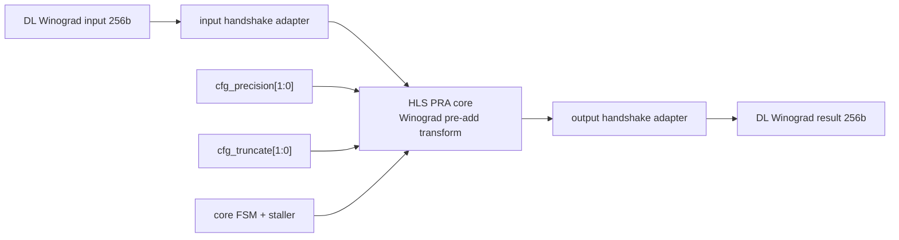

# NV_NVDLA_CSC_pra_cell

源码：`vmod/nvdla/csc/NV_NVDLA_CSC_pra_cell.v`

## 1. 模块定位

`NV_NVDLA_CSC_pra_cell` 是 CSC Data Loader 中的 Winograd PRA（Pre-Addition）计算单元。DL 共实例化4个 cell，把 Winograd 输入块分成4路256-bit并行变换，再送入 CMAC。

DC direct convolution 不使用该模块。该文件由 Catapult HLS 生成，除顶层外还包含握手适配、staller、FSM、移位、前导符号检测和浮点/整数运算等多个内部模块。

## 2. 架构图



## 3. 顶层接口

```verilog
chn_data_in_rsc_z[255:0]
chn_data_in_rsc_vz
chn_data_in_rsc_lz

cfg_precision[1:0]
cfg_truncate_rsc_z[1:0]

chn_data_out_rsc_z[255:0]
chn_data_out_rsc_vz
chn_data_out_rsc_lz
```

HLS resource-channel 命名与常见 ready/valid 相反，需要结合方向理解：输入侧由 DL 提供数据/有效并接收可接受指示；输出侧由下游提供可接受条件，cell 给出输出有效和数据。

## 4. 数据通路

PRA 对 Winograd tile 做乘法阵列之前的线性预加减变换。其目的不是完成卷积，而是把空间域输入变换到 Winograd 域，使后续 CMAC 可用较少乘法完成等价卷积。

抽象流程为：

```text
256-bit 输入块
  -> 按 precision 拆成元素
  -> 多级加/减和常数移位
  -> 按 pra_truncate 截断/舍入
  -> 重新打包为256-bit结果
```

int8、int16和fp16复用同一外部宽度，但内部元素数、位宽扩展和截断路径不同。

## 5. 握手与停顿

HLS core 通过 input/output wait adapter 和统一 staller 保持运算中间状态。当输出不能接收时，流水会停住并反向阻止新输入。这套握手只存在于 DL 内部；CSC 对 CMAC 的最终接口仍没有 ready。

## 6. 阅读 RTL 的方法

1. 直接跳到文件末尾 `module NV_NVDLA_CSC_pra_cell`；
2. 看顶层如何连接 `NV_NVDLA_CSC_pra_cell_core`；
3. 看 core 的输入/输出握手与 `core_fsm/staller`；
4. 若只研究 DC 模式，到此即可；
5. 研究 Winograd 数值时，再按 precision 选择一条运算分支追踪。

## 7. 容易误解的点

1. PRA 是 Winograd 输入变换，不是 CMAC 乘加或 CACC 累加。
2. 文件很大主要因为 HLS 展开和多精度算术库，不代表顶层控制复杂。
3. DL 实例化4个相同 cell，不需要逐个阅读。
4. `pra_truncate` 只影响 Winograd 路径。
5. HLS 端口的 `vz/lz` 不能仅凭名称猜 valid/ready，必须结合端口方向和 wrapper 赋值。
