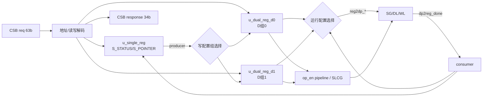
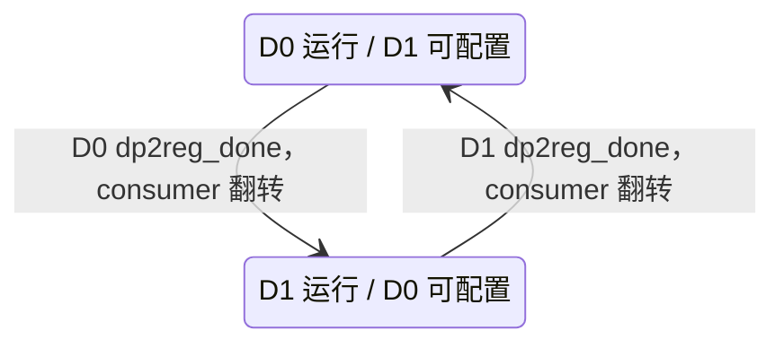

# NV_NVDLA_CSC_regfile

源码：`vmod/nvdla/csc/NV_NVDLA_CSC_regfile.v`

## 1. 模块定位

`NV_NVDLA_CSC_regfile` 是 CSC 的 CSB 寄存器终点和双配置组控制器。它解析 CSB 请求，实例化一份 single register block 与两份 dual register block，并用 producer/consumer 指针支持“一层运行、下一层配置”的乒乓机制。

它不参与 activation/weight 数据计算，但决定数据通路当前使用哪一组配置，并负责 `op_en` 生命周期与 SLCG 使能。

## 2. 架构图



## 3. CSB 接口

```verilog
csb2csc_req_pvld
csb2csc_req_prdy
csb2csc_req_pd[62:0]
csc2csb_resp_valid
csc2csb_resp_pd[33:0]
```

请求包主要解出：

```text
addr[21:0]
wdat[31:0]
write
nposted
srcpriv
wrbe[3:0]
level[1:0]
```

`csb2csc_req_prdy` 恒为1。读请求返回寄存器数据；non-posted 写请求返回写响应；posted 写不要求返回。

## 4. S/D 地址分区

```text
offset < 0x008  -> S 组
offset >= 0x008 -> producer 指向的 D0 或 D1 组
```

S 组只有状态与指针，D 组保存层配置。写 D 组时还必须满足目标组 `op_en=0`；运行中的配置组被硬件写保护。

## 5. producer/consumer 乒乓



- `producer`：软件通过 `S_POINTER` 选择接下来写 D0 还是 D1；
- `consumer`：硬件选择当前数据通路读取 D0 还是 D1；
- `dp2reg_done`：SG 完成当前层后清当前组 `op_en` 并翻转 consumer；
- `S_STATUS`：根据每组 `op_en` 和 consumer 报告 idle/pending/running 状态。

producer 和 consumer 可以不同，从而允许当前层运行时配置另一组。

## 6. `op_en` 与运行配置

每个 dual block 各保存一个 `op_en`。数据通路可见的 `reg2dp_op_en_ori` 由 consumer 选择；随后经过多级寄存得到 `reg2dp_op_en`，并展开成 `slcg_op_en`。

写 `D_OP_ENABLE.op_en=1` 是软件提交该配置组的动作。提交后：

- 本组 D 寄存器停止接受写入；
- consumer 轮到本组时，SG 开始该层；
- SG 的 `dp2reg_done` 清除本组 `op_en`；
- consumer 转向另一组。

## 7. 数据通路输出

`reg2dp_*` 输出包含卷积模式、精度、输入/输出几何、weight 几何、stride、dilation、padding、bank、entry、release/reuse、atomics 等。所有字段都通过 consumer 对 D0/D1 二选一，因此同一层看到的是一致配置快照。

## 8. SLCG 使能

`slcg_op_en` 由当前/即将运行的 `op_en` 延迟和展开得到，确保时钟先于数据通路活动打开，并在尾部流水排空后关闭。顶层用它驱动普通操作和 Winograd相关门控单元。

## 9. 设计前提与断言

- 运行中的 D 组不可改写；
- 软件不应同时让 producer 指向仍在运行的组并尝试更新；
- 寄存器地址必须属于合法 S/D offset；
- `op_en` 的置位与硬件 done 清除遵守乒乓协议。

非法写通常表现为写使能被屏蔽，而不是产生可恢复的总线错误。

## 10. 阅读 RTL 的方法

1. 看 CSB package 解包和 response；
2. 看 `select_s/select_d0/select_d1`；
3. 看三份寄存器实例；
4. 看 consumer 翻转和两组 `op_en` 更新；
5. 看所有 `reg2dp_*` 的 consumer mux；
6. 最后看 `slcg_op_en` 延迟。

## 11. 容易误解的点

1. producer 选择软件写哪组，consumer 选择硬件运行哪组，两者含义不同。
2. `D_OP_ENABLE` 不是普通配置位，而是配置提交与生命周期状态位。
3. `dp2reg_done` 来自 SG，不是 CACC 中断。
4. CSC 的 done 只表示 CSC 发射流水完成，不代表最终结果已经被 SDP 接收。
5. D 组写保护通过屏蔽写使能实现，不能依赖写后报错发现问题。
