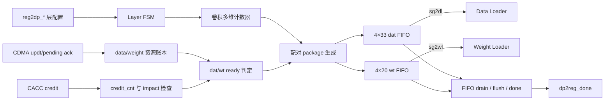
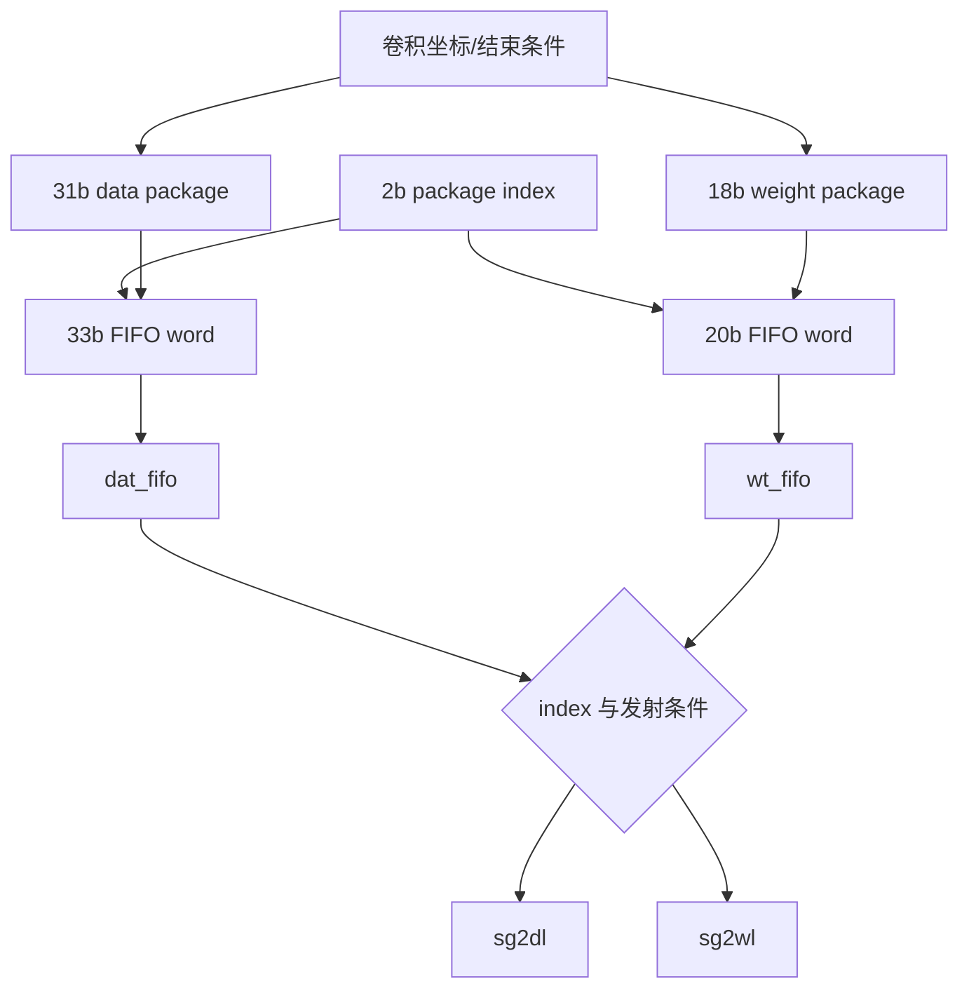

# NV_NVDLA_CSC_sg

源码：`vmod/nvdla/csc/NV_NVDLA_CSC_sg.v`

## 1. 模块定位

`NV_NVDLA_CSC_sg` 是 CSC 的 Sequence Generator。它不读取 CBUF 数据，而是把层配置、CDMA 资源账本和 CACC credit 转换成一串严格配对的 data/weight 操作包，分别交给 DL 和 WL 执行。

它是 CSC 的控制核心，负责：

- 层启动、pending、busy、done 生命周期；
- activation slice 与 weight kernel/entry 可用量记账；
- output、stripe、R/S、channel group、kernel group、batch 等循环；
- CACC credit 门控；
- 生成 `sg2dl_pd[30:0]` 和 `sg2wl_pd[17:0]`；
- 层结束后产生 `dp2reg_done`。

## 2. 架构图



两个 FIFO 中比外部 `pd` 多出的 2 bit 是 package index，用于保证 data/weight 配对关系。

## 3. 主状态机

```text
IDLE -> PEND -> BUSY -> DONE -> IDLE
  \--------------> BUSY
```

| 状态 | 进入条件 | 语义 |
| --- | --- | --- |
| `IDLE` | 复位或上一层完成 | 等待 `reg2dp_op_en` |
| `PEND` | `op_en && need_pending` | 请求 CDMA 对 data/weight 账本清账 |
| `BUSY` | 无需 pending，或 pending 完成 | 生成并发射操作包 |
| `DONE` | `layer_done && fifo_is_clear && !pkg_vld` | 等流水 flush，产生 `dp2reg_done` |

`need_pending` 由本层 bank 配置与 `last_data_bank/last_weight_bank` 比较得到。复位时 last bank 为非法保留值，因此首层通常进入 PEND。

## 4. pending 与资源账本

SG 同时管理两套生产者/消费者状态：

```text
CDMA updt  -> 增加 slices/kernels/entries available
SG issue   -> 消耗可用资源
DL/WL rls  -> sc2cdma_*_updt 归还已消费资源
```

主要启动门槛包括：

- data：可用 slice 至少覆盖输入高度需求；
- weight：可用 kernel/entry 至少覆盖当前 kernel group；
- output：CACC credit 足以容纳将要产生的输出影响量；
- 两个 package FIFO 均可写。

pending 请求有效期间，SG 会清空相应可用量。因而 testbench 或软件模型必须在 pending 请求撤销后再发送 `cdma2sc_*_updt`。

## 5. package 数据通路



data package 位域：

| 位 | 字段 |
| ---: | --- |
| `[4:0]` | `w_offset` |
| `[9:5]` | `h_offset` |
| `[16:10]` | `channel_size` |
| `[23:17]` | `stripe_length` |
| `[25:24]` | `cur_sub_h` |
| `[26]` | `block_end` |
| `[27]` | `channel_end` |
| `[28]` | `group_end` |
| `[29]` | `layer_end` |
| `[30]` | `dat_release` |

weight package 位域：

| 位 | 字段 |
| ---: | --- |
| `[6:0]` | `weight_size` |
| `[12:7]` | `kernel_size` |
| `[14:13]` | `cur_sub_h` |
| `[15]` | `channel_end` |
| `[16]` | `group_end` |
| `[17]` | `wt_release` |

两个 package 的 `channel_end/group_end` 来自同一组循环边界，保证 DL/WL 对同一计算拍准备匹配的操作数。

## 6. stripe 与 channel 推进

SG 把输出原子切成 stripe。stripe 长度受硬件吞吐和最大长度约束，data package 将本 stripe 的长度以及开始/结束信息交给 DL；DL 最终把它们压缩成 `sc2mac_dat_pd`。

C 方向存在多轮时，前几轮 `channel_end=0`，CACC 将结果写回 assembly buffer；最后一轮 `channel_end=1`，CACC 才将最终值送 delivery 路径。SG 因此决定了 CACC 是“继续累加”还是“结束当前输出”。

## 7. credit 门控

SG 的 credit 计数复位容量对应 CACC delivery buffer 的 slot 数。CACC/SDP 每完成一个输出 beat 的握手，就通过 `accu2sc_credit_vld/size` 返还 credit。

发射可能产生最终输出的 stripe 前，SG 估算 `dat_impact`：

- int16 通常每像素占 1 个 delivery beat；
- int8 通常每像素占 2 个 delivery beat。

credit 不足时暂停 package pop/issue。已经进入无反压流水的操作不会被中途撤回。

## 8. 层完成

层结束需要同时满足：

```text
最后一个卷积 package 已生成
+ data/weight FIFO 已清空
+ 没有待推入 package
+ 按 stripe 大小等待固定 flush 周期
```

随后 `dp2reg_done` 置位，使 regfile 清当前组 `op_en` 并翻转 consumer。

## 9. 断言与设计前提

源码包含大量几何合法性断言，覆盖：

- precision 和 conv mode 合法；
- Winograd 几何组合；
- stripe/channel/kernel 上限；
- R/S、batch、y-extension 组合；
- 原子数和计数器不溢出；
- FIFO 和资源账本不欠账。

这些断言反映软件必须遵守的配置合同，并不意味着 SG 会对非法配置进行恢复。

## 10. 阅读 RTL 的方法

1. 先看四态 FSM；
2. 看 `need_pending/pending_done`；
3. 看 data/weight 可用资源账本；
4. 找 `pkg_adv` 和各级循环计数器；
5. 看 `dat_pkg_pd/wt_pkg_pd` 的打包；
6. 看两个 FIFO 的联动 push/pop；
7. 最后看 credit 和 `dp2reg_done`。

不要从文件开头依次阅读全部断言和 testpoint；先建立 package 生成主线，再用断言补充边界。

## 11. 容易误解的点

1. `sg2dl_pvld/sg2wl_pvld` 是无 ready 的内部发射口；FIFO ready 在 SG 内部消化。
2. data/weight FIFO 必须成对写入，但可能根据 loader 条件分别取出；package index 用于保持对应关系。
3. CDMA update 是资源记账，不是 CBUF 数据返回。
4. `channel_end` 对 CACC 的意义大于对 CMAC：它决定当前部分和是否为最终轮。
5. `layer_done` 不等于立即 `dp2reg_done`，还要等待 FIFO 和流水清空。
