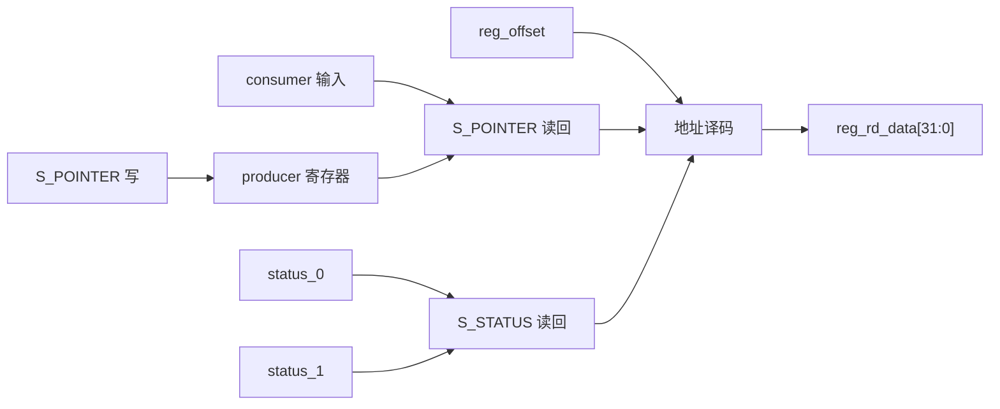

# NV_NVDLA_CSC_single_reg

源码：`vmod/nvdla/csc/NV_NVDLA_CSC_single_reg.v`

## 1. 模块定位

`NV_NVDLA_CSC_single_reg` 实现 CSC 不随 D0/D1 复制的 S 组寄存器。它只保存软件 producer 指针，并把 regfile 计算出的 consumer 和两组状态组织成读回数据。

## 2. 架构图



## 3. 寄存器

| offset | 名称 | 方向 | 作用 |
| ---: | --- | --- | --- |
| `0x000` | `S_STATUS` | 只读 | D0/D1 的状态 |
| `0x004` | `S_POINTER` | 读写/部分只读 | producer 可写，consumer 由硬件输入 |

`S_STATUS` 中每组状态通常编码为 idle、pending 或 running，具体值由上层 regfile 根据该组 `op_en` 与 consumer 关系产生。

## 4. producer 指针

软件在配置一层之前先选择 producer：

```text
producer=0 -> 后续 D 寄存器访问落到 D0
producer=1 -> 后续 D 寄存器访问落到 D1
```

consumer 不能由软件直接写，它由 `dp2reg_done` 驱动的硬件乒乓逻辑维护。

## 5. 数据通路特点

该模块没有卷积数据通路。唯一可写状态 `producer` 直接影响上层 regfile 的 D 组地址选择；`status_0/status_1/consumer` 仅参与读回拼装。

## 6. 容易误解的点

1. single 表示只有一份 S 组，不表示寄存器只有一个。
2. producer 可写，consumer 只读。
3. 修改 producer 不会启动层；真正提交配置的是目标 D 组的 `op_en`。
4. S_STATUS 是 regfile 提供的派生状态，不在本模块内独立运行状态机。
