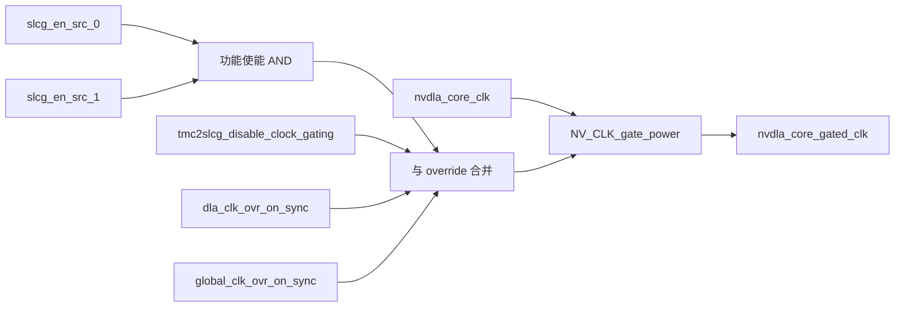

# NV_NVDLA_CSC_slcg

源码：`vmod/nvdla/csc/NV_NVDLA_CSC_slcg.v`

## 1. 模块定位

`NV_NVDLA_CSC_slcg` 是 CSC 使用的时钟门控包装器。顶层实例化4份，为普通操作流水和 Winograd/PRA 路径分别产生 gated clock。

它不处理卷积数据，只根据操作使能、测试使能和全局 override 决定是否让核心时钟通过。

## 2. 架构图



## 3. 接口

```verilog
slcg_en_src_0
slcg_en_src_1
dla_clk_ovr_on_sync
global_clk_ovr_on_sync
tmc2slcg_disable_clock_gating
nvdla_core_clk
nvdla_core_rstn
nvdla_core_gated_clk
```

两路 source enable 在模块内做逻辑与。普通 `op_0/1/2` 实例把 `src_1` 接常数1，因此只由对应 `slcg_op_en` 控制；Winograd 实例把 `src_1` 接 `slcg_wg_en`，只有整层操作有效且 Winograd 局部路径需要工作时才开钟。

## 4. 门控规则

功能上可概括为：

```text
gate_enable = (src0 && src1)
              || dla_override
              || global_override
              || disable_clock_gating_for_test
```

正常功能模式下 override/test 信号为0，时钟仅在对应 CSC 操作活跃时打开。任一 override 置位都会强制时钟通过，便于 DFT、仿真调试或全局时钟控制。

## 5. 顶层使用

CSC 顶层实例包括：

- `u_slcg_op_0`
- `u_slcg_op_1`
- `u_slcg_op_2`
- `u_slcg_wg`

`op_*` 为普通 SG/DL/WL 各段流水提供门控时钟；`wg` 只在 Winograd/PRA 路径活动时启用，以降低 direct convolution 下的无效翻转。

## 6. 设计注意

SLCG 的使能通常由 regfile 提前打开并延后关闭。验证功能数据通路时可将 override 保持0；若强制 disable gating，功能结果应不变，只改变功耗相关时钟活动。

## 7. 容易误解的点

1. SLCG 不会暂停或恢复协议事务，它只在上层保证安全边界后关时钟。
2. `tmc2slcg_disable_clock_gating=1` 的含义是禁用门控，即强制开钟。
3. Winograd 有独立 gated clock，DC 模式下该时钟静止是正常现象。
4. 调试“模块没有翻转”时，需同时检查 `op_en/slcg_op_en` 与 override，而不只看数据 valid。
