# NV_NVDLA_CSC_wl

源码：`vmod/nvdla/csc/NV_NVDLA_CSC_wl.v`

## 1. 模块定位

`NV_NVDLA_CSC_wl` 是 CSC 的 Weight Loader。它把 SG 的 weight package 展开成一串 kernel 权重装载拍，从 CBUF weight 区取得权重；压缩模式下再从固定 bank15 取得 WMB，恢复稀疏权重的原始位置，最后通过 one-hot `sel[15:0]` 把权重装入 CMAC_A/B 的物理 kernel lane。

WL 不与 activation 在 CSC 内做逐拍握手。它更像 CMAC 权重状态的生产者：

```text
WL 先用 weight + mask + sel 更新某个 CMAC lane
DL 随后广播 activation，并用 pd 推进一次计算
同一组 weight 可以被 stripe 内多个 activation 位置复用
```

## 2. 总体架构

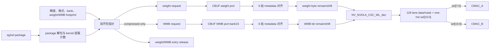

WL 内部实际维护两种不同单位的库存：

- WMB 路按 bit/原始 weight 位置计数；
- weight 路按 byte/非零值计数。

压缩率不同会让两条流以不同速度消耗，所以不能把它们视为一一对应的成对 CBUF 读取。

## 3. 主要接口

### 3.1 SG weight package

```verilog
sg2wl_pvld
sg2wl_pd[17:0]
sg2wl_reuse_rls
sc_state[1:0]
```

位域：

| 位 | 字段 | WL 中的作用 |
| ---: | --- | --- |
| `[6:0]` | `weight_size` | 当前原始位置范围 |
| `[12:7]` | `kernel_size` | 本 package 的逻辑 kernel 数 |
| `[14:13]` | `cur_sub_h` | 子高/Winograd 位置 |
| `[15]` | `channel_end` | 最终 channel round 边界 |
| `[16]` | `group_end` | kernel/操作组结束 |
| `[17]` | `wt_release` | 允许归还 weight 资源 |

weight package 不携带 output x 或 stripe length。WL 根据 `kernel_size`、精度和内部 `stripe_cnt` 决定要产生多少个物理 weight 装载拍。

### 3.2 CBUF 接口

```verilog
sc2buf_wt_rd_en
sc2buf_wt_rd_addr[11:0]
sc2buf_wt_rd_valid
sc2buf_wt_rd_data[1023:0]

sc2buf_wmb_rd_en
sc2buf_wmb_rd_addr[7:0]
sc2buf_wmb_rd_valid
sc2buf_wmb_rd_data[1023:0]
```

weight 地址包含 bank 与 entry；WMB 地址只有 8-bit entry，因为 CBUF 把 WMB 读口固定映射到 bank15。两条请求均无 ready，返回固定晚 6 拍。

### 3.3 CMAC weight 输出

A/B 每路均包含：

```verilog
sc2mac_wt_{a,b}_pvld
sc2mac_wt_{a,b}_mask[127:0]
sc2mac_wt_{a,b}_data0...data127  // 128×8 bit
sc2mac_wt_{a,b}_sel[7:0]
```

`sel` 选择要更新的物理 kernel lane，`mask` 选择该 lane 内哪些乘法位置有效。二者不是同一维度。

## 4. Layer 配置与环形地址空间

layer start 时 WL 锁存：

- `data_bank + 1`：weight 区起始 bank；
- `weight_bank + 1`：weight 区容量；
- `weight_bytes`：weight footprint；
- `wmb_bytes`：压缩模式的 WMB footprint；
- `weight_format`：compressed/uncompressed；
- INT8/INT16/FP16 精度；
- Winograd/y-extension 相关子高组织。

CBUF 的逻辑分区是：

```text
低地址若干 bank       -> data
data bank 之后的 bank -> weight
bank15                 -> WMB 固定读口映射
```

weight 与 WMB 各有独立的环形起始指针、当前指针、last 指针和 release 计数。相同 bank 配置的连续层不会无条件回到区域起点；双方依靠 CDMA/CSC 资源账本保持一致。

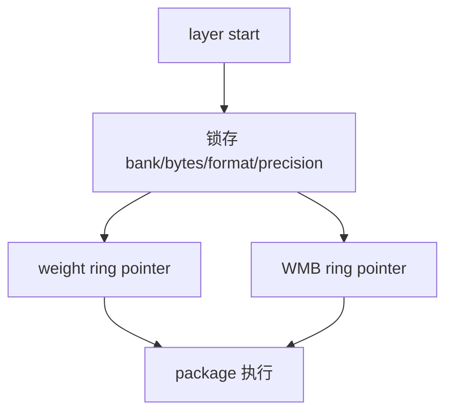

`data_bank` 或 `weight_bank` 写成 `4'hf` 会在 `+1` 运算中产生进位。源码中的 bank overflow 断言是纯组合的，不受 `op_en` 门控；软件应始终保持合法 bank 分配。

## 5. Package 如何展开成 kernel 装载拍

WL 用 `stripe_cnt` 追踪当前 package 已经生成了几个物理 weight beat。需要的拍数为：

```text
INT8:       stripe_length = ceil(kernel_size / 2)
INT16/FP16: stripe_length = kernel_size
```

这来自 CMAC 的物理复用方式：一个物理 MAC lane 在 INT8 下同时提供两条 8-bit 乘加结果路径，而在 INT16/FP16 下只表示一个逻辑 kernel 结果。

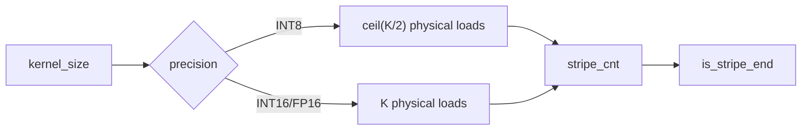

因此 INT8 一个物理 weight beat 的典型组织是：

```text
data[511:0]    = logical kernel 2n 的 64×INT8 weight
data[1023:512] = logical kernel 2n+1 的 64×INT8 weight
sel[n]         = 把这对权重装入物理 lane n
```

DL 在 Direct INT8 下会把同一组 64 个 activation 复制到两个 512-bit half，于是物理 lane 可同时算两个逻辑 kernel。若逻辑 kernel 数为奇数，最后一个 beat 的另一 half 由 mask 关闭。

INT16/FP16 下一个 1024-bit beat 表示 64×16-bit weight，对应一个逻辑 kernel。

## 6. 非压缩 weight 数据通路

### 6.1 请求生成

非压缩模式中，原始位置与 CBUF weight byte 一一对应。WL 根据 package、当前 kernel 装载拍和精度计算：

- 本拍需要的 weight bytes；
- 128-bit 原始位置 mask；
- 是否跨 1024-bit entry；
- 当前环形地址是否应递增或 wrap；
- stripe/channel/group/release 边界。

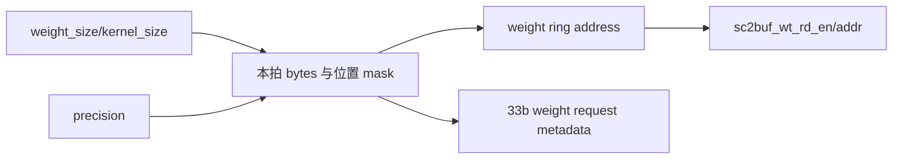

如果当前 `wt_rsp_byte_remain` 已足够形成下一拍，WL 可直接消耗本地剩余 weight，不需要再读 CBUF。只有剩余 byte 不足时才发新请求。

### 6.2 33-bit weight request metadata

`wt_req_pipe_pd[32:0]` 与 weight 请求同步经过 6 级流水：

| 位 | 字段 | 作用 |
| ---: | --- | --- |
| `[7:0]` | `bytes` | 本拍需要消费的 weight byte 数 |
| `[16:8]` | `wmb_rls_entries` | 对齐到该拍的 WMB 释放数 |
| `[28:17]` | `wt_rls_entries` | weight 释放 entry 数 |
| `[29]` | `stripe_end` | 当前 kernel 装载序列结束 |
| `[30]` | `channel_end` | channel round 边界 |
| `[31]` | `group_end` | 操作组边界 |
| `[32]` | `rls` | 释放触发 |

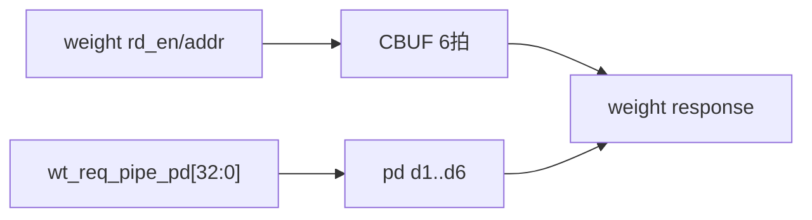

### 6.3 返回、byte remain 与跨 entry 拼接

每个有效 CBUF weight response 增加 128 bytes 可用量。当前输出拍消费 `wt_rsp_bytes`，剩余量由 `wt_rsp_byte_remain` 保存。

概念公式：

```text
byte_remain_next
  = byte_remain_old
  + (rd_valid ? 128 : 0)
  - current_output_bytes
```

数据同时按旧剩余量移位：

```text
旧 remain 的尾部 + 新 entry 的头部
  -> wt_data_input_sft[1023:0]
  -> 当前 decoder 输入
```

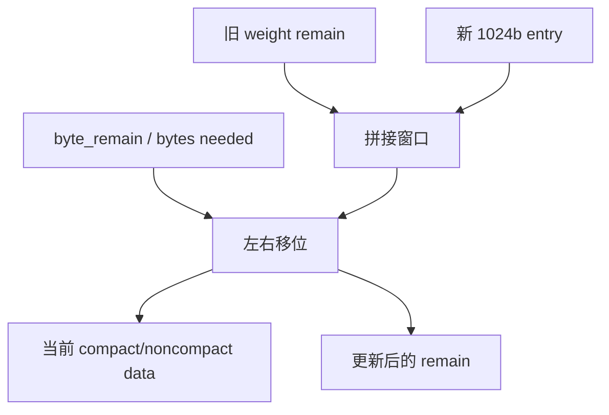

非压缩时 decoder mask 通常是连续 mask；压缩时相同 weight byte 流要由 WMB 前缀位置重新分散。

## 7. 压缩 weight 与 WMB 双流

### 7.1 两种存储语义

压缩模式把原始权重序列拆成：

```text
WMB bit stream:
    原始位置 i 是否非零

compact weight byte stream:
    仅按顺序保存 WMB=1 的值
```

例如：

```text
原始 weight : [5, 0, -2, 0, 0, 7]
WMB         : [1, 0,  1, 0, 0, 1]
compact data: [5, -2, 7]
```

WL 必须先取得足够 WMB，才能知道当前 128 个原始位置需要从 compact stream 消耗多少 weight bytes。

### 7.2 WMB 按需请求

`wmb_element_avl` 表示本地已经缓存、尚未消费的 WMB 原始位置数：

```text
每次 WMB rd_valid：增加 1024 个 mask bit
每个物理 kernel beat：减去 wmb_req_element
```

只有：

```text
compressed && wmb_element_avl < 本拍所需原始位置数
```

才发出新的 `sc2buf_wmb_rd_en`。

本拍所需位置数还受以下因素影响：

- `weight_size`；
- INT8 是否一次装两个逻辑 kernel；
- `cur_sub_h`/y-extension 或 Winograd 子高倍数。

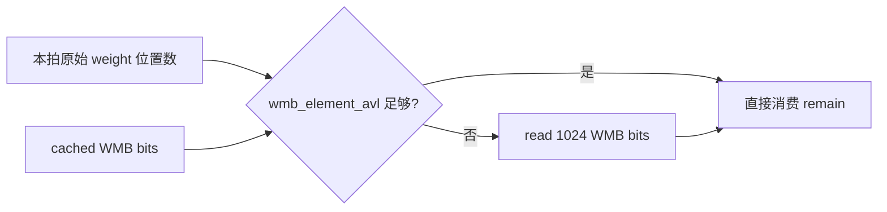

### 7.3 31-bit WMB request metadata

`wmb_req_pipe_pd[30:0]` 的精确位域：

| 位 | 字段 | 作用 |
| ---: | --- | --- |
| `[6:0]` | `ori_element` | 原始基础 weight 位置数 |
| `[14:7]` | `element` | 考虑 dual/sub_h 后实际消耗的 WMB bit 数 |
| `[23:15]` | `rls_entries` | WMB release entry 数 |
| `[24]` | `stripe_end` | kernel 装载序列结束 |
| `[25]` | `channel_end` | channel round 边界 |
| `[26]` | `group_end` | 操作组边界 |
| `[27]` | `rls` | release 标志 |
| `[28]` | `dual` | INT8 双 kernel 组织 |
| `[30:29]` | `cur_sub_h` | 子高位置 |

它与 WMB 请求一起延迟 6 拍，返回后恢复本次 WMB 应怎样切片、是否双 kernel、以及边界释放信息。

### 7.4 WMB bit remain 与当前 128-lane mask

WMB response 到达后，WL 使用：

- `wmb_rsp_bit_remain`：还剩多少可用 bit；
- `wmb_emask_remain`：尚未消费的 1024-bit mask 窗口；
- 左右移位结果：拼接跨 WMB entry 的当前位置 mask。

形成当前 `wmb_rsp_emask[127:0]` 或更宽的中间窗口。

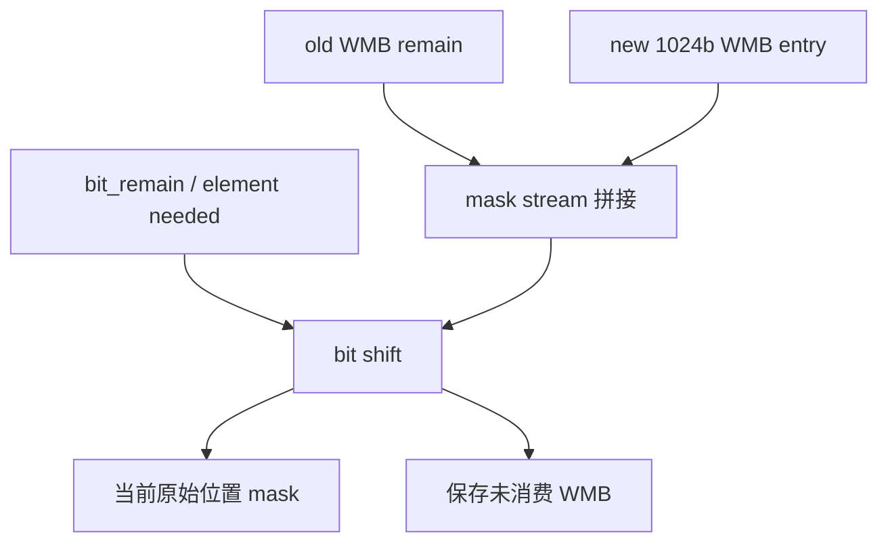

### 7.5 WMB 决定 compact weight 消耗量

当前原始位置 mask 中 1 的个数决定需要多少 compact weights：

```text
compact_bytes_needed = popcount(current_WMB_window)
```

INT16/FP16 的每个逻辑元素占两个 byte，RTL 会结合精度与位置 mask 形成正确 byte mask。若 compact weight remain 不足，再发 weight CBUF 请求；因此 WMB 和 weight 两个 request stream 可以相隔多拍。

## 8. `NV_NVDLA_CSC_WL_dec` 解压

WL 在 decoder 前准备：

```verilog
dec_input_data[1023:0]
dec_input_mask[127:0]
dec_input_sel[15:0]
dec_input_pipe_valid
```

`dec_input_mask` 在非压缩模式是连续有效位置 mask，在压缩模式是 WMB 恢复出的原始位置 mask。

decoder 对每个输出位置 `i` 的抽象操作为：

```text
if mask[i] == 0:
    output_mask[i] = 0
else:
    compact_index = popcount(mask[0:i]) - 1
    output_data[i] = compact_data[compact_index]
    output_mask[i] = 1
```

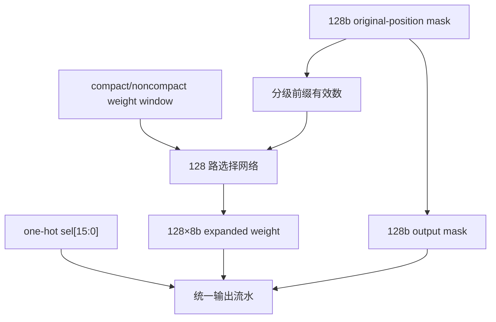

RTL 使用并行前缀与多级 mux，而不是串行执行 popcount。非压缩模式也经过 `u_dec`，以统一数据、mask、sel 和 valid 的输出延迟。

## 9. one-hot `sel` 如何轮转

WL 的物理 lane select 复位/序列起点为：

```text
wt_rsp_sel_d1 = 16'h0001
```

每完成一个物理 weight beat，one-hot 向下一位轮转；上一序列的 `stripe_end` 会让下一序列重新从 bit0 开始。RTL 有 one-hot 断言保护。

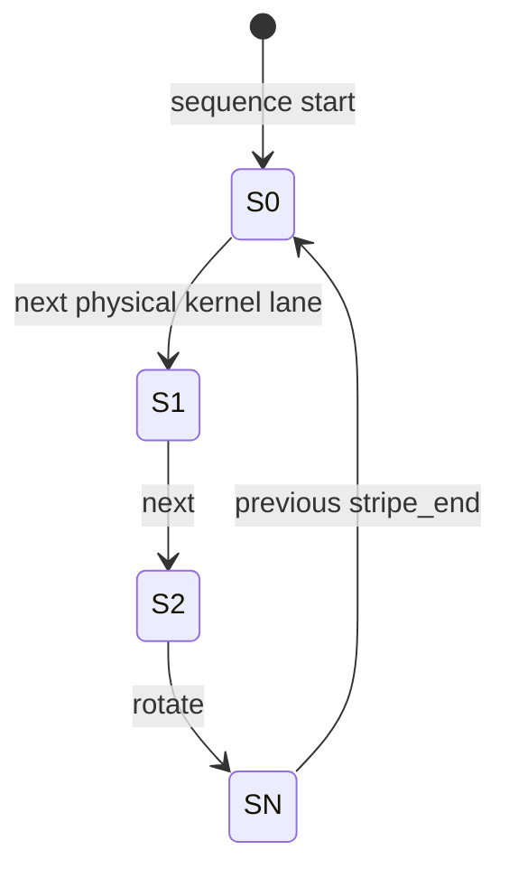

精度对应关系：

| 精度 | `sel[n]` 的逻辑意义 |
| --- | --- |
| INT8 | 物理 lane n，通常同时装入逻辑 kernel `2n` 和 `2n+1` 两组 weight |
| INT16/FP16 | 物理 lane n，装入逻辑 kernel `n` 的一组 weight |

所以不能简单把 `sel[0]` 永远解释成“只选择逻辑 kernel0”；INT8 下它选择的是承载 kernel pair 的物理 lane0。

## 10. CMAC_A/B 分发

`u_dec` 输出一份共享的：

```text
sc2mac_out_data[0:127]
sc2mac_out_mask[127:0]
sc2mac_out_sel[15:0]
sc2mac_out_pvld
```

WL 再拆分：

```text
a_sel = pvld ? sel[7:0]  : 0
b_sel = pvld ? sel[15:8] : 0
a_pvld = |a_sel
b_pvld = |b_sel
```

两侧 mask 也分别由各自 `pvld` 门控。

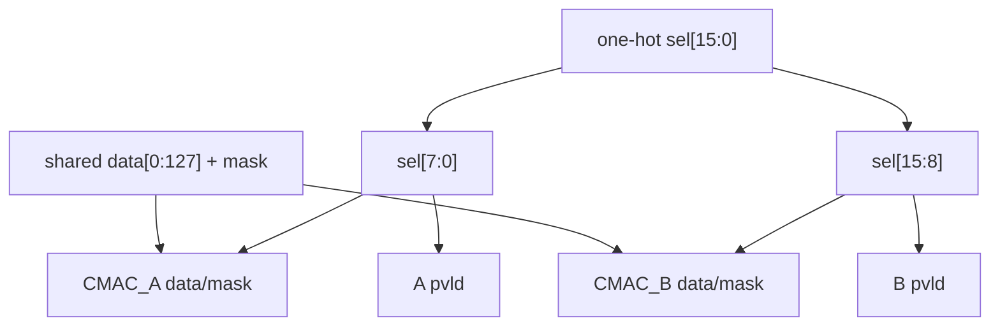

逻辑 kernel 覆盖关系为：

| 精度 | CMAC_A 物理8 lane | CMAC_B 物理8 lane |
| --- | --- | --- |
| INT8 | 通常承载逻辑 kernel 0～15 | 通常承载逻辑 kernel 16～31 |
| INT16/FP16 | 逻辑 kernel 0～7 | 逻辑 kernel 8～15 |

这里说“通常”是相对当前 kernel group 的局部编号；全层更高的 kernel 编号由 SG 分组后重复使用同一物理阵列。

## 11. WL 与 DL 的时间关系

weight 输出与 activation 输出没有共同 ready，也不要求同拍：

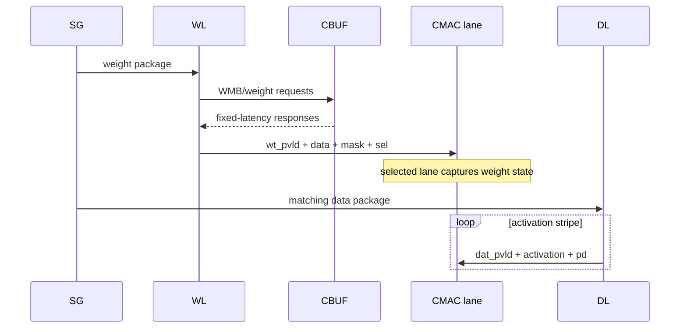

SG 的 data/weight package index 和 pop 条件保证两条 loader 不会越过逻辑配对边界；CMAC 的 weight active 状态则允许“先装 weight、后连续送 data”的复用时序。

## 12. Weight/WMB 资源释放

WL 统计已经安全离开复用窗口的 CBUF entry。package `wt_release`、局部 group/channel 边界或 `sg2wl_reuse_rls` 触发：

```verilog
sc2cdma_wt_updt
sc2cdma_wt_entries[11:0]
sc2cdma_wmb_entries[8:0]
sc2cdma_wt_kernels[13:0] = 0
```

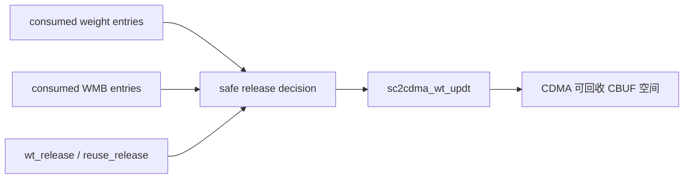

`sc2cdma_wt_kernels` 在 RTL 中硬连为 0，是归还方向的无效字段；实际释放依靠 weight/WMB entry 数。读过一个 entry 不等于立即释放，因为 weight 可能跨 activation stripe 或 channel round 复用。

## 13. 固定延迟与无反压

WL 不能反压 CBUF response，也收不到 CMAC ready。安全性依赖：

1. SG 只在 `kernels_avl/entries_avl` 足够时发 package；
2. weight/WMB 请求前检查本地 remain 是否不足；
3. 请求 metadata 与固定 6 拍返回严格对齐；
4. CMAC 已在 CSC 前 `op_en`，可以捕获所有 weight beat；
5. package index 保证 DL/WL 不跨越配对关系。

一旦请求进入 CBUF 流水，就不能通过停住 WL 来重新排序。

## 14. 建议沿 RTL 阅读的信号链

非压缩主路径：

```text
sg2wl_pd
-> wl_pd / wl_weight_size / wl_kernel_size
-> stripe_cnt / is_stripe_end
-> wt_req_valid / wt_req_addr_out
-> wt_req_pipe_pd
-> wt_rsp_pipe_pd_d0..d6
-> wt_rsp_byte_remain / wt_data_input_sft
-> dec_input_data/mask/sel
-> u_dec
-> sc2mac_out_*
-> sc2mac_wt_a/b_*
```

压缩路径再加入：

```text
wmb_element_avl / wmb_req_element
-> wmb_req_valid / wmb_req_addr
-> wmb_req_pipe_pd
-> wmb_rsp_pipe_pd_d0..d6
-> wmb_rsp_bit_remain / wmb_emask_remain
-> wmb_rsp_emask
-> wt_req_emask / dec_input_mask
```

释放路径：

```text
wt_rsp_rls / stripe_end / group_end
-> wt_rls_cnt
-> wt_rls_wt_entries / wt_rls_wmb_entries
-> sc2cdma_wt_updt
```

## 15. 容易误解的点

1. 一个 weight package 会展开成多个物理 lane 装载拍。
2. INT8 一个物理 lane 通常承载两个逻辑 kernel；INT16/FP16 才是一 lane 对一个逻辑 kernel。
3. `sel` 是物理 kernel lane 维度，mask 是 lane 内乘法位置维度。
4. A/B weight 数据来自同一 decoder，不是两条独立 CBUF weight 流。
5. 压缩模式下 WMB 与 compact weight 按不同单位计数，请求不要求同拍或一一对应。
6. 每个 WMB response 增加 1024 个位置 bit；每个 weight response 增加 128 bytes。
7. 非压缩模式也经过 `WL_dec`，不能把 decoder 等同于“只在压缩时启用”。
8. `wt_rsp_sel_d1` 是轮转 one-hot，序列结束后回到 bit0。
9. `sc2cdma_wt_kernels` 恒为 0，不能用于统计释放 kernel 数。
10. CBUF 指针跨同 bank 连续层环形推进，不是每层自动回零。
