# NV_NVDLA_csc

源码：`vmod/nvdla/csc/NV_NVDLA_csc.v`

## 1. 模块定位

`NV_NVDLA_csc` 是 CSC（Convolution Sequence Controller）的顶层模块。它位于 CBUF 与两组 CMAC 之间，按照卷积几何和 CACC 可用信用产生逐拍计算顺序，从 CBUF 读取 activation、weight 和压缩权重的 WMB，并组织成 CMAC 可直接消费的 128-lane 操作数。

CSC 不执行乘法或累加。它完成的是三类工作：

1. 通过 CSB 接收并乒乓保存层配置；
2. 生成 stripe、channel group、kernel group 的执行序列；
3. 将 CBUF 中的数据重排、解压、加 mask 后送给 CMAC_A/CMAC_B。

系统位置如下：

```text
CDMA 生产并记账 -> CBUF 保存 -> CSC 调度、读取和重排 -> CMAC_A/B 乘加 -> CACC 累加
```

## 2. 总体架构

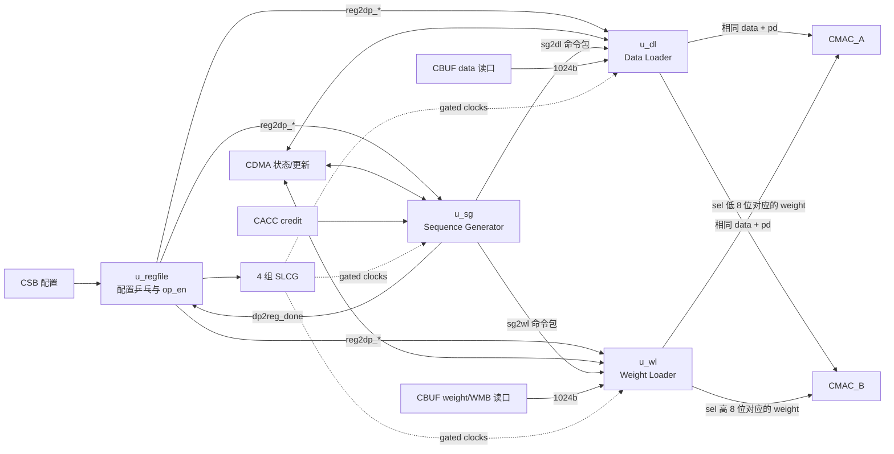

顶层主要实例为：

| 实例 | 模块 | 职责 |
| --- | --- | --- |
| `u_regfile` | `NV_NVDLA_CSC_regfile` | CSB 终点、双配置组、consumer/producer 管理 |
| `u_sg` | `NV_NVDLA_CSC_sg` | 层状态机、资源就绪、卷积循环、操作包生成 |
| `u_dl` | `NV_NVDLA_CSC_dl` | activation 地址生成、CBUF 读取、重排和双路广播 |
| `u_wl` | `NV_NVDLA_CSC_wl` | weight/WMB 地址生成、解压、kernel 半阵列选择 |
| `u_slcg_*` | `NV_NVDLA_CSC_slcg` | 分区时钟门控 |

## 3. 外部接口

### 3.1 CSB 配置接口

```verilog
csb2csc_req_pvld
csb2csc_req_prdy
csb2csc_req_pd[62:0]
csc2csb_resp_valid
csc2csb_resp_pd[33:0]
```

CSC 的寄存器地址块为 `0x6000`。请求 `prdy` 恒为 1，读写响应由 `u_regfile` 产生。

### 3.2 与 CDMA 的状态接口

data 侧：

```verilog
cdma2sc_dat_updt/entries[11:0]/slices[11:0]
sc2cdma_dat_updt/entries[11:0]/slices[11:0]
sc2cdma_dat_pending_req
cdma2sc_dat_pending_ack
```

weight 侧：

```verilog
cdma2sc_wt_updt/kernels[13:0]/entries[11:0]
cdma2sc_wmb_entries[8:0]
sc2cdma_wt_updt/kernels[13:0]/entries[11:0]
sc2cdma_wmb_entries[8:0]
sc2cdma_wt_pending_req
cdma2sc_wt_pending_ack
```

这些信号表示 CBUF 中可用资源的增减，不承载 activation 或 weight 数据。`sc2cdma_wt_kernels` 在 RTL 中恒为 0；有效的释放记账主要使用 entry 数。

### 3.3 CBUF 三条读接口

| 通道 | 请求 | 返回 | 说明 |
| --- | --- | --- | --- |
| data | `rd_en + addr[11:0]` | `valid + data[1023:0]` | activation entry |
| weight | `rd_en + addr[11:0]` | `valid + data[1023:0]` | weight entry |
| WMB | `rd_en + addr[7:0]` | `valid + data[1023:0]` | 压缩权重 mask，固定 bank15 |

CBUF 没有 ready，且返回延迟固定为 6 拍。DL/WL 必须提前生成合法请求并保存与返回数据配套的控制信息。

### 3.4 到 CMAC 的操作数接口

data A/B 每路包含：

```verilog
pvld
mask[127:0]
data0 ... data127    // 每项 8 bit
pd[8:0]
```

weight A/B 每路包含：

```verilog
pvld
mask[127:0]
data0 ... data127    // 每项 8 bit
sel[7:0]
```

data A/B 的内容、mask、valid 和 `pd` 完全相同。weight 数据同源，但 16-bit kernel select 被拆分：

```text
sel[7:0]  -> CMAC_A 的 8 个 kernel lane
sel[15:8] -> CMAC_B 的 8 个 kernel lane
```

### 3.5 CACC credit

```verilog
accu2sc_credit_vld
accu2sc_credit_size[2:0]
```

SG 维护下游可用 credit。没有足够 credit 时，新的 channel-end stripe 不再发出，从而在 CACC/SDP 出口背压时让整条无 ready 的计算流水安全停住。

## 4. 控制通路

CSC 的控制主线为：

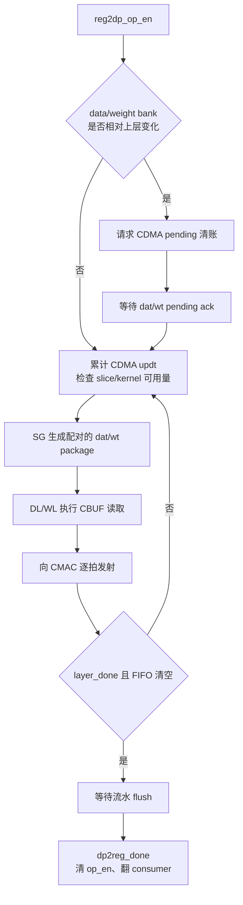

每层的正常启动约定为先使能下游：

```text
CACC op_en -> CMAC_B op_en -> CMAC_A op_en -> CSC op_en
```

首层通常因为 bank 配置与复位保存值不同而进入 pending。pending 请求撤销前不能发送 CDMA update；SG 在 pending 期间会清空资源账本，过早到达的 update 会被丢弃。

## 5. 数据通路

CSC 的数据通路不是“从 CBUF 取出一拍 data 和一拍 weight，然后直接一起送给 CMAC”这么简单。它实际上由三条相互配合的路径构成：

1. **命令路径**：SG 把卷积坐标变成 data/weight package；
2. **操作数路径**：DL、WL 根据 package 读取 CBUF，进行重排或解压；
3. **metadata 路径**：mask、kernel select、stripe/channel/layer 边界与操作数一起对齐到 CMAC。

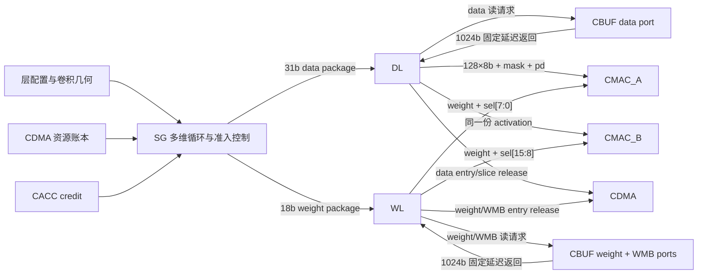

### 5.1 一个 package 表示什么

SG 不是为每一次 CBUF 读取产生一条完整命令，而是产生较高层次的操作包。DL/WL 接收一个 package 后，会在内部展开成若干拍地址、返回处理和 CMAC 输出。

data package：

| 字段 | 作用于数据通路 |
| --- | --- |
| `w_offset/h_offset` | 当前卷积窗口相对输入 feature 的位置 |
| `channel_size` | 本轮需要读取、送入 CMAC 的 channel 范围 |
| `stripe_length` | 本次连续产生多少个输出位置 |
| `cur_sub_h` | Winograd 或 y-extension 下的子行位置 |
| `block_end` | 局部数据块结束 |
| `channel_end` | 当前输出的 C 方向累加是否完成 |
| `group_end/layer_end` | kernel group 或整层边界 |
| `dat_release` | 这批 data 是否可归还给 CDMA |

weight package：

| 字段 | 作用于数据通路 |
| --- | --- |
| `weight_size` | 当前需要展开的权重元素范围 |
| `kernel_size` | 当前 kernel group 中的 kernel 数 |
| `cur_sub_h` | 与 data package 对应的 filter/子行位置 |
| `channel_end/group_end` | 与 data 路保持同一卷积层级边界 |
| `wt_release` | weight/WMB entry 是否可归还 |

SG 写入两个深度为 4 的 package FIFO，并额外附带 2-bit package index。index 用来约束两个 FIFO 的弹出顺序：允许 data 或 weight 因复用而单独前进，但不允许 DL 和 WL 跨过彼此、组合成错误的操作数对。

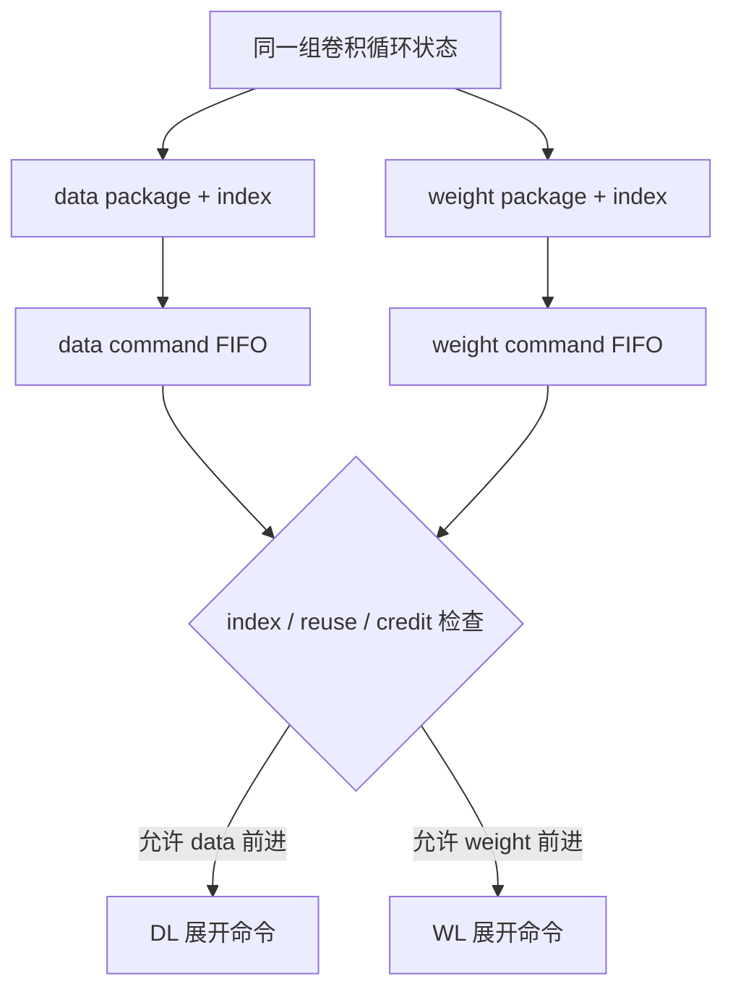

这里的“配对”是卷积语义上的配对，不表示 `sc2mac_dat_pvld` 和 `sc2mac_wt_pvld` 必须同拍出现。CMAC 能保存由 `sel` 更新的权重，因此常见情况是 WL 先装入一组 kernel 权重，随后 DL 连续发送一个 stripe 的多拍 activation，复用这组权重。

### 5.2 activation：从卷积坐标到 CBUF 请求

DL 收到 data package 后，先锁存 stripe 的起始坐标与边界，再用内部计数器展开：

```text
package 的 w/h offset、channel size、stripe length
  -> 当前 output x / batch / sub-height
  -> 映射到 input x/y/channel
  -> 判断真实数据、padding 或内部 dummy
  -> 计算 CBUF bank + entry 地址
  -> 产生 sc2buf_dat_rd_en/addr
```

CBUF data 地址为：

```text
addr[11:8] = data bank
addr[7:0]  = bank 内 entry
```

实际地址还要考虑：

- `entries_per_slice` 和当前 slice；
- channel/byte 在 1024-bit entry 中的偏移；
- CBUF data 区的环形起点；
- Direct、image/pixel 和 Winograd 不同的坐标推进方式；
- stride、dilation/y-extension 造成的窗口位置变化。

并不是每一个 CMAC 输出 beat 都必然触发一次 CBUF 读取。若下一个窗口需要的数据仍在 DL 的移位、拼接或行缓存寄存器中，DL 可以复用已经返回的 entry；只有地址改变或模式要求强制 fetch 时才再次拉高 `sc2buf_dat_rd_en`。

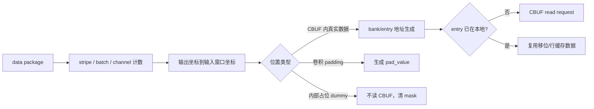

### 5.3 activation：固定延迟返回与控制对齐

CBUF 没有 request ready。请求一旦发出，1024-bit entry 在固定 6 拍后随 `sc2buf_dat_rd_valid` 返回。DL 在发请求的同一拍生成一份 request metadata，其中至少需要保留这次访问对应的：

- 坐标和 byte/channel offset；
- 数据来自真实 CBUF、padding 还是 dummy；
- 精度和数据格式选择；
- stripe start/end、channel end、layer end；
- 输出 lane mask 所需的边界信息。

metadata 通过 `dat_req_pipe_pd -> dat_rsp_pipe_pd` 与 CBUF 延迟同步。当 `rd_valid` 到达时，DL 才知道这 1024 bit 应该放入哪一个局部片段，以及随后应当怎样移位和拼接。

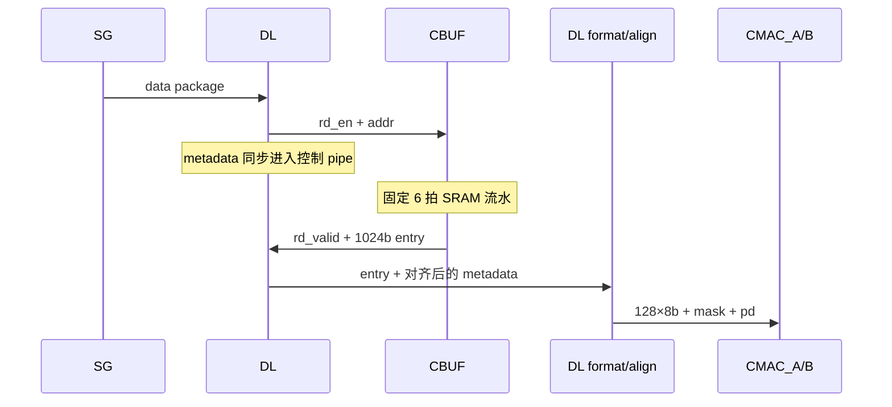

这也是为什么不能只追 `sc2buf_dat_rd_data`：空闲拍数据总线可以保留旧值，必须同时追 `rd_valid` 和对应的 `dat_rsp_pipe_pd`。

### 5.4 activation：移位、拼接、padding 与 mask

CBUF 的自然粒度是一个 1024-bit entry，但 CMAC 需要的是“当前卷积拍的 128 个 byte lane”。两者宽度相同，语义却不一定直接对齐。例如当前 channel 起点可能位于 entry 中间，所需 128 bytes 可能跨越相邻 entry。

DL 因而需要完成：

```text
当前 entry + 已保存的相邻 entry/剩余片段
  -> 按 byte/channel offset 左右移位
  -> 跨 entry 拼接
  -> 选择当前窗口需要的 128 bytes
  -> 根据真实 channel、边界和精度形成 128-bit mask
```

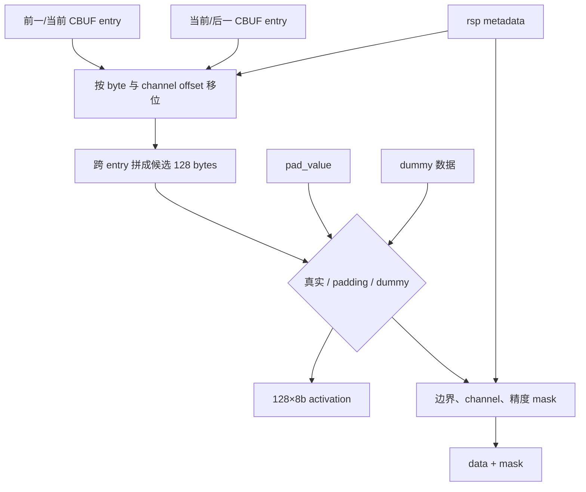

三类位置必须区分：

- **真实数据**：使用 CBUF 返回值，对真实 channel 置 mask；
- **卷积 padding**：使用寄存器配置的 `pad_value` 参与计算；
- **内部 dummy**：只是为了保持硬件循环或阵列对齐，数据可为任意占位值，但对应 mask 必须清零。

mask 才决定 lane 是否参与 CMAC 运算，不能只根据输出 data 是否为零判断有效性。Direct INT8 下，DL 把64个 activation复制到上下两个64-byte half，供物理 MAC lane 对两组 kernel权重并行计算；INT16/FP16 下相邻两个 byte 组成一个16-bit元素。

### 5.5 Direct feature、image/pixel 与 Winograd 分支

DL 的地址和格式路径随输入格式及卷积模式分支。

| 路径 | 地址/重排重点 | 进入 CMAC 前的额外处理 |
| --- | --- | --- |
| Direct + feature | 按 slice、channel、window 坐标读取 | byte 对齐、跨 entry 拼接、padding/mask |
| Direct + image/pixel | 按 pixel 宽度、channel packing、byte stride 读取 | 处理像素行布局、channel odd/even 与 padding |
| Winograd | 按 Winograd tile/sub-height 读取 | 4 路 PRA pre-addition transform |

Winograd 下，DL 将整理后的 1024-bit activation 分为四个 256-bit 分组，送入四个 `NV_NVDLA_CSC_pra_cell`。PRA 对输入 tile 做进入乘法阵列前的加减变换，再重新组合成 128×8-bit 物理接口。

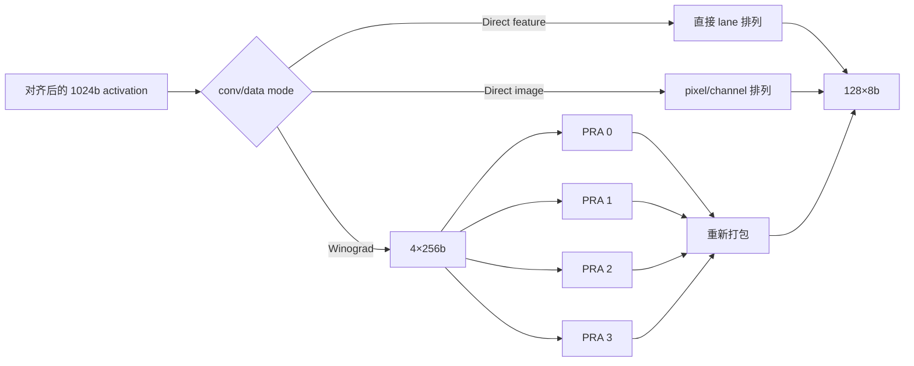

PRA 改变的是送入 CMAC 的数值组合，不改变外部 lane 总宽度。普通 Direct Convolution 不经过 PRA。

### 5.6 activation 输出的 `pd`

DL 在每个有效 activation beat 上生成 `sc2mac_dat_pd[8:0]`：

| 位 | 含义 | 下游用途 |
| ---: | --- | --- |
| `[4:0]` | batch index | CACC 选择 batch 累加上下文 |
| `[5]` | stripe start | CMAC/下游建立一个 stripe 的开始状态 |
| `[6]` | stripe end | 结束当前 stripe |
| `[7]` | channel end | CACC 判断本拍是否完成 C 方向最终累加 |
| `[8]` | layer end | 标记整层最后一个输出序列 |

```text
SG package 的 stripe_length / 边界字段
  -> DL 在 stripe 内逐拍展开
  -> 第一拍置 stripe_start
  -> 最后一拍置 stripe_end
  -> 最终 C 轮附带 channel_end
  -> 整层最后一拍附带 layer_end
```

`pd` 只属于 activation 路，因为 activation beat 是一次 CMAC 计算推进的时间基准。weight 路不携带 `pd`，而是通过 `sel` 更新 CMAC 内的 kernel 权重状态。

### 5.7 非压缩 weight 路径

WL 收到 weight package 后，根据 weight 区起始 bank、环形 entry 指针、精度、kernel 数和 weight size 产生 CBUF 请求：

```text
weight package
  -> 当前 kernel/channel/filter 位置
  -> weight 环形 entry 地址
  -> sc2buf_wt_rd_en/addr
  -> 固定 6 拍返回 1024b
  -> shift/拼接为当前128个原始位置
  -> 连续有效 mask
  -> WL_dec 统一输出流水
```

非压缩权重在 CBUF 中按原始位置连续保存，因此 mask 通常由本拍的真实 weight 数、channel 边界和精度直接生成。即使不压缩，数据仍经过 `WL_dec`，以便与压缩路径共用相同的输出级和 `sel` 对齐时序。

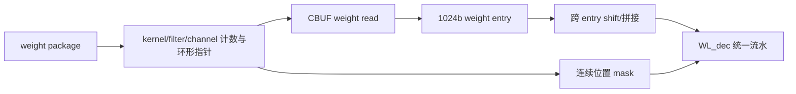

### 5.8 压缩 weight 与 WMB 展开

压缩模式把两个逻辑流分开保存：

- weight entry：只连续保存非零 weight 值；
- WMB entry：每一 bit 描述原始 weight 位置是否存在非零值。

WL 分别维护 weight 与 WMB 的读指针和剩余量。由于一个 WMB entry 描述的原始位置数与一个紧凑 weight entry 容纳的非零值数不一定同步耗尽，两条 CBUF 请求并不要求一一同拍。WL 会缓存各自的剩余 bit/byte，再组合成当前 128-lane 解压窗口。

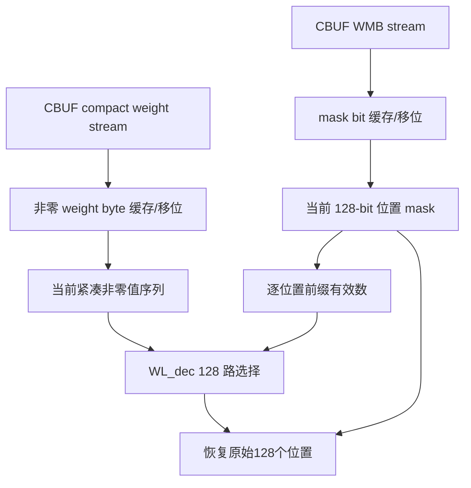

对原始位置 `i`，decoder 的逻辑含义可以写成：

```text
if WMB[i] == 1:
    output_data[i] = compact_weight[popcount(WMB[0:i]) - 1]
    output_mask[i] = 1
else:
    output_data[i] = don't-care/0
    output_mask[i] = 0
```

真实 RTL 使用分级前缀和与多路选择网络完成上述操作，而不是串行执行 128 次 popcount。跨 entry 的非零 weight 衔接由 WL 的 shift 和 remain 状态负责。

### 5.9 kernel select 与 CMAC_A/B 分发

WL decoder 先形成一份共享结果：

```text
output_data[0:127]
output_mask[127:0]
output_sel[15:0]
```

`output_sel` 的维度是 kernel，而 `output_mask` 的维度是点积元素：

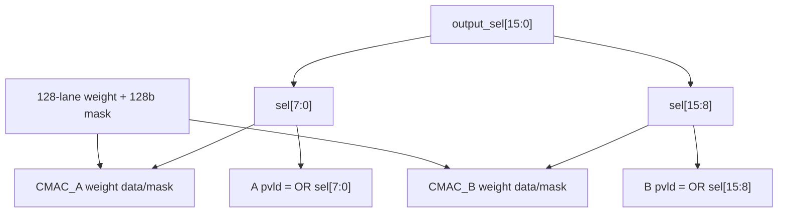

- `sel[k]=1`：把当前 128-lane weight 装入对应的 kernel lane；
- `mask[i]=1`：该 kernel 的第 `i` 个点积元素有效；
- data A/B 是广播关系；
- weight 数据也是同一个 decoder 结果，A/B 的差别主要是各自看到的 8-bit `sel` 和由它门控的 valid/mask。

若当前 kernel group 只命中 CMAC_A，B 侧 `pvld` 为 0；反之亦然。一个 16-kernel group 可以通过 select 序列把不同 kernel 的权重依次装入两个半阵列。

### 5.10 data 和 weight 在哪里真正会合

data 与 weight 并不是在 CSC 顶层合并成一个接口，而是在 CMAC 的 active/MAC 路径会合：

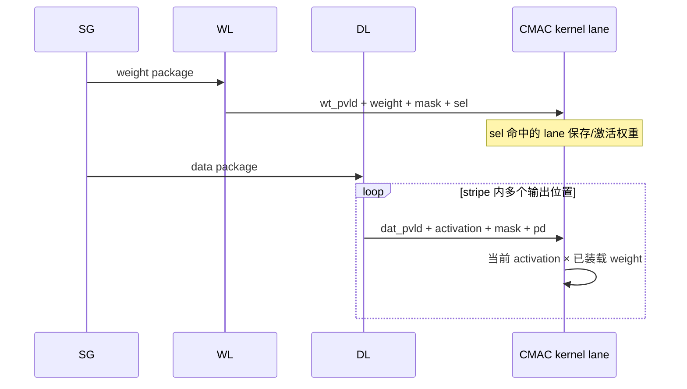

因此应该用下面的模型理解一次计算：

```text
WL：更新“哪个 kernel lane 当前保存哪组 weight”
DL：给所有 kernel lane 广播“这一拍的 activation”
CMAC：对 sel 已装载的8个 kernel分别执行点积
```

weight 可以被同一 stripe 的多个 activation 位置复用，activation 也会同时被多个 kernel lane 复用。这正是 CSC 把 DL 和 WL 分成两条独立流水的原因。

### 5.11 一次 Direct Convolution stripe 的概念时序

下面是逻辑时序，用于理解依赖关系；除 CBUF 固定 6 拍返回外，不表示所有内部级都只有一拍：

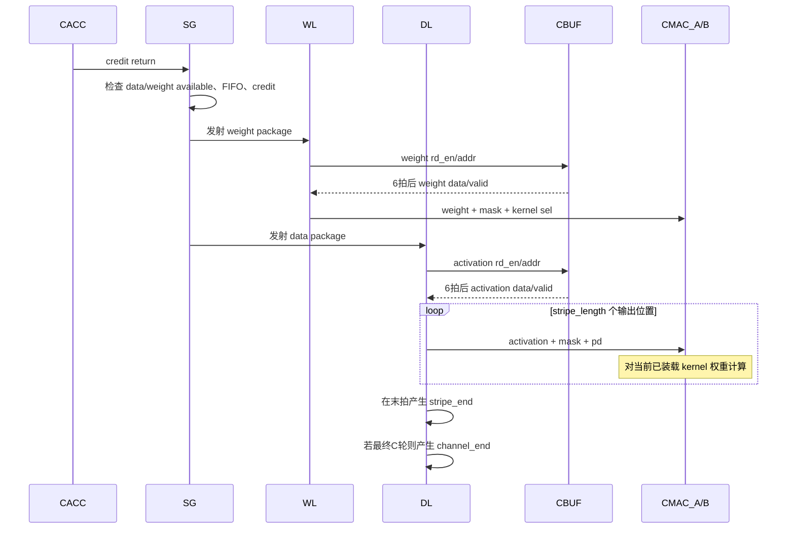

实际执行中 DL/WL 的请求和返回会重叠，多个 package 也会通过 FIFO 和内部流水并行存在。图中先画 weight、后画 data 是为了表示依赖关系，不意味着所有模式下两个模块严格串行。

### 5.12 资源释放与数据流的闭环

CBUF 中的 entry 被读取后不会立即自动释放。DL/WL 根据 package 边界、环形指针推进以及 reuse 配置，在安全时刻向 CDMA 返还资源：

```text
DL -> sc2cdma_dat_updt + entries/slices
WL -> sc2cdma_wt_updt  + weight/WMB entries
```

这两条 `updt` 是资源所有权信息，不携带操作数。完整闭环为：

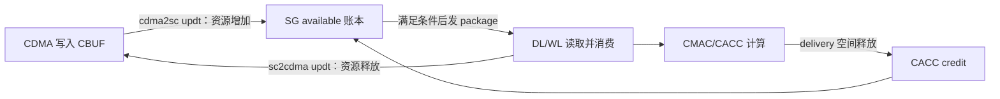

当 data/weight reuse 置位时，SG/DL/WL 可以跨操作保留相应 CBUF 内容和指针，不立即释放；模式变化、显式 release 或 pending 清账时再恢复双方一致的资源视图。

### 5.13 无 ready 流水怎样保证不溢出

CSC 的 CBUF 侧和 CMAC 侧都没有逐拍 ready。安全性来自发射前的四层准入条件：

1. CDMA resource update 表明所需 data slice、weight kernel/entry 已写入；
2. SG 的 data/weight command FIFO 有空位；
3. CACC credit 足够容纳最终 channel-end stripe 的输出影响量；
4. 软件已经按顺序使能 CACC、CMAC_B、CMAC_A，保证下游固定流水可接收。

条件不足时，SG 停在 package pop/issue 之前；一旦 package 已进入 DL/WL 和 CBUF 固定延迟流水，就不会再被中途反压或撤回。

## 6. 卷积循环的硬件映射

SG 同时推进多级卷积坐标。理解 RTL 时可以用以下抽象循环对应各计数器：

```text
for output position / stripe:
  for kernel group:
    for R/S filter position:
      for channel group:
        issue matching activation package and weight package
```

实际 RTL 为了复用、CBUF 地址布局和流水吞吐，会交错推进这些维度。几个结束标志负责恢复层级边界：

- `block_end`：局部数据块结束；
- `channel_end`：当前输出的 C 方向累加完成；
- `group_end`：当前 kernel/操作组结束；
- `layer_end`：整层最后一个操作包。

## 7. 时钟门控

顶层实例化 4 个 SLCG：`op_0`、`op_1`、`op_2` 和 `wg`。前三组覆盖普通操作流水，`wg` 只在 Winograd 路径需要时启用。`dla_clk_ovr_on_sync`、`global_clk_ovr_on_sync` 和 `tmc2slcg_disable_clock_gating` 可强制打开门控。

## 8. 阅读顺序

建议按下面顺序阅读 CSC RTL：

1. 本顶层的子模块例化和外部接口；
2. `NV_NVDLA_CSC_sg.v`：先掌握层状态机与 package；
3. `NV_NVDLA_CSC_dl.v`：追 activation；
4. `NV_NVDLA_CSC_wl.v`：追 weight；
5. `NV_NVDLA_CSC_WL_dec.v`：只在理解压缩展开时深入；
6. regfile、双组寄存器与 SLCG；
7. Winograd 专用 `pra_cell`。

## 9. 容易误解的点

1. SG 输出的是操作命令包，不是 activation 或 weight 数据。
2. CSC 到 CMAC 没有 ready；是否能继续发数必须在 SG 内根据资源和 credit 提前判断。
3. CMAC_A/B 的 activation 相同，kernel 分工由 weight `sel` 的低/高 8 位决定。
4. `sc2mac_dat_pd` 属于 data 路，不属于 weight 路；weight 路携带的是 `sel`。
5. CBUF 返回固定 6 拍，DL/WL 中大量寄存器用于让控制字段与数据重新对齐。
6. `data_bank`、`weight_bank` 字段是 0-based 的 bank 数减一；两者配置必须满足总 bank 容量约束。
7. Winograd、pixel/image 和 compressed weight 是旁路/扩展模式，第一遍不应遮蔽 DC feature 非压缩主路径。
