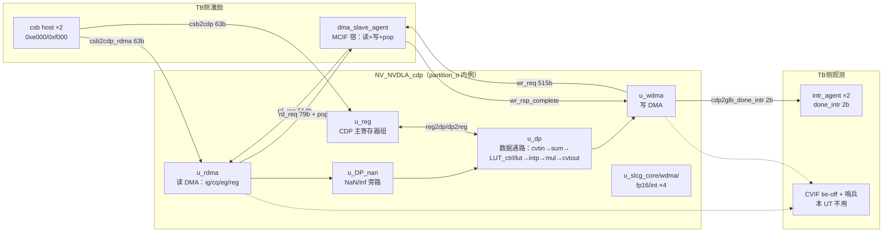
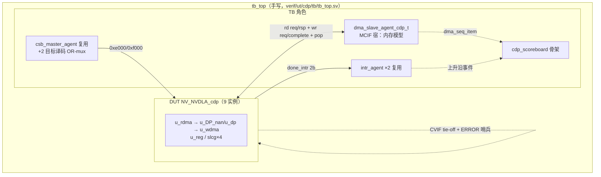

# CDP（Channel Data Processor，跨通道数据处理器）验证方案书

> **文档类型：验证方案书**（结构为：① DUT 架构与代码列表 ② feature 功能特性清单
> ③ 测试点核销 ④ 验证框架，同 [csc-cmac-cacc.md](csc-cmac-cacc.md) 章节骨架）。
>
> 事实来源：outdir/nv_full/vmod/nvdla/cdp/ 源码实读（2026-08-03，nv_full 配置，
> `developer` 分支，tmake 产物即 UT 工具真正消费的 Verilog）。所有 file:line 均按
> 写稿时刻文件终态逐条核对；行号随代码演进会漂移，修订时须重新核对。
>
> 修订记录：2026-08-03 首版——**环境搭建阶段（阶段4）**：UT 环境落地 +
> T0 寄存器面冒烟全绿（seed1/seed2 + regress）。**feature 覆盖判定与测试点分解
> 待后续 Wave**：§2 覆盖列全标"待定"、§3 除 T0 外全标"待测试点分解"。

CDP 实现 LRN（Local Response Normalization，局部响应归一化）：从外存读入
feature cube，对每个元素做跨通道平方和 → LUT（Look-Up Table，查找表）插值取
归一化因子 → 乘法 → 转换截断，再写回外存。**纯内存到内存引擎，无任何引擎
直连口**（对比 SDP 的 cacc 直连、PDP 的 sdp2pdp 直连），是三个后处理 UT 里
边界最干净的一路。

## 1. DUT 架构与代码列表

### 1.1 DUT 边界与实例

**DUT = 6 种模块、9 个实例**（例化点均在 NV_NVDLA_cdp.v）：

| # | 模块 | 实例名 | 例化点 | 说明 |
|---|---|---|---|---|
| 1 | NV_NVDLA_CDP_rdma | u_rdma | NV_NVDLA_cdp.v:198 | 读 DMA：自带 CSB 口（0xe000 块）与自己的 reg 组；内含 u_ig（请求生成）/u_cq（在途上下文 FIFO）/u_eg（响应重组+credit 归还）/u_reg（CDP_rdma.v:126/:156/:170/:197） |
| 2 | NV_NVDLA_CDP_slcg ×4 | u_slcg_core / u_slcg_wdma / u_slcg_fp16 / u_slcg_int | :232 / :241 / :250 / :259 | SLCG 时钟门控单元（core/wdma/fp16 数据通路/int 数据通路 4 域） |
| 3 | NV_NVDLA_CDP_DP_nan | u_DP_nan | :271 | NaN/Inf 检测与 flush-to-zero 旁路（fp16 用），int 直通 |
| 4 | NV_NVDLA_CDP_wdma | u_wdma | :291 | 写 DMA：出口打包 wr cmd/data、done 中断生成（cdp2glb_done_intr_pd 声明 CDP_wdma.v:57） |
| 5 | NV_NVDLA_CDP_dp | u_dp | :325 | 归一化数据通路（**实例名是 u_dp 不是 u_core**）：u_cvtin :313 → u_syncfifo :331 / u_bufferin :354 → u_sum :365 → u_LUT_ctrl :403 / u_lut :462 → u_intp :551 → u_mul :651 → u_cvtout :694（行号在 CDP_dp.v） |
| 6 | NV_NVDLA_CDP_reg | u_reg | :395 | CDP 主寄存器组（0xf000 块）：u_single_reg :325 / u_dual_reg_d0 :369 / u_dual_reg_d1 :408（行号在 CDP_reg.v）+ op_en/LUT 访问指针等外置逻辑 |

> **DUT 边界注**：MCIF/CVIF（内存通路仲裁）与 GLB（中断汇聚）**不纳入 DUT**——
> MCIF 宿由 TB 的 dma_slave_agent 扮演，CVIF 宿 tie-off（本 UT 只走 MC 路，
> §4.6 ram_type 注记），cdp2glb_done_intr_pd 由 intr_agent 直接观测。真实芯片
> 中 CDP 例化在 partition_o（NV_NVDLA_partition_o.v:2121），CSB 链路上游还有
> csb_master 扇出，均不入 DUT，TB 直驱两个 csb2cdp* 口。**无任何引擎直连口**。

### 1.2 源文件清单（按功能分组）

全部 30 件，目录 outdir/nv_full/vmod/nvdla/cdp/（UT filelist 全列，顶层最后）：

**顶层（1 件）**：

| 文件 | 角色 |
|---|---|
| NV_NVDLA_cdp.v | 39 端口（:9-49）；9 实例例化（1.1 节表） |

**RDMA 读路（7 件）**：

| 文件 | 角色 |
|---|---|
| NV_NVDLA_CDP_rdma.v | 读 DMA 顶层；u_ig/u_cq/u_eg/u_reg/u_slcg |
| NV_NVDLA_CDP_RDMA_ig.v | ingress：按 cube 几何生成读请求（size 0-based 32B 块数语义 :833 一带） |
| NV_NVDLA_CDP_RDMA_cq.v | context queue：在途请求上下文 FIFO（RAM 宏经 -y rams/ 兜底） |
| NV_NVDLA_CDP_RDMA_eg.v | egress：rd_rsp 重组成 element 流 + rd_cdt_lat_fifo_pop 归还（:343 一带） |
| NV_NVDLA_CDP_RDMA_reg.v | CDP_RDMA CSB 终点（0xe000）；S/D 译码 :379-383、prdy 恒 1（:569） |
| NV_NVDLA_CDP_RDMA_REG_single.v | S 组：S_STATUS/S_POINTER（:54-55 译码） |
| NV_NVDLA_CDP_RDMA_REG_dual.v | D 组 ×2 实例（乒乓）：:99-113 译码、:207-217 复位块 |

**DP 数据通路（16 件）**：

| 功能组 | 文件 | 角色 |
|---|---|---|
| 通路顶层 | NV_NVDLA_CDP_dp.v | 子级流水拼装（1.1 节 #5 行内例化点） |
| 入口转换 | NV_NVDLA_CDP_DP_cvtin.v | datin offset/scale/shifter 输入转换 |
| 缓冲 | NV_NVDLA_CDP_DP_bufferin.v / NV_NVDLA_CDP_DP_syncfifo.v | 跨通道窗口缓冲 / 同步 FIFO |
| 平方和 | NV_NVDLA_CDP_DP_sum.v + int_sum_block.v / fp_sum_block.v / fp_format_cvt.v | 跨通道滑窗平方和（normalz_len 3/5/7/9） |
| LUT | NV_NVDLA_CDP_DP_LUT_ctrl.v / NV_NVDLA_CDP_DP_LUT_CTRL_unit.v | LE/LO 双表命中判定、索引计算、oflow/uflow/hybrid 优先级 |
| LUT | NV_NVDLA_CDP_DP_lut.v | 表存储（LE 65 项 / LO 257 项 ×16b；**最大单文件 17051 行**） |
| 插值 | NV_NVDLA_CDP_DP_intp.v / NV_NVDLA_CDP_DP_INTP_unit.v | 表项间线性插值 |
| 乘法 | NV_NVDLA_CDP_DP_mul.v / NV_NVDLA_CDP_DP_MUL_unit.v | 原始数据 × 归一化因子 |
| 出口转换 | NV_NVDLA_CDP_DP_cvtout.v | datout offset/scale/shifter 输出转换 + 饱和计数 |
| NaN 旁路 | NV_NVDLA_CDP_DP_nan.v | NaN/Inf 计数与 flush（顶层直例，非 u_dp 内） |

**WDMA 写路（1 件）**：NV_NVDLA_CDP_wdma.v——写请求打包（cmd/data 变体）、
require_ack、done 中断。

**寄存器（3 件）**：NV_NVDLA_CDP_reg.v（0xf000 CSB 终点；S/D 译码 :637-642、
prdy 恒 1 :833、LUT 访问指针外置逻辑 :1040-1058）/ NV_NVDLA_CDP_REG_single.v
（S 组 :168-205 译码与 trigger）/ NV_NVDLA_CDP_REG_dual.v（D 组乒乓 ×2，
:169-197 译码、:358-378 复位块）。

**门控（1 件）**：NV_NVDLA_CDP_slcg.v（4 实例复用）。

**外部依赖**：无 DW_*/DESIGNWARE 引用（实测 grep 为零——与 cmac 不同，UT
filelist 不带 +define+DESIGNWARE_NOEXIST、不列 NV_DW_* 替身）；RAM 宏与 vlibs
cell 由 `-y` 目录兜底。

### 1.3 外部端口 6 组（39 端口，TB 全接）

端口声明 NV_NVDLA_cdp.v:50-91（**cdp 源端口声明带行首空格**，grep 用
`^\s*(input|output)`）。

**① CSB 配置口 ×2（独立双目标）**——形状同 [csb-link.md](../common/csb-link.md)，
req 63b / resp 34b；两口 prdy 均恒 1（CDP_reg.v:833、CDP_RDMA_reg.v:569）：

| 目标 | 字节块 | 信号 | 端口声明 |
|---|---|---|---|
| CDP_RDMA | 0xe000（CSB_TGT_CDP_RDMA=14） | csb2cdp_rdma_req_{pvld,prdy,pd[62:0]} / cdp_rdma2csb_resp_{valid,pd[33:0]} | :75-79 |
| CDP | 0xf000（CSB_TGT_CDP=15） | csb2cdp_req_* / cdp2csb_resp_* | :58-59、:80-82 |

块号对照 verif/ut/common/base/ut_types.svh:30-31。

**② MCIF 读通道（1 路读客户端 + credit）**——协议见
[dma-if.md](../common/dma-if.md)；CDP 是 dma_if 默认位宽（79/514/515）的原型客户端：

| 信号 | 方向（对 CDP） | 位宽 | 端口声明 |
|---|---|---|---|
| cdp2mcif_rd_req_valid / ready / pd | out/in/out | 1/1/79（{size[78:64], addr[63:0]}） | :69-71 |
| mcif2cdp_rd_rsp_valid / ready / pd | in/out/in | 1/1/514（{mask[1:0], data[511:0]}） | :87-89 |
| cdp2mcif_rd_cdt_lat_fifo_pop | out | 1（credit 归还脉冲） | :68 |

**③ MCIF 写通道（1 路写客户端）**：

| 信号 | 方向 | 位宽 | 端口声明 |
|---|---|---|---|
| cdp2mcif_wr_req_valid / ready / pd | out/in/out | 1/1/515（[514]=id：0=cmd（[77]=require_ack）/1=data） | :72-74 |
| mcif2cdp_wr_rsp_complete | in | 1（仅 require_ack=1 的 cmd 返回） | :90 |

**④ CVIF 双宿镜像（与 ②③ 同形一组）**：cdp2cvif_rd_req_* / cvif2cdp_rd_rsp_* /
cdp2cvif_rd_cdt_lat_fifo_pop / cdp2cvif_wr_req_* / cvif2cdp_wr_rsp_complete
（:60-66、:83-86）。选路由 src/dst_ram_type 决定（1=MC 0=CV）；**本 UT tie-off**
（输入 0、ready 0）+ tb 哨兵（复位后任何 CVIF 请求打 `ERROR :` 行）。

**⑤ 中断**：cdp2glb_done_intr_pd[1:0]（:67）——d0/d1 乒乓组各一位，TB 按位挂
2 个 intr_agent。

**⑥ tie-off/杂项**：nvdla_core_clk / nvdla_core_rstn（:56-57）、
pwrbus_ram_pd[31:0]（:91，拴 0）、dla_clk_ovr_on_sync / global_clk_ovr_on_sync
（:50-51，拴 0）、tmc2slcg_disable_clock_gating（:52，拴 1 关门控）。

### 1.4 寄存器地址图（feature 表与 T0 的基础）

两块 S/D 分界不同：**CDP_RDMA=块内 0x008**（CDP_RDMA_reg.v:379）、
**CDP=块内 0x048**（CDP_reg.v:637——CDP 的 S 组含整个 LUT 参数窗 0x008-0x044，
LUT 全 CDP 只有一套、不随乒乓切换）。op_en 置位期间对应 D 组写保护 + 断言
（CDP_reg.v:641-642/:683/:730；RDMA 同构 :383 一带）。乒乓机制同 CDMA
（producer 选写组、consumer 选消费组、dp2reg_done 翻转），不复述。

**CDP_RDMA 块（0xe000；S 译码 RDMA_REG_single.v:54-55、D 译码 RDMA_REG_dual.v:99-113、复位 :207-217）**：

| 字节地址 | 寄存器 | 可写字段位图 | 复位值 |
|---|---|---|---|
| 0xe000 | S_STATUS | 只读 {14'b0, status_1[1:0], 14'b0, status_0[1:0]} | 0 |
| 0xe004 | S_POINTER | producer[0]；consumer[16] 只读 | 0 |
| 0xe008 | D_OP_ENABLE | op_en[0]（触发器外置：RDMA_reg.v，置位启动层） | 0 |
| 0xe00c/10/14 | D_DATA_CUBE_WIDTH/HEIGHT/CHANNEL | [12:0] | 0 |
| 0xe018 | D_SRC_BASE_ADDR_LOW | [31:5]（低 5 位硬 0，32B 对齐） | 0 |
| 0xe01c | D_SRC_BASE_ADDR_HIGH | [31:0] | 0 |
| 0xe020 | D_SRC_LINE_STRIDE | [31:5] | 0 |
| 0xe024 | D_SRC_SURFACE_STRIDE | [31:5] | 0 |
| 0xe028 | D_SRC_DMA_CFG | src_ram_type[0]（1=MC 0=CV；**复位 0=CV，§4.6 坑**） | 0 |
| 0xe02c | D_SRC_COMPRESSION_EN | 常量字段（`assign src_compression_en=1'h0`，RDMA_REG_dual.v:115），读恒 0 | 0 |
| 0xe030 | D_OPERATION_MODE | 常量字段（`assign operation_mode=2'h0`，:114），读恒 0 | 0 |
| 0xe034 | D_DATA_FORMAT | input_data[1:0] | 0 |
| 0xe038 | D_PERF_ENABLE | dma_en[0] | 0 |
| 0xe03c | D_PERF_READ_STALL | 只读计数（dp2reg_d*_perf_read_stall） | 0 |
| 0xe040 | D_CYA | [31:0] | 0 |

**CDP 块（0xf000；S 译码 CDP_REG_single.v:168-185、D 译码 CDP_REG_dual.v:169-197、复位 :358-378）**：

| 字节地址 | 寄存器 | 可写字段位图 | 复位值 |
|---|---|---|---|
| 0xf000 | S_STATUS | 只读（同 RDMA 形） | 0 |
| 0xf004 | S_POINTER | producer[0]；consumer[16] 只读 | 0 |
| 0xf008 | S_LUT_ACCESS_CFG | lut_access_type[17]（0=READ/1=WRITE）、lut_table_id[16]（0=LE/1=LO）；**写触发 lut_addr_trigger 装载指针 [9:0]**（CDP_REG_single.v:204；指针本体外置 CDP_reg.v:1044-1057）；读回 [9:0]=当前指针（只读回读） | 0 |
| 0xf00c | S_LUT_ACCESS_DATA | lut_data[15:0]；**写=写表项+指针自增（type=WRITE 时，CDP_reg.v:1038）；读=读表项+指针自增（type=READ 时，:1040）**——读也有副作用 | 0 |
| 0xf010 | S_LUT_CFG | {hybrid_priority[6], oflow_priority[5], uflow_priority[4], le_function[0]} | 0 |
| 0xf014 | S_LUT_INFO | {lo_index_select[23:16], le_index_select[15:8], le_index_offset[7:0]} | 0 |
| 0xf018/1c | S_LUT_LE_START_LOW/HIGH | [31:0] / [5:0] | 0 |
| 0xf020/24 | S_LUT_LE_END_LOW/HIGH | [31:0] / [5:0] | 0 |
| 0xf028/2c | S_LUT_LO_START_LOW/HIGH | [31:0] / [5:0] | 0 |
| 0xf030/34 | S_LUT_LO_END_LOW/HIGH | [31:0] / [5:0] | 0 |
| 0xf038 | S_LUT_LE_SLOPE_SCALE | {oflow_scale[31:16], uflow_scale[15:0]} | 0 |
| 0xf03c | S_LUT_LE_SLOPE_SHIFT | {oflow_shift[9:5], uflow_shift[4:0]} | 0 |
| 0xf040/44 | S_LUT_LO_SLOPE_SCALE/SHIFT | 同 LE 形 | 0 |
| 0xf048 | D_OP_ENABLE | op_en[0]（外置） | 0 |
| 0xf04c | D_FUNC_BYPASS | {mul_bypass[1], sqsum_bypass[0]} | 0 |
| 0xf050/54 | D_DST_BASE_ADDR_LOW/HIGH | [31:5] / [31:0] | 0 |
| 0xf058/5c | D_DST_LINE_STRIDE / D_DST_SURFACE_STRIDE | [31:5] | 0 |
| 0xf060 | D_DST_DMA_CFG | dst_ram_type[0]（**复位 0=CV，§4.6 坑**） | 0 |
| 0xf064 | D_DST_COMPRESSION_EN | 常量字段（CDP_REG_dual.v:198），读恒 0 | 0 |
| 0xf068 | D_DATA_FORMAT | input_data_type[1:0] | **2'b01（int16，:361）** |
| 0xf06c | D_NAN_FLUSH_TO_ZERO | nan_to_zero[0] | 0 |
| 0xf070 | D_LRN_CFG | normalz_len[1:0]（窗宽 3/5/7/9） | 0 |
| 0xf074 | D_DATIN_OFFSET | [15:0] | 0 |
| 0xf078 | D_DATIN_SCALE | [15:0] | **16'h1（:363）** |
| 0xf07c | D_DATIN_SHIFTER | [4:0] | 0 |
| 0xf080 | D_DATOUT_OFFSET | [31:0] | 0 |
| 0xf084 | D_DATOUT_SCALE | [15:0] | **16'h1（:366）** |
| 0xf088 | D_DATOUT_SHIFTER | [5:0] | 0 |
| 0xf08c/90/94 | D_NAN_INPUT_NUM / D_INF_INPUT_NUM / D_NAN_OUTPUT_NUM | 只读计数 | 0 |
| 0xf098 | D_OUT_SATURATION | 只读计数 | 0 |
| 0xf09c | D_PERF_ENABLE | {lut_en[1], dma_en[0]} | 0 |
| 0xf0a0-0xf0b4 | D_PERF_WRITE_STALL / LUT_UFLOW / LUT_OFLOW / LUT_HYBRID / LUT_LE_HIT / LUT_LO_HIT | 只读计数 ×6 | 0 |
| 0xf0b8 | D_CYA | [31:0] | 0 |

> 复位值要点：仅 3 个非零——CDP D_DATA_FORMAT=0x1（int16）、D_DATIN_SCALE=0x1、
> D_DATOUT_SCALE=0x1；其余（含 RDMA 全部）为 0。T0 已实测证实。

## 2. feature 功能特性清单

> **环境搭建阶段骨架**：feature id/名称/来源锚点已列，**覆盖列全标"待定"、
> 测试点列留空**，待后续 Wave 测试点分解时定案。

### 2.1 F-CSB 寄存器面与乒乓

| id | 名称 | 来源锚点 | 覆盖 | 测试点 |
|---|---|---|---|---|
| F-CSB-1 | 双块独立 CSB 终点（0xe000/0xf000）、prdy 恒 1、互不串扰 | CDP_reg.v:833、CDP_RDMA_reg.v:569 | 待定 | |
| F-CSB-2 | S/D 分界异构（RDMA 0x008 / CDP 0x048）与 producer 乒乓影子 | CDP_RDMA_reg.v:379、CDP_reg.v:637 | 待定 | |
| F-CSB-3 | op_en 置位期 D 组写保护 + 断言 | CDP_reg.v:641-642/:683/:730 | 待定 | |
| F-CSB-4 | 双块 op_en 联动开层（软件先 CDP 后 RDMA 或反序的合同） | 各自 D_OP_ENABLE 外置触发器 | 待定 | |

### 2.2 F-LUT 表访问与插值

| id | 名称 | 来源锚点 | 覆盖 | 测试点 |
|---|---|---|---|---|
| F-LUT-1 | LUT 表装载：CFG 写装指针、DATA 写自增写表（LE 65 / LO 257 项） | CDP_reg.v:1038/:1043-1057 | 待定 | |
| F-LUT-2 | LUT 表读回：type=READ 时读 DATA 自增读表 | CDP_reg.v:1040 | 待定 | |
| F-LUT-3 | LE 表 exp/linear 双模式（le_function） | S_LUT_CFG[0] | 待定 | |
| F-LUT-4 | 命中/oflow/uflow/hybrid 优先级与斜率外插 | DP_LUT_ctrl.v、S_LUT_CFG[6:4] | 待定 | |
| F-LUT-5 | 插值（intp）与 index_select/offset | DP_intp.v、S_LUT_INFO | 待定 | |
| F-LUT-6 | perf 计数：le_hit/lo_hit/oflow/uflow/hybrid（lut_en 门控） | 0xf0a4-0xf0b4 | 待定 | |

### 2.3 F-DP 归一化数据通路

| id | 名称 | 来源锚点 | 覆盖 | 测试点 |
|---|---|---|---|---|
| F-DP-1 | int8/int16 平方和滑窗（normalz_len 3/5/7/9，通道边界补 0） | DP_sum.v + int_sum_block.v、D_LRN_CFG | 待定 | |
| F-DP-2 | fp16 通路（fp_sum_block/fp_format_cvt + NaN/Inf） | fp_sum_block.v、DP_nan.v | 待定 | |
| F-DP-3 | sqsum_bypass / mul_bypass 旁路 | D_FUNC_BYPASS、CDP_dp.v | 待定 | |
| F-DP-4 | datin/datout offset/scale/shifter 转换与饱和（sat 计数） | DP_cvtin.v / DP_cvtout.v、0xf098 | 待定 | |
| F-DP-5 | nan_to_zero flush 与 NaN/Inf 计数 | DP_nan.v、0xf08c-0xf094 | 待定 | |

### 2.4 F-RDMA 取数

| id | 名称 | 来源锚点 | 覆盖 | 测试点 |
|---|---|---|---|---|
| F-RDMA-1 | cube 几何（W/H/C）到读请求流（addr/size）的生成 | CDP_RDMA_ig.v | 待定 | |
| F-RDMA-2 | src ram_type 选宿（MC/CV） | D_SRC_DMA_CFG、RDMA_ig 选路 | 待定 | |
| F-RDMA-3 | rd_rsp mask 语义（11/01）重组与在途多笔（cq 深度） | CDP_RDMA_eg.v、CDP_RDMA_cq.v | 待定 | |
| F-RDMA-4 | credit 归还 rd_cdt_lat_fifo_pop 脉冲合同 | CDP_RDMA_eg.v:343 一带 | 待定 | |
| F-RDMA-5 | perf_read_stall 计数（dma_en 门控） | 0xe03c | 待定 | |

### 2.5 F-WDMA 写回与中断

| id | 名称 | 来源锚点 | 覆盖 | 测试点 |
|---|---|---|---|---|
| F-WDMA-1 | 结果打包写请求（cmd/data 变体、require_ack） | CDP_wdma.v | 待定 | |
| F-WDMA-2 | dst 几何步进（line/surface stride、32B 对齐） | D_DST_* 寄存器 | 待定 | |
| F-WDMA-3 | dst ram_type 选宿（MC/CV） | D_DST_DMA_CFG | 待定 | |
| F-WDMA-4 | done 中断按乒乓组置位（intr_pd[1:0]）与 S_STATUS/consumer 翻转 | CDP_wdma.v:57、cdp2glb_done_intr_pd | 待定 | |
| F-WDMA-5 | perf_write_stall 计数 | 0xf0a0 | 待定 | |

### 2.6 F-MISC 杂项

| id | 名称 | 来源锚点 | 覆盖 | 测试点 |
|---|---|---|---|---|
| F-MISC-1 | CYA 写读（双块） | 0xe040 / 0xf0b8 | 待定 | |
| F-MISC-2 | SLCG 4 域门控透明性（tmc2slcg_disable=1 下） | NV_NVDLA_CDP_slcg.v ×4 | 待定 | |

### 2.7 reg2dp 字段核对总表（验收硬标准：零遗漏）

两块 reg 顶层全部 reg2dp_* 输出逐一核对（CDP_RDMA 12 个：
NV_NVDLA_CDP_RDMA_reg.v:45-56；CDP 49 个：NV_NVDLA_CDP_reg.v:135-183。
合计 **61 个，下表全部出现，零遗漏**；feature 映射待测试点分解定案）：

| 块 | 字段（位宽） | 来源寄存器 | feature 映射 |
|---|---|---|---|
| rdma | channel[12:0] | 0xe014 D_DATA_CUBE_CHANNEL | F-RDMA-1（待定） |
| rdma | cya[31:0] | 0xe040 D_CYA | F-MISC-1（待定） |
| rdma | dma_en | 0xe038 D_PERF_ENABLE | F-RDMA-5（待定） |
| rdma | height[12:0] | 0xe010 D_DATA_CUBE_HEIGHT | F-RDMA-1（待定） |
| rdma | input_data[1:0] | 0xe034 D_DATA_FORMAT | F-RDMA-1/F-DP-1（待定） |
| rdma | op_en | 0xe008 D_OP_ENABLE（外置触发器） | F-CSB-4（待定） |
| rdma | src_base_addr_high[31:0] | 0xe01c | F-RDMA-1（待定） |
| rdma | src_base_addr_low[26:0] | 0xe018（[31:5]） | F-RDMA-1（待定） |
| rdma | src_line_stride[26:0] | 0xe020（[31:5]） | F-RDMA-1（待定） |
| rdma | src_ram_type | 0xe028 D_SRC_DMA_CFG | F-RDMA-2（待定） |
| rdma | src_surface_stride[26:0] | 0xe024（[31:5]） | F-RDMA-1（待定） |
| rdma | width[12:0] | 0xe00c D_DATA_CUBE_WIDTH | F-RDMA-1（待定） |
| cdp | cya[31:0] | 0xf0b8 D_CYA | F-MISC-1（待定） |
| cdp | datin_offset[15:0] | 0xf074 | F-DP-4（待定） |
| cdp | datin_scale[15:0] | 0xf078 | F-DP-4（待定） |
| cdp | datin_shifter[4:0] | 0xf07c | F-DP-4（待定） |
| cdp | datout_offset[31:0] | 0xf080 | F-DP-4（待定） |
| cdp | datout_scale[15:0] | 0xf084 | F-DP-4（待定） |
| cdp | datout_shifter[5:0] | 0xf088 | F-DP-4（待定） |
| cdp | dma_en | 0xf09c D_PERF_ENABLE[0] | F-WDMA-5（待定） |
| cdp | dst_base_addr_high[31:0] | 0xf054 | F-WDMA-2（待定） |
| cdp | dst_base_addr_low[26:0] | 0xf050（[31:5]） | F-WDMA-2（待定） |
| cdp | dst_line_stride[26:0] | 0xf058（[31:5]） | F-WDMA-2（待定） |
| cdp | dst_ram_type | 0xf060 D_DST_DMA_CFG | F-WDMA-3（待定） |
| cdp | dst_surface_stride[26:0] | 0xf05c（[31:5]） | F-WDMA-2（待定） |
| cdp | input_data_type[1:0] | 0xf068 D_DATA_FORMAT | F-DP-1/2（待定） |
| cdp | interrupt_ptr | 派生：= dp2reg_consumer（CDP_reg.v:1024，非寄存器字段） | F-WDMA-4（待定） |
| cdp | lut_access_type | 0xf008[17] | F-LUT-1/2（待定） |
| cdp | lut_addr[9:0] | 外置指针（CDP_reg.v:1044-1057，CFG 写装载/DATA 访问自增） | F-LUT-1/2（待定） |
| cdp | lut_data[15:0] | 派生：= 写总线 [15:0] 直通（CDP_reg.v:1022） | F-LUT-1（待定） |
| cdp | lut_data_trigger | 派生：DATA 写脉冲（CDP_REG_single.v:205 经顶层） | F-LUT-1（待定） |
| cdp | lut_en | 0xf09c D_PERF_ENABLE[1] | F-LUT-6（待定） |
| cdp | lut_hybrid_priority | 0xf010[6] | F-LUT-4（待定） |
| cdp | lut_le_end_high[5:0] | 0xf024 | F-LUT-4（待定） |
| cdp | lut_le_end_low[31:0] | 0xf020 | F-LUT-4（待定） |
| cdp | lut_le_function | 0xf010[0] | F-LUT-3（待定） |
| cdp | lut_le_index_offset[7:0] | 0xf014[7:0] | F-LUT-5（待定） |
| cdp | lut_le_index_select[7:0] | 0xf014[15:8] | F-LUT-5（待定） |
| cdp | lut_le_slope_oflow_scale[15:0] | 0xf038[31:16] | F-LUT-4（待定） |
| cdp | lut_le_slope_oflow_shift[4:0] | 0xf03c[9:5] | F-LUT-4（待定） |
| cdp | lut_le_slope_uflow_scale[15:0] | 0xf038[15:0] | F-LUT-4（待定） |
| cdp | lut_le_slope_uflow_shift[4:0] | 0xf03c[4:0] | F-LUT-4（待定） |
| cdp | lut_le_start_high[5:0] | 0xf01c | F-LUT-4（待定） |
| cdp | lut_le_start_low[31:0] | 0xf018 | F-LUT-4（待定） |
| cdp | lut_lo_end_high[5:0] | 0xf034 | F-LUT-4（待定） |
| cdp | lut_lo_end_low[31:0] | 0xf030 | F-LUT-4（待定） |
| cdp | lut_lo_index_select[7:0] | 0xf014[23:16] | F-LUT-5（待定） |
| cdp | lut_lo_slope_oflow_scale[15:0] | 0xf040[31:16] | F-LUT-4（待定） |
| cdp | lut_lo_slope_oflow_shift[4:0] | 0xf044[9:5] | F-LUT-4（待定） |
| cdp | lut_lo_slope_uflow_scale[15:0] | 0xf040[15:0] | F-LUT-4（待定） |
| cdp | lut_lo_slope_uflow_shift[4:0] | 0xf044[4:0] | F-LUT-4（待定） |
| cdp | lut_lo_start_high[5:0] | 0xf02c | F-LUT-4（待定） |
| cdp | lut_lo_start_low[31:0] | 0xf028 | F-LUT-4（待定） |
| cdp | lut_oflow_priority | 0xf010[5] | F-LUT-4（待定） |
| cdp | lut_table_id | 0xf008[16] | F-LUT-1/2（待定） |
| cdp | lut_uflow_priority | 0xf010[4] | F-LUT-4（待定） |
| cdp | mul_bypass | 0xf04c[1] | F-DP-3（待定） |
| cdp | nan_to_zero | 0xf06c | F-DP-5（待定） |
| cdp | normalz_len[1:0] | 0xf070 D_LRN_CFG | F-DP-1（待定） |
| cdp | op_en | 0xf048 D_OP_ENABLE（外置触发器） | F-CSB-4（待定） |
| cdp | sqsum_bypass | 0xf04c[0] | F-DP-3（待定） |

（另有只读回读字段 dp2reg_*：out_saturation → F-DP-4、nan/inf 计数 ×3 →
F-DP-5、perf ×7 → F-LUT-6/F-RDMA-5/F-WDMA-5、done ×2 → F-WDMA-4，非 reg2dp
但已入 feature 表骨架。）

## 3. 测试点核销（环境搭建阶段）

| 测试 | 内容 | 状态 |
|---|---|---|
| T0 | 双块寄存器面冒烟（环境自证，纯 CSB 面）：① 两块复位值读（S_STATUS/S_POINTER + 代表 D 寄存器，含 CDP 三个非零复位值）② 代表 D 寄存器 mask 化写读（期望=写值&字段 mask，mask 实读 REG_dual.v）③ S_POINTER 乒乓影子各一例（d0/d1 独立保值）④ 块内偏移扫描读不挂（RDMA 0x000-0x040 全扫；CDP 0x000-0x0b8 跳过 0x008/0x00c，决策见 §4.6）⑤ 双块互不串（0xe/0xf 各写特征值互读）。全程不写 D_OP_ENABLE、不碰 S_LUT_ACCESS_*；全用 nposted 写 | **已核销**（seed1/seed2 + regress 全绿，2026-08-03） |
| T1+ | 数据通路（RDMA→sum→LUT→intp→mul→cvt→WDMA 端到端）、LUT 装载/读回、乒乓、中断、背压、负面 | **待测试点分解**（后续 Wave） |

## 4. 验证框架

### 4.1 TB 结构

### 4.2 组件表（实例名与代码一致，verif/ut/cdp/ 与 verif/ut/common/）

| 组件 | 实例名 | 来源 | 说明 |
|---|---|---|---|
| csb_master_agent | env.csb_agt | 复用 verif/ut/common/csb/ | 单 host 序列 + 块号（word_addr[15:10]∈{14,15}）译码扇出双 req 口；双路 resp OR-mux + $onehot0 检查（tb_top.sv CSB 适配段；driver 单笔阻塞保证无冲突） |
| dma_slave_agent#(79,514,515) | env.mc_agt | 复用 verif/ut/common/dma/（nvdla_ut_pkg.sv:50-52 已特化 typedef dma_slave_agent_cdp_t——**名字里带 cdp：CDP 本就是该 typedef 的原型客户端**） | MCIF 宿：responder 读内存模型 + 写落盘 + require_ack 回 complete + credit pop 计数；monitor 发布 dma_seq_item |
| intr_agent ×2 | env.intr0_agt / env.intr1_agt | 复用 verif/ut/common/intr/ | cdp2glb_done_intr_pd[0]/[1] 逐位挂接，上升沿计数 |
| cdp_scoreboard | env.sb | 新建 verif/ut/cdp/env/cdp_scoreboard.svh | **阶段4 环境版占位**：dma/intr analysis imp 仅计数，check 留空——数据通路比对待后续 wave；T0 的 CSB 面比对由 seq 内 csb_check 承担 |
| cdp_csb_base_seq / cdp_t0_reg_seq | — | 新建 verif/ut/cdp/seqs/ | 基类含 wa()/csb_write/read/check（保留 randomize-with 防坑写法，§4.6）；T0 实现 §3 表五项 |
| cdp_base_test / cdp_t0_reg_test | uvm_test_top | 新建 verif/ut/cdp/tests/cdp_test_lib.svh | base 建 env + objection/run_seqs 钩子 |
| common.mk / ut_base_test / ut_types | — | 复用 verif/ut/common/base/ | CSB 目标枚举已含 CDP_RDMA=14/CDP=15（ut_types.svh:30-31） |

### 4.3 BFM 规格（dma_slave_responder，复用件行为与旋钮）

verif/ut/common/dma/dma_slave_responder.svh（阶段3.1 已按 MCIF RTL 实证重写，
本 UT 直接复用）：

- **读通道**：size 是 0-based 32B 块数（n=size+1，与 CDP_RDMA_ig.v:833 同语义）；
  响应按 512b beat 紧凑打包（beat j 低 256b=块 2j、高 256b=块 2j+1），首块恒落
  首拍低半；mask 只出 2'b11 / 2'b01（末奇块），2'b10 永不出现；多笔在途按请求序
  回数；
- **写通道**：wr_req_pd[514]=id（0=cmd/1=data）；cmd 记 addr 与 require_ack[77]，
  data 逐 64B 落盘；**仅 require_ack=1 回单拍 wr_rsp_complete**；
- **credit**：rd_cdt_lat_fifo_pop 脉冲计数（credit_returned）；
- **内存**：未初始化地址回确定性 pattern（地址异或哈希 default_byte），测试可
  load_bytes()/load_data() 预载镜像；
- **旋钮**：rd_rsp_dly_min/max（beat 延迟）、req_gap_pct/min/max（req_prdy 背压）、
  rd_rsp_first_min（首拍最小延迟，默认 6 拍——cdma_cbuf T3 波形实证的隐性契约，
  对 CDP 是否必需待数据通路 wave 复验）。

### 4.4 激励顺序合同

（占位：数据通路激励顺序——LUT 装载 → 双块 D 组编程 → 双 op_en → 等中断——
待测试点分解时定案。）

### 4.5 refmodel 分层与判分

（占位：LRN refmodel（sum/LUT/intp/mul/cvt 逐级翻译）与 wr 流判分面，待后续
wave 落地。）

### 4.6 平台实现注记（阶段4 落地经验）

- **LUT 扫描回避决策（T0 ④ 实读 RTL 后定案）**：CDP 块偏移扫描跳过
  0x008/0x00c 两个 offset。依据：写 0x008/0x00c 分别出 lut_addr_trigger /
  lut_data_trigger 脉冲（CDP_REG_single.v:204-205，装载 LUT 指针 / 写 LUT 表项）；
  **读 0x00c 在 lut_access_type==0（复位值即 READ 模式）时同样触发 LUT 地址自增**
  （CDP_reg.v:1040 reg2dp_lut_data_rd_trigger）——"只读不写"的扫描对 0x00c 也有
  副作用，故两个一起跳过（读 0x008 本身无副作用，为对齐"不碰 S_LUT_ACCESS_*"
  纪律一并跳过）。后续 LUT 表装载/读回是独立测试点（F-LUT-1/2）。
- **ram_type 复位值坑（数据通路 wave 必读）**：src_ram_type（0xe028）与
  dst_ram_type（0xf060）复位值均为 0=CV（RDMA_REG_dual.v:215、CDP_REG_dual.v:370），
  而本 UT 的 CVIF 被 tie 死（ready=0、rsp=0）+ ERROR 哨兵。**后续数据通路测试
  必须显式编程 src/dst_ram_type=1 选 MC**，否则请求全走 CVIF：轻则挂死，重则
  哨兵报错。哨兵正是为把"忘配 ram_type"从挂死变成一眼可见的 ERROR 行而设。
- **cdp 无 DesignWare 依赖**：与 cmac 不同，cdp 源 grep 无 DW_*/DESIGNWARE
  引用，filelist 不带 +define+DESIGNWARE_NOEXIST、不列 NV_DW_* 替身（filelist.f
  头注）。
- **tb_top 手写**（未用 ccc 的 gen_tb_top.py）：cdp 仅 39 端口、单实例，手写成本
  低于维护生成器；端口清单逐条核对自 NV_NVDLA_cdp.v:9-49。**cdp 源端口声明带
  行首空格**，grep 端口用 `^\s*(input|output)`。
- **randomize-with 作用域坑（沿用 ccc T0 实测教训）**：约束块里引用与 seq_item
  成员同名的外部变量会被就近解析成 item 成员（约束静默失效）。规矩：字地址
  randomize 前先算好存入本地变量再进约束（cdp_csb_base_seq.svh 保留防坑注释）。
- **本次搭建实测**：T0 首编译首跑即全绿（seed1/seed2/regress），未触发 DUT 内建
  断言（+define+ASSERT_ON 全程开启）、无 CVIF 哨兵触发——纯 CSB 面激励不启动
  数据通路，符合预期。

## 5. 与预研线索不符的发现（同步点用）

1. **cdp 源文件实为 30 件**（任务线索"~31 个 .v"）：`ls outdir/nv_full/vmod/nvdla/cdp/`
   计 30 个 .v，UT filelist 已全列。
2. **CDP 块 S 组远大于同族单元**：S/D 分界在 0x048（CDP_reg.v:637），S 组含
   S_LUT_ACCESS_*/S_LUT_CFG/S_LUT_INFO 及全部 LE/LO 表参数（0x008-0x044 共 16 个
   寄存器）——因 LUT 全 CDP 只有一套、不随乒乓切换。写 T0/扫描类测试不能套
   "S 组只有 STATUS/POINTER"的 csc/cmac/cacc 经验。
3. **S_LUT_ACCESS_DATA 读有副作用**（读=读表+指针自增，CDP_reg.v:1040）：
   "只读扫描无副作用"的假设对 CDP 不成立，已作为 §4.6 首条决策记录。
4. **D_OPERATION_MODE / D_*_COMPRESSION_EN 是常量字段**（RDMA_REG_dual.v:114-115、
   CDP_REG_dual.v:198 assign 常 0）：写不进、读恒 0，nv_full 配置下无压缩、
   单一操作模式，reg2dp 无对应输出。
