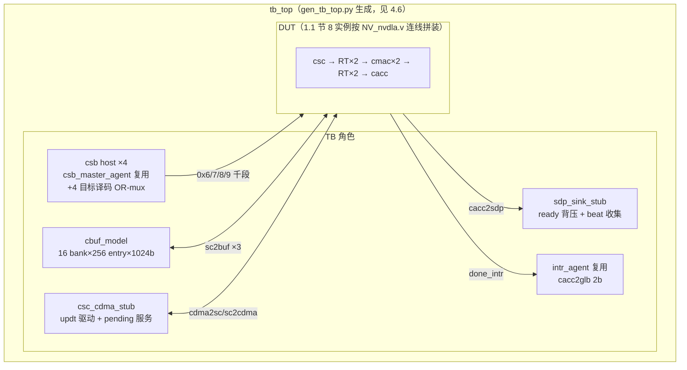

# CSC + CMAC×2 + CACC（卷积核心链）验证方案书

> **文档类型：验证方案书**（区别于本目录四要素 spec，结构为：① DUT 架构与代码列表
> ② feature 功能特性清单 ③ 测试点初稿 ④ 验证框架，见 [README](../README.md)）。
>
> 事实来源：vmod/ 源码实读（2026-08-01，nv_full 配置，`developer` 分支）。所有 file:line
> 均按写稿时刻文件终态逐条核对；行号随代码演进会漂移，修订时须重新核对。
> 修订记录：2026-08-02 吸收 DV Wave 1（T0 四目标全绿）实测反馈——§1.3 补 sc2mac dat
> 的 pd 口、§2.3/§3.8 增 wl bank 组合断言合同、§3.1 A 组核销标注、§4 组件定名与平台
> 注记。2026-08-02（第二轮）：DV Wave 2 regress **9/9 全绿**（T0×2/T1/T2/T3×3/T5/T6，
> 老回归无破坏）——beat 序（§4.5）、跨层 cbuf 指针合同（§2.3）、refmodel 支持面（§2）
> 实测定案回写；§3 测试点全量核销标注；§5 增 wt_kernels 死字段发现。

CSC（Convolution Sequence Controller，卷积时序控制器）按卷积节拍从 CBUF 读出
feature/weight 并组织成 MAC 阵列的逐拍操作数；CMAC（Convolution MAC，卷积乘加阵列）
两个半阵列做乘加；CACC（Convolution Accumulator，卷积累加器）跨 C 方向多轮累加部分和、
截断后交付 SDP。三个单元合成一条无反压的推进流水（唯一反压点在 CACC 出口），
适合作为一个联合 UT 验证。

## 1. DUT 架构与代码列表

### 1.1 DUT 边界与实例

```mermaid
flowchart LR
  subgraph TB侧激励
    CBUF[cbuf_model<br>sc2buf 三读口]
    CDMA[csc_cdma_stub<br>cdma2sc/sc2cdma]
    CSB[csb host ×4]
  end
  subgraph DUT
    CSC[NV_NVDLA_csc<br>partition_c]
    RTA[RT_csc2cmac_a<br>2 拍]
    RTB[RT_csc2cmac_b<br>2 拍]
    MA[NV_NVDLA_cmac 例 A<br>partition_ma]
    MB[NV_NVDLA_cmac 例 B<br>partition_mb]
    RTA2[RT_cmac_a2cacc<br>2 拍]
    RTB2[RT_cmac_b2cacc<br>2 拍]
    CACC[NV_NVDLA_cacc<br>partition_a]
  end
  subgraph TB侧观测
    SDP[sdp_sink_stub<br>cacc2sdp ready/背压]
    GLB[intr 观测]
  end
  CBUF -->|1024b×3 通道| CSC
  CDMA <-->|updt/pending| CSC
  CSC -->|sc2mac dat_a+wt_a| RTA --> MA
  CSC -->|sc2mac dat_b+wt_b| RTB --> MB
  MA -->|mac2accu 8×176b| RTA2 --> CACC
  MB -->|mac2accu 8×176b| RTB2 --> CACC
  CACC -->|cacc2sdp 514b| SDP
  CACC -.->|accu2sc_credit（DUT 内自闭环）.-> CSC
  CACC -->|done_intr 2b| GLB
  CSB --> CSC & MA & MB & CACC
```

**DUT = 7 种模块、8 个实例**（cmac 同一模块两例化）：

| # | 模块 | 实例名 | 所在分区源文件（例化点） | 说明 |
|---|---|---|---|---|
| 1 | NV_NVDLA_csc | u_NV_NVDLA_csc | vmod/nvdla/top/NV_NVDLA_partition_c.v:1698 | 时序控制 + cbuf 读 + 操作数发射 |
| 2 | NV_NVDLA_RT_csc2cmac_a | u_NV_NVDLA_RT_csc2cmac_a | vmod/nvdla/top/NV_NVDLA_partition_o.v:2529 | dat_a+wt_a 总线纯 2 拍打拍（d1/d2 触发器链，NV_NVDLA_RT_csc2cmac_a.v:1336-1337 样板） |
| 3 | NV_NVDLA_RT_csc2cmac_b | u_NV_NVDLA_RT_csc2cmac_b | vmod/nvdla/top/NV_NVDLA_partition_c.v:2276 | dat_b+wt_b 同上 |
| 4 | NV_NVDLA_cmac（例 A） | u_NV_NVDLA_cmac | vmod/nvdla/top/NV_NVDLA_partition_m.v:635，经 NV_nvdla.v:2523 例化 u_partition_ma | 8 kernel 半阵列 |
| 5 | NV_NVDLA_cmac（例 B） | u_NV_NVDLA_cmac | 同一 partition_m，NV_nvdla.v:2817 例化 u_partition_mb | 同上；**仅 CSB 口带 `_a_` 后缀**（csb2cmac_a_req_*、cmac_a2csb_resp_*），b 语义完全由外部连线赋予（NV_nvdla.v:2820-2824 把 csb2cmac_b 网线连进 `.csb2cmac_a_req_*` 口）；**数据口无 a/b 后缀**（见 1.1 节边界注） |
| 6 | NV_NVDLA_RT_cmac_a2cacc | u_NV_NVDLA_RT_cmac_a2cacc | vmod/nvdla/top/NV_NVDLA_partition_p.v:425 | mac_a2accu 2 拍打拍 |
| 7 | NV_NVDLA_RT_cmac_b2cacc | u_NV_NVDLA_RT_cmac_b2cacc | vmod/nvdla/top/NV_NVDLA_partition_a.v:217 | mac_b2accu 2 拍打拍 |
| 8 | NV_NVDLA_cacc | u_NV_NVDLA_cacc | vmod/nvdla/top/NV_NVDLA_partition_a.v:170 | 累加 + 截断 + 交付 |

> **DUT 边界注**：真实芯片里 CSB/中断通路还各有一级打拍（NV_NVDLA_RT_csb2cmac
> ×2：partition_c.v:2808 / partition_o.v:3061；NV_NVDLA_RT_csb2cacc：
> partition_c.v:2826；NV_NVDLA_RT_cacc2glb：partition_c.v:2844）。这些只影响
> CSB/中断的绝对延迟、不影响功能语义，**不纳入 DUT**，TB 直连四个单元的 CSB 口
> 与 cacc2glb 口。**cmac 模块的数据口 sc2mac_dat_* / sc2mac_wt_* / mac2accu_*
> 一律无 a/b 后缀**（NV_NVDLA_cmac.v:147/:453 sc2mac_dat_pd、partition_m.v:635
> 例化处、NV_nvdla.v:2825 起 `.sc2mac_wt_pvld` 等），a/b 语义全靠外部连线区分；
> 拼 DUT 顶层时按 NV_nvdla.v 的连线表接线即为权威（DV 实测确认：Wave 1 生成器
> 按此接线通过 T0）。

### 1.2 源文件清单（按功能分组）

**CSC（vmod/nvdla/csc/，12 件）**：

| 功能组 | 文件 | 角色（例化点） |
|---|---|---|
| 顶层 | NV_NVDLA_csc.v | 端口 :584-1229；u_regfile :1232、u_sg :1285、u_wl :1337、u_dl :1640、slcg×4 :1952-1988 |
| 时序生成 | NV_NVDLA_CSC_sg.v | sequence generator：层状态机/pending/信用/就绪判断；内含 u_dat_fifo :7109、u_wt_fifo :7122 |
| 时序生成 | NV_NVDLA_CSC_SG_dat_fifo.v / NV_NVDLA_CSC_SG_wt_fifo.v | sg→dl / sg→wl 的 stripe 命令包 FIFO |
| 数据装载 | NV_NVDLA_CSC_dl.v | data loader：sc2buf_dat 读、stripe 组装、sc2mac_dat_a/b 双路同源发射（b 路 :20343-20345；pd 生成 :20323）；内含 pra_cell×4 :18636-18690 |
| 数据装载 | NV_NVDLA_CSC_pra_cell.v | Winograd PRA（Pre-Addition）变换单元（首版不启用） |
| 权重装载 | NV_NVDLA_CSC_wl.v | weight loader：sc2buf_wt/wmb 读、解压/展开、sel[15:0] 高低 8 位拆 a/b 两路（:10443-10444）；内含 u_dec :10292 |
| 权重装载 | NV_NVDLA_CSC_WL_dec.v | 压缩权重解码（首版非压缩仍经此路径直通） |
| 寄存器 | NV_NVDLA_CSC_regfile.v / NV_NVDLA_CSC_single_reg.v / NV_NVDLA_CSC_dual_reg.v | CSB 终点；S/D 分界与乒乓（2.1 节） |
| 门控 | NV_NVDLA_CSC_slcg.v | SLCG 时钟门控单元 |

**CMAC（vmod/nvdla/cmac/，14 件、15 个模块）**：

| 功能组 | 文件 | 角色（例化点） |
|---|---|---|
| 顶层 | NV_NVDLA_cmac.v | 端口 :300-595；u_core :600、u_reg :890 |
| 核心 | NV_NVDLA_CMAC_core.v | u_cfg :1064、u_rt_in :1121、u_active :1655、u_mac_0..7 :2059-:2276、u_rt_out :2313、slcg×20 :2444-2672 |
| 核心 | NV_NVDLA_CMAC_CORE_cfg.v | 层配置锁存/广播（proc_precision/conv_mode） |
| 核心 | NV_NVDLA_CMAC_CORE_rt_in.v / NV_NVDLA_CMAC_CORE_rt_out.v | 阵列入/出口重定时；rt_out 生成 mac2accu_mode={8{is_wg}}（rt_out.v:881）与 dp2reg_done（:874） |
| 核心 | NV_NVDLA_CMAC_CORE_active.v | 操作数有效位筛选（按 mask 关死无效 lane 翻转，功耗门控） |
| MAC | NV_NVDLA_CMAC_CORE_mac.v | 单 kernel 乘加树：u_mul_0..63 :2641-:3901、u_nan :2513、u_exp :2530（fp16 用）；输出 176b 部分和 |
| MAC | NV_NVDLA_CMAC_CORE_MAC_mul.v | 乘法器（含 booth×8 :375-445；**NV_NVDLA_CMAC_CORE_MAC_booth 定义在本文件 :680**，无独立文件） |
| MAC | NV_NVDLA_CMAC_CORE_MAC_exp.v / NV_NVDLA_CMAC_CORE_MAC_nan.v | fp16 指数对齐 / NaN-Inf 处理（首版 int 不触达） |
| 寄存器 | NV_NVDLA_CMAC_reg.v / NV_NVDLA_CMAC_REG_single.v / NV_NVDLA_CMAC_REG_dual.v | CSB 终点；D 组仅 2 个寄存器 |
| 门控 | NV_NVDLA_CMAC_CORE_slcg.v | SLCG 单元 |

**CACC（vmod/nvdla/cacc/，13 件）**：

| 功能组 | 文件 | 角色（例化点） |
|---|---|---|
| 顶层 | NV_NVDLA_cacc.v | 端口 :58-108；u_regfile :202、u_assembly_ctrl :232、u_assembly_buffer :262、u_calculator :291、u_delivery_ctrl :364、u_delivery_buffer :422、slcg×7 :457-529 |
| 组装 | NV_NVDLA_CACC_assembly_ctrl.v | mac2accu 双半解包（pd 位图 :389-393）、abuf 写调度、C 轮次累加控制 |
| 组装 | NV_NVDLA_CACC_assembly_buffer.v | 部分和缓冲（abuf） |
| 计算 | NV_NVDLA_CACC_calculator.v | 192 个计算 cell：CALC_int16×64（:7876 起，in 38b/48b→out 48b partial/32b final+sat）、CALC_int8×64（:8972 起，22b/34b→34b/32b）、CALC_fp_48b×64（:10068 起）；每 cell 独立 cfg_truncate[4:0]（:7868） |
| 计算 | NV_NVDLA_CACC_CALC_int8.v / NV_NVDLA_CACC_CALC_int16.v / NV_NVDLA_CACC_CALC_fp_48b.v | 加法+截断+饱和算子（refmodel 需逐行翻译 int8/int16 两件） |
| 交付 | NV_NVDLA_CACC_delivery_ctrl.v | dbuf 写读调度、截断轮次、dp2reg_done（:3772）、credit 生成（:4273-4279） |
| 交付 | NV_NVDLA_CACC_delivery_buffer.v | 交付缓冲（dbuf）+ cacc2sdp 打包（:1487-1504）+ done 中断（:1529-1549） |
| 寄存器 | NV_NVDLA_CACC_regfile.v / NV_NVDLA_CACC_single_reg.v / NV_NVDLA_CACC_dual_reg.v | CSB 终点 |
| 门控 | NV_NVDLA_CACC_slcg.v | SLCG 单元 |

**Retiming（vmod/nvdla/retiming/，DUT 内 4 件）**：NV_NVDLA_RT_csc2cmac_a.v、
NV_NVDLA_RT_csc2cmac_b.v、NV_NVDLA_RT_cmac_a2cacc.v、NV_NVDLA_RT_cmac_b2cacc.v。
均为无逻辑 2 级触发器链（每信号 `_d1`/`_d2` 两级，样板 RT_csc2cmac_a.v:1336-1337）。
同目录另有 RT_csb2cmac / RT_csb2cacc / RT_cacc2glb / RT_sdp2nocif，不入 DUT（1.1 节边界注）。

### 1.3 外部端口 7 组（TB 全部要接或观测）

**① CSB 配置口 ×4（独立四目标）**——形状同 [csb-link.md](../common/csb-link.md)，req 63b / resp 34b；
四个口的 prdy 均恒 1（CSC_regfile.v:781、CMAC_reg.v:536×2、CACC_regfile.v:627）：

| 目标 | 字节块 | 信号（req_pvld/prdy/pd[62:0]，resp_valid/pd[33:0]） | 端口声明 |
|---|---|---|---|
| CSC | 0x6000（CSB_TGT_CSC=6） | csb2csc_* / csc2csb_* | NV_NVDLA_csc.v:598-603 |
| CMAC_A | 0x7000（=7） | csb2cmac_a_* / cmac_a2csb_*（例 A） | NV_NVDLA_cmac.v:303-308 |
| CMAC_B | 0x8000（=8） | 同名端口，例 B，外部连线改名 | NV_nvdla.v:2820-2824 |
| CACC | 0x9000（=9） | csb2cacc_* / cacc2csb_* | NV_NVDLA_cacc.v:63-68 |

块号对照 verif/ut/common/base/ut_types.svh:22-25。

**② sc2buf 三通道读（CSC→TB 的 cbuf_model）**——协议合同同 cdma-cbuf.md 2.4 节
（固定 6 拍返回、无反压、可背靠背流水）：

| 通道 | 请求 | 返回 | 端口声明（NV_NVDLA_csc.v） |
|---|---|---|---|
| dat | sc2buf_dat_rd_en + addr[11:0] | valid + data[1023:0] | :615-619 |
| wt | sc2buf_wt_rd_en + addr[11:0] | valid + data[1023:0] | :627-631 |
| wmb | sc2buf_wmb_rd_en + **addr[7:0]** | valid + data[1023:0] | :621-625（恒读 bank15，8 位 entry 地址） |

**③ cdma2sc / sc2cdma 状态-信用面（TB 的 csc_cdma_stub 扮演 CDMA）**：

| 信号 | 方向（对 CSC） | 位宽 | 端口声明（NV_NVDLA_csc.v） |
|---|---|---|---|
| cdma2sc_dat_updt / entries / slices | in | 1/12/12 | :605-607 |
| sc2cdma_dat_updt / entries / slices | out | 1/12/12 | :609-611 |
| cdma2sc_wt_updt / kernels / entries | in | 1/14/12 | :1161-1163 |
| cdma2sc_wmb_entries | in | 9 | :1164（**注意端口名无 `_wt_` 中缀**，与 CDMA 侧 cdma2sc_wt_wmb_entries 命名不对称，TB 接线留神） |
| sc2cdma_wt_updt / kernels / entries | out | 1/14/12 | :1166-1168；**kernels 是死字段，恒发 0**（CSC_wl.v:3753 硬拴；CDMA 侧只消费 entries，上游自注 "sc2cdma_wt_kernels are useless"，CDMA_wt.v:8190——见 §5.13 与 cdma-cbuf.md §2.5 勘误） |
| sc2cdma_wmb_entries | out | 9 | :1169 |
| sc2cdma_dat_pending_req / cdma2sc_dat_pending_ack | out / in | 1/1 | :587 / :594 |
| sc2cdma_wt_pending_req / cdma2sc_wt_pending_ack | out / in | 1/1 | :589 / :596 |

**④ sc2mac 操作数总线（DUT 内部 CSC→RT→CMAC，monitor 观测点）**——
**dat 带 pd[8:0] 无 sel，wt 带 sel[7:0] 无 pd**（DV Wave 1 端口表实测核正）：

- dat_a / dat_b：pvld + mask[127:0] + data0..127 各 8b + **pd[8:0]**
  （NV_NVDLA_csc.v:633- 起、pd 声明 :763；cmac 侧 sc2mac_dat_pd cmac.v:453）。
  pd 即 ⑤ 的 stripe 信息位图，由 dl 随 dat 发出（dl_out_flag，CSC_dl.v:20323；
  a 路 :20353、b 路 :20414），cmac 打拍透传成 mac2accu_pd。**两路内容完全相同**
  （dl 同一组寄存器驱动，dl.v:20343-20345）；
- wt_a / wt_b：pvld + mask[127:0] + data0..127 各 8b + **sel[7:0]**（csc.v:897-898、
  :1027），无 pd。u_dec 输出一份 128B 权重数据 + sel[15:0] one-hot；sel[7:0]→a
  （kernel 0-7）、sel[15:8]→b（kernel 8-15），两路数据同源、pvld 按各自半区 sel
  是否非零独立置起（CSC_wl.v:10432、:10443-10452）。

**⑤ mac2accu ×2（DUT 内部 CMAC→RT→CACC，monitor 观测点）**：
pvld + mask[7:0]（8 kernel lane 有效位）+ mode[7:0]（={8{conv_mode==wg}}，层内静态，
rt_out.v:881）+ data0..7 各 176b + pd[8:0]（cmac.v:310-321；与 ④ 的 sc2mac_dat pd
同位图，cmac 内随流水打拍后随结果输出）。pd 位图（CACC 解包处，
assembly_ctrl.v:389-393）：

| bit | 字段 |
|---|---|
| [4:0] | batch_index |
| [5] | stripe_st |
| [6] | stripe_end |
| [7] | channel_end（本 C 轮最后一拍） |
| [8] | layer_end |

**⑥ cacc2sdp 交付口（唯一反压点）+ credit 回环 + 中断**：

- cacc2sdp_valid / **ready** / pd[513:0]（cacc.v:96-98）。pd 打包
  （CACC_delivery_buffer.v:1487-1504）：[511:0]=16×32b 结果（data0 在低位）、
  **[512]=batch_end 硬拴 0**（:1482）、[513]=layer_end；
- accu2sc_credit_vld / size[2:0]：**size 硬连 1**（delivery_ctrl.v:4273），vld =
  cacc2sdp 握手打一拍（:4274-4279）。连回 CSC（csc.v:591-592），联合 DUT 内自闭环，
  TB 只观测不驱动；
- cacc2glb_done_intr_pd[1:0]（cacc.v:103）：最后一个 beat 在 cacc2sdp 口完成握手且
  layer_end 时置一拍（delivery_buffer.v:1529）；**bit 选择是内部 toggle 交替**
  （intr_sel 每次 done 翻转，:1530-1532），不是按 consumer 组号选位。

**⑦ tie-off/杂项**：pwrbus_ram_pd[31:0]（csc.v:613、cacc.v:61；**cmac 无此口**，
纯逻辑无 RAM——DV Wave 1 端口表实测确认）、dla_clk_ovr_on_sync /
global_clk_ovr_on_sync / tmc2slcg_disable_clock_gating（三单元均有，cmac.v:593-595
等），TB 全拴 0。

### 1.4 寄存器地址图（feature 表与 T0 的基础）

三单元 S/D 分界均为**单元内偏移 0x008**（CSC_regfile.v:581-583；CMAC/CACC 同构模板），
S 组 = S_STATUS（+0x0）与 S_POINTER（+0x4）；op_en 置位期间对应 D 组写保护
（CSC_regfile.v:586-587）。乒乓机制同 CDMA（producer 选写组、consumer 选消费组、
dp2reg_done 翻转），不复述。

| 单元 | D 组寄存器（字节地址） | 字段位图（读回拼装处） |
|---|---|---|
| CSC | 0x6008 D_OP_ENABLE、0x600c D_MISC_CFG、0x6010 D_DATAIN_FORMAT、0x6014/18 D_DATAIN_SIZE_EXT_0/1、0x601c D_BATCH_NUMBER、0x6020 D_POST_Y_EXTENSION、0x6024 D_ENTRY_PER_SLICE、0x6028 D_WEIGHT_FORMAT、0x602c/30 D_WEIGHT_SIZE_EXT_0/1、0x6034 D_WEIGHT_BYTES、0x6038 D_WMB_BYTES、0x603c/40 D_DATAOUT_SIZE_0/1、0x6044 D_ATOMICS、0x6048 D_RELEASE、0x604c D_CONV_STRIDE_EXT、0x6050 D_DILATION_EXT、0x6054 D_ZERO_PADDING、0x6058 D_ZERO_PADDING_VALUE、0x605c D_BANK、0x6060 D_PRA_CFG、0x6064 D_CYA（共 24，译码 CSC_dual_reg.v:193-216） | CSC_dual_reg.v:218-241。要点：MISC_CFG = {skip_weight_rls[28], skip_data_rls[24], weight_reuse[20], data_reuse[16], proc_precision[13:12], in_precision[9:8], conv_mode[0]} |
| CMAC | 0x7008 D_OP_ENABLE、0x700c D_MISC_CFG（**仅 2 个**，CMAC_REG_dual.v:66-67） | MISC_CFG = {proc_precision[13:12], conv_mode[0]}（:105、:110） |
| CACC | 0x9008 D_OP_ENABLE、0x900c D_MISC_CFG、0x9010/14 D_DATAOUT_SIZE_0/1、0x9018 D_DATAOUT_ADDR、0x901c D_BATCH_NUMBER、0x9020 D_LINE_STRIDE、0x9024 D_SURF_STRIDE、0x9028 D_DATAOUT_MAP、0x902c D_CLIP_CFG、0x9030 D_OUT_SATURATION（只读）、0x9034 D_CYA（共 12，译码 CACC_dual_reg.v:111-122） | CACC_dual_reg.v:124-135 |

> 复位值要点：三单元 proc_precision 复位均 **2'b01（int16）**而非 0
> （CSC_dual_reg.v:379、CMAC_REG_dual.v:101、CACC_dual_reg.v:216），T0 复位值
> 比对必须按此建预期，不能套"D 组全 0"的 CDMA 经验。（T0 已实测证实。）

> **D_BANK 写值设计合同（DV Wave 1 实测踩中）**：CSC u_wl 内有两条**纯组合**的
> bank 配置合法性断言——表达式是 `reg2dp_data_bank + 1` / `reg2dp_weight_bank + 1`
> 的进位监视位（wl.v:1729-1730、:1736-1737），**不含 op_en 门控**，寄存器一写立即
> 生效："Error! data bank oveflow"（wl.v:2384，RTL 原文即拼作 oveflow）/
> "Error! weight bank oveflow"（:2431）。即任一 bank 字段写 4'hF 当拍触发断言。
> 因此**寄存器扫描/随机写测试对 D_BANK 类字段禁用全 1**，必须用满足
> `(data_bank+1)+(weight_bank+1) ≤ 16` 的合法值（bank 总量合同另见
> cdma-cbuf.md 4.4 节）。这是设计合同（假定软件只写合法配置），不是 bug。

## 2. feature 功能特性清单

**首版覆盖面（Wave 2 实测定案的 refmodel 支持面）**：DC 直卷积、int8+int16、
非压缩权重、feature 输入、单 batch、stride=1 / 无 pad / 无 dilation、**R=S=1**
（R/S>1 延后）、**C 为 64 的整数倍**（C 多轮迭代已含，非对齐尾轮延后）、
**K：int16≤16 / int8≤32**、clip_truncate 全域 [0,31] 已验、**累加中途不饱和由
partial 位宽 guard 保证**（仅 final 截断处饱和，refmodel 按此建模，Wave 2 已验）。
其余延后并注明理由。

表列说明：来源锚点给 reg 字段（1.4 节地址图）或机制代码；"覆盖"列 ✔=首版、⏸=延后。

### 2.1 F-MODE 模式与精度

| id | 名称 | 来源锚点 | 覆盖 | 测试点 |
|---|---|---|---|---|
| F-MODE-1 | DC 直卷积模式（conv_mode=0，三单元一致配置） | csc/cmac/cacc D_MISC_CFG.conv_mode；模式判定 CSC_sg.v:4232（无模式即断言）| ✔ | C1/D1、T1 |
| F-MODE-2 | Winograd 模式（conv_mode=1；mac2accu_mode 全 1，rt_out.v:881） | 同上；CACC is_winograd assembly_ctrl.v:416 | ⏸ 理由：官方后端已弃用、几何约束多（sg.v:4326-4467 一串 winograd 断言）| — |
| F-MODE-3 | int8 处理精度（proc_precision=0） | D_MISC_CFG.proc_precision；CACC is_int8 assembly_ctrl.v:398 | ✔ | D2/E1、T1 |
| F-MODE-4 | int16 处理精度（=1，复位默认值） | assembly_ctrl.v:404；复位 2'b01（1.4 节） | ✔ | D3/E2、T2 |
| F-MODE-5 | fp16（=2）+ NaN/Inf 通路（MAC_nan/exp、CALC_fp_48b） | assembly_ctrl.v:410 | ⏸ 理由：int 先行，fp refmodel 成本高 | — |
| F-MODE-6 | in_precision 与 proc 同值合同（csc 只在 cdma 已换算后消费） | csc D_MISC_CFG.in_precision[9:8] | ✔（恒=proc） | A2、T1 |
| F-MODE-7 | feature 输入（datain_format=0） | csc D_DATAIN_FORMAT；is_pixel 断言 sg.v:4185 | ✔ | C1、T1 |
| F-MODE-8 | pixel/image 输入（datain_format=1，weight_channel≤128 断言 sg.v:4279） | 同上 | ⏸ 理由：依赖 IMG 摆放规则（cdma-cbuf.md 留白项） | — |

### 2.2 F-GEO 数据几何

| id | 名称 | 来源锚点 | 覆盖 | 测试点 |
|---|---|---|---|---|
| F-GEO-1 | 输入立方 W/H/C（datain_width/height/channel_ext，0-based） | csc D_DATAIN_SIZE_EXT_0/1 | ✔（**C 须 64 整数倍**，refmodel 支持面；非对齐尾轮延后） | C2、T1/T3 |
| F-GEO-2 | 输出立方 W/H（dataout_width/height）与 stripe 推进 | csc D_DATAOUT_SIZE_0；stripe 计数 sg.v:5053-5303 断言群 | ✔ | C3/D4、T1 |
| F-GEO-3 | 权重几何 R/S/C/K（weight_width/height/channel_ext、weight_kernel） | csc D_WEIGHT_SIZE_EXT_0/1；R/S 越界断言 sg.v:5783/:5830 | ✔（**R=S=1**；R/S>1 延后 T4。K：int16≤16 / int8≤32） | D5、T1/T5 |
| F-GEO-4 | conv stride x/y（conv_x/y_stride_ext） | csc D_CONV_STRIDE_EXT | ⏸ 首版恒 1（写 0）；扫描留 T4 | T4 |
| F-GEO-5 | zero padding（pad_left/top/value） | csc D_ZERO_PADDING(_VALUE) | ⏸ 首版无 pad；pad 值替换路径留 T4 | T4 |
| F-GEO-6 | dilation x/y | csc D_DILATION_EXT | ⏸ 首版恒 1（写 0）；留 T4 | T4 |
| F-GEO-7 | y_extension（img 竖向拆分；=3 非法断言 sg.v:4514，与 channel/batch 冲突断言 :4561/:4608） | csc D_POST_Y_EXTENSION | ⏸ 理由：img 专属（F-MODE-8 同延后）；非法值入负面组 | H3 |

### 2.3 F-CBUF cbuf 取数与信用

| id | 名称 | 来源锚点 | 覆盖 | 测试点 |
|---|---|---|---|---|
| F-CBUF-1 | bank 划分消费（data_bank/weight_bank，与 CDMA D_BANK 同值合同） | csc D_BANK；layer 起始地址由 bank 推出 | ✔ | B1、T1 |
| F-CBUF-2 | entry_per_slice 消费（dat 地址步进基数） | csc D_ENTRY_PER_SLICE | ✔ | B2、T1 |
| F-CBUF-3 | dat 就绪门槛：slices_avl ≥ datain_height+1 才起 stripe | CSC_sg.v:5855 | ✔ | B3、T1/T3 |
| F-CBUF-4 | wt 就绪门槛：required_kernels_inc ≤ kernels_avl | CSC_sg.v:5880 | ✔ | B4、T1/T5 |
| F-CBUF-5 | 首层必走 PEND：last_data/weight_bank 复位 4'hF ≠ 配置值 → need_pending | sg.v:2430、:2491（复位）、:1999-2013（bank_change 判定） | ✔ | B5、T1 |
| F-CBUF-6 | **pending 期间 updt 丢弃**：pending_req 高时 slices_avl_w/kernels_avl_w 清零（含当拍进来的 updt） | sg.v:8343-8345、:8389-8391；载使能含 updt :8398 | ✔ | B6/H1、T1（激励合同）/T3 |
| F-CBUF-7 | bank 不变则免 pending（第二层同 bank 直通） | sg.v:1999-2013 | ✔ | B7、T6 |
| F-CBUF-8 | 层末释放：dat_release 归还 rls_slices、wt_release 归还 cur_kernel | sg.v:8306、:8332（dat）；:8353、:8378（wt）；csc D_RELEASE | ✔ | B8、T1 |
| F-CBUF-9 | data_reuse/weight_reuse 跨层复用与 reuse_release | csc D_MISC_CFG[16]/[20]；sg.v:8316、:8362 | ⏸ 理由：依赖多层序列+skip_rls 组合，Wave 3 | T6 扩展 |
| F-CBUF-10 | skip_data_rls/skip_weight_rls（层末不释放，required_kernels 跨层累计 sg.v:5872） | csc D_MISC_CFG[24]/[28] | ⏸ 同上 | T6 扩展 |
| F-CBUF-11 | weight_bytes/wmb_bytes 消费（wt 折算 entry；wmb 仅压缩，last_wmb_entries 仅 compressed 置数 wl.v:1769） | csc D_WEIGHT_BYTES / D_WMB_BYTES | ✔ / ⏸（wmb 压缩留后） | B9 |
| F-CBUF-12 | wmb 通道读（压缩权重 mask 位流，addr[7:0] 恒 bank15） | csc.v:621-625 | ⏸ 理由：压缩权重整链延后 | — |
| F-CBUF-13 | **D_BANK 写值纯组合断言合同**：任一 bank 字段=4'hF 当拍触发 "data/weight bank oveflow"（无 op_en 门控），激励恒用合法值 | wl.v:2384/:2431（断言）、:1729-1737（+1 进位来源）；1.4 节合同框 | ✔（激励合同，全测生效） | A2/H8、T0 |

> **跨层 cbuf 指针合同（Wave 2 T6 实测定案，TB 预载地址计算依据）**：同 bank
> 配置的连续层，CSC 的 dat/wt 读指针在各自 bank 区内**环形前进、不复位**——
> 层 i+1 的预载基址 = 此前各层足迹累计 % 区容量，其中 dat 层足迹 =
> (datain_height+1)×(entries+1) 个 entry、wt 层足迹 = weight_bytes 折算的 entry 数
> （字段本身即 128B 单位，1.4 节；wl 直接当 entry 数消费，wl.v:1899）。只有走 PEND
> 清账的层，两侧（CSC 内部指针与 stub/refmodel 账本）才一起归零。与 CDMA 写指针
> 跨层不复位（cdma-cbuf.md §4.4/§6.3，T5 实证）对偶——两个 UT 的指针模型同构。

### 2.4 F-DISP 发数组织（atomics/stripe/batch）

| id | 名称 | 来源锚点 | 覆盖 | 测试点 |
|---|---|---|---|---|
| F-DISP-1 | atomics 总数 = D_ATOMICS+1（=输出 W×H×batch 原子数），层结束判据 | csc D_ATOMICS；sg.v:2857-2861；溢出断言 :4091（≤3840×128） | ✔ | C3、T1 |
| F-DISP-2 | stripe 切分与推进（stripe 长度 dat_stripe_size ≤ 0x40 断言 sg.v:7712；首 stripe 16/其余 32 的节拍由 sg 状态机产出，monitor 以 pd.stripe_st/end 观测） | sg.v:5053-5303 计数群 | ✔ | C4、T1/T5 |
| F-DISP-3 | C 方向多轮迭代：channel 组（≤64 断言 sg.v:5497）逐轮发射、pd.channel_end 标记末轮 | sg.v:5450-5544；CACC 侧 accu_channel_end assembly_ctrl.v:392 | ✔（**首版必含；C 为 64 整数倍轮次**） | C5/E3、T1/T5 |
| F-DISP-4 | K 方向 kernel 组：cur_kernel ≤ 32 断言（sg.v:4875），>16 时 wt sel 拆双半 | sg.v:4875、wl.v:10443 | ✔（refmodel 支持面 K：int16≤16 / int8≤32，int8 双半已含） | D6、T5 |
| F-DISP-5 | 多 batch（batches>0，pd.batch_index 递增） | csc/cacc D_BATCH_NUMBER；pd[4:0] | ⏸ 首版单 batch（=0）；与 y_extension 互斥断言 sg.v:4608 | T4 |
| F-DISP-6 | dataout_channel 消费（csc 与 cacc 两份配置一致合同） | csc D_DATAOUT_SIZE_1 / cacc D_DATAOUT_SIZE_1 | ✔ | A6、T1 |

### 2.5 F-MAC MAC 阵列

| id | 名称 | 来源锚点 | 覆盖 | 测试点 |
|---|---|---|---|---|
| F-MAC-1 | a/b 半阵列分工：dat 双路同内容、wt 按 sel[15:0] 高低半拆 kernel 0-7 / 8-15 | CSC_dl.v:20343-20345；CSC_wl.v:10443-10452 | ✔ | D6、T1/T5 |
| F-MAC-2 | 乘加正确性：每 kernel lane 176b 部分和 = Σ(dat×wt)（int8 128 元素 / int16 64 元素） | CMAC_CORE_mac.v u_mul_0..63；booth 复用 MAC_mul.v:680 | ✔ | D2/D3、T1/T2/T3 |
| F-MAC-3 | lane mask 语义：dat/wt mask[127:0] 按元素、mac2accu mask[7:0] 按 kernel lane；active 级筛掉无效 lane | cmac.v:311、CMAC_CORE_active.v | ✔（K 尾组不满 mask 已验；C 尾组随 C 64 对齐合同延后） | D7、T5 |
| F-MAC-4 | 双 CSB 目标独立配置（0x7000/0x8000 各自 op_en/precision，两例必须同配） | 1.3 节①；NV_nvdla.v:2820-2824 | ✔ | A3、T0/T1 |
| F-MAC-5 | mac2accu_mode 全 0（DC）/全 1（WG）层内静态 | rt_out.v:878-881 | ✔（恒 0 观测） | D8 |
| F-MAC-6 | cmac dp2reg_done：数据面 layer_end 穿出 rt_out 触发（本单元乒乓翻转） | rt_out.v:874 | ✔ | G2、T1 |

### 2.6 F-ACC 累加与截断

| id | 名称 | 来源锚点 | 覆盖 | 测试点 |
|---|---|---|---|---|
| F-ACC-1 | C 轮部分和累加：abuf 回读 in_op + 新部分和 in_data，channel_end 轮走 final 出口；**partial 出口位宽含 guard、中途不饱和**（refmodel 合同，Wave 2 已验） | CACC_calculator.v:7876 端口组；assembly_ctrl channel_end 流水 :993-:3839 | ✔ | E3、T1/T5 |
| F-ACC-2 | clip_truncate 右移截断 + 饱和（final 出口 48b/34b→32b，sat 置位）；**全域 [0,31] 已扫**（T2） | cacc D_CLIP_CFG；CALC_int16.v/CALC_int8.v（refmodel 逐行翻译对象）；cfg_truncate 分发 calculator.v:7868 | ✔ | E1/E2、T2 |
| F-ACC-3 | 饱和计数 sat_count（只读 D_OUT_SATURATION，层间累计口径以实测校准） | cacc dp2reg_sat_count（regfile.v:45）；calc_fout_*_sat | ✔ | E4、T2 |
| F-ACC-4 | int8/int16 cell 阵列分工（int16 cell0-63 + int8 cell64-127；int8 模式 128 通道两段合用——**按例化位宽推断，refmodel 开发时以 calc_op_en_int 选通实测定案**） | calculator.v:7876/:8972 | ✔ | E1、T1 |
| F-ACC-5 | mac_b 无 a 单独 valid 为非法（双半同拍合同） | assembly_ctrl.v:364 断言 | ✔ | H2 |
| F-ACC-6 | 双层在途上限：第 3 个 layer_end 进入 delivery 即断言 | delivery_ctrl.v:4250 | ✔（激励合同） | H4 |

### 2.7 F-OUT 输出与背压

| id | 名称 | 来源锚点 | 覆盖 | 测试点 |
|---|---|---|---|---|
| F-OUT-1 | cacc2sdp beat 打包：16×32b + batch_end（恒 0）+ layer_end | delivery_buffer.v:1482、:1487-1504 | ✔ | F1、T1 |
| F-OUT-2 | beat 序——**Wave 2 实测定案**：光栅序逐像素；int16 每像素 1 beat、int8 每像素恒 2 beat（is_x2→dlv_push_single=2，与 K 无关，delivery_ctrl.v:3148-3151、:3165）。定案全文见 §4.5 | delivery_ctrl.v:1076-1090（x1/x2/x4 分型）、:3148-3165（push size） | ✔（已固化进 refmodel） | F2、T1 |
| F-OUT-3 | ready 背压：cacc2sdp 停等时 dbuf 兜住、全链上游经 credit 环自然停 | cacc.v:97；credit 环 F-OUT-4 | ✔ | F3、T3 |
| F-OUT-4 | credit 环：credit_cnt 复位 0x100（=dbuf 256 slot），每 beat 握手 +1（size 恒 1，delivery_ctrl.v:4273），CSC 发 channel_end stripe 前需 credit_cnt ≥ dat_impact_cnt+batch_delta（int8 为 stripe×2） | CSC_sg.v:8091（复位）、:8043-8046（impact）、:8086（ready）、:7302/:7313（pop 门控） | ✔ | F4、T3 |
| F-OUT-5 | CACC 输出几何字段**只消费奇偶位**：cur_dataout_addr 取 [0]、line/surf_stride 取 [0]，与 packed 位共同决定 1×1/重排判定；配置一致性断言 delivery_ctrl.v:1191/:1238 | delivery_ctrl.v:688、:810、:871、:1112、:2523-2534 | ✔（首版 packed 线性一种配置；奇偶/重排扫描 Wave 3） | F5、T1 |

### 2.8 F-PP 乒乓与中断

| id | 名称 | 来源锚点 | 覆盖 | 测试点 |
|---|---|---|---|---|
| F-PP-1 | 四单元各自乒乓：producer/consumer/S_STATUS 三态、done 翻转清 op_en | 1.4 节；CSC_regfile.v:581-599 | ✔ | A4/G3、T0/T6 |
| F-PP-2 | op_en 写保护（op_en 置位期写本组 D 寄存器无效） | CSC_regfile.v:586-587（三家同构） | ✔ | A5/H5、T0 |
| F-PP-3 | cacc dp2reg_done = dlv 末 stripe 进 dbuf（delivery_ctrl.v:3772，乒乓翻转时刻）；**中断晚于 done**：最后 beat 在 cacc2sdp 握手才发 intr（delivery_buffer.v:1529） | 两处锚点 | ✔ | G1、T1 |
| F-PP-4 | 中断位 toggle 交替（非 consumer 选位）：第 1/3/5…层 bit0，第 2/4…层 bit1 | delivery_buffer.v:1530-1538 | ✔ | G4、T6 |
| F-PP-5 | csc dp2reg_done（sg 完成+flush 计时 sg.v:2029 flush_cycles）与 cmac done 各自翻转本单元乒乓 | sg.v:2038-2041；rt_out.v:874 | ✔ | G2、T1/T6 |
| F-PP-6 | 双层背靠背：ping 层运行中配 pong 层，四单元第二组独立生效 | 乒乓机制 + F-CBUF-7 | ✔ | G5、T6 |

### 2.9 F-MISC 杂项

| id | 名称 | 来源锚点 | 覆盖 | 测试点 |
|---|---|---|---|---|
| F-MISC-1 | pra_truncate（Winograd PRA 截断） | csc D_PRA_CFG；pra_cell×4 dl.v:18636 | ⏸ 理由：WG 专属 | — |
| F-MISC-2 | cya（csc/cacc chicken bits，功能面无消费预期） | csc D_CYA / cacc D_CYA | ✔（仅写读，恒 0 运行） | A2、T0 |
| F-MISC-3 | 压缩权重解码（weight_format=1，WL_dec 展开 + wmb 流） | csc D_WEIGHT_FORMAT；WL_dec.v | ⏸ 理由：与 CDMA T4 压缩线同批启动 | — |
| F-MISC-4 | SLCG 门控透明性（clk_ovr/tmc2slcg 拴 0 下功能不变） | 1.3 节⑦ | ✔（隐含于所有测试） | — |

### 2.10 reg2dp 字段核对总表（验收硬标准：零遗漏）

三单元 regfile 全部 reg2dp_* 输出逐一核对（CSC 38 个：NV_NVDLA_CSC_regfile.v:71-108；
CMAC 3 个：NV_NVDLA_CMAC_reg.v:36-38；CACC 14 个：NV_NVDLA_CACC_regfile.v:49-62。
合计 **55 个，下表全部出现，零遗漏**）：

| 单元 | 字段（位宽） | feature | 覆盖 |
|---|---|---|---|
| csc | atomics[20:0] | F-DISP-1 | ✔ |
| csc | batches[4:0] | F-DISP-5 | ⏸ |
| csc | conv_mode | F-MODE-1/2 | ✔（DC） |
| csc | conv_x_stride_ext[2:0] | F-GEO-4 | ⏸（恒 1） |
| csc | conv_y_stride_ext[2:0] | F-GEO-4 | ⏸（恒 1） |
| csc | cya[31:0] | F-MISC-2 | ✔（写读） |
| csc | data_bank[3:0] | F-CBUF-1/13 | ✔（写值≠4'hF） |
| csc | data_reuse | F-CBUF-9 | ⏸ |
| csc | datain_channel_ext[12:0] | F-GEO-1 | ✔（64 对齐） |
| csc | datain_format | F-MODE-7/8 | ✔（feature） |
| csc | datain_height_ext[12:0] | F-GEO-1 | ✔ |
| csc | datain_width_ext[12:0] | F-GEO-1 | ✔ |
| csc | dataout_channel[12:0] | F-DISP-6 | ✔ |
| csc | dataout_height[12:0] | F-GEO-2 | ✔ |
| csc | dataout_width[12:0] | F-GEO-2 | ✔ |
| csc | entries[11:0] | F-CBUF-2 | ✔ |
| csc | in_precision[1:0] | F-MODE-6 | ✔ |
| csc | op_en | F-PP-1/2 | ✔ |
| csc | pad_left[4:0] | F-GEO-5 | ⏸ |
| csc | pad_top[4:0] | F-GEO-5 | ⏸ |
| csc | pad_value[15:0] | F-GEO-5 | ⏸ |
| csc | pra_truncate[1:0] | F-MISC-1 | ⏸ |
| csc | proc_precision[1:0] | F-MODE-3/4 | ✔ |
| csc | rls_slices[11:0] | F-CBUF-8 | ✔ |
| csc | skip_data_rls | F-CBUF-10 | ⏸ |
| csc | skip_weight_rls | F-CBUF-10 | ⏸ |
| csc | weight_bank[3:0] | F-CBUF-1/13 | ✔（写值≠4'hF） |
| csc | weight_bytes[24:0] | F-CBUF-11 | ✔ |
| csc | weight_channel_ext[12:0] | F-GEO-3 | ✔ |
| csc | weight_format | F-MISC-3 | ⏸（恒 0） |
| csc | weight_height_ext[4:0] | F-GEO-3 | ✔（=0，R=1） |
| csc | weight_kernel[12:0] | F-GEO-3/F-DISP-4 | ✔（int16≤16/int8≤32） |
| csc | weight_reuse | F-CBUF-9 | ⏸ |
| csc | weight_width_ext[4:0] | F-GEO-3 | ✔（=0，S=1） |
| csc | wmb_bytes[20:0] | F-CBUF-11/12 | ⏸ |
| csc | x_dilation_ext[4:0] | F-GEO-6 | ⏸（恒 1） |
| csc | y_dilation_ext[4:0] | F-GEO-6 | ⏸（恒 1） |
| csc | y_extension[1:0] | F-GEO-7 | ⏸（负面 H3 覆盖非法值） |
| cmac | conv_mode | F-MODE-1、F-MAC-5 | ✔ |
| cmac | op_en | F-PP-1、F-MAC-4 | ✔ |
| cmac | proc_precision[1:0] | F-MODE-3/4 | ✔ |
| cacc | batches[4:0] | F-DISP-5 | ⏸ |
| cacc | clip_truncate[4:0] | F-ACC-2 | ✔（全域已扫） |
| cacc | conv_mode | F-MODE-1 | ✔ |
| cacc | cya[31:0] | F-MISC-2 | ✔（写读） |
| cacc | dataout_addr[26:0] | F-OUT-5 | ✔（bit0 语义） |
| cacc | dataout_channel[12:0] | F-DISP-6 | ✔ |
| cacc | dataout_height[12:0] | F-GEO-2 | ✔ |
| cacc | dataout_width[12:0] | F-GEO-2 | ✔ |
| cacc | line_packed | F-OUT-5 | ✔（单配置） |
| cacc | line_stride[18:0] | F-OUT-5 | ✔（bit0 语义） |
| cacc | op_en | F-PP-1 | ✔ |
| cacc | proc_precision[1:0] | F-MODE-3/4 | ✔ |
| cacc | surf_packed | F-OUT-5 | ✔（单配置） |
| cacc | surf_stride[18:0] | F-OUT-5 | ✔（bit0 语义） |

（另有只读回读字段 dp2reg_sat_count → F-ACC-3、dp2reg_done×3 → F-PP-1/3/5，
非 reg2dp 但已入 feature 表。）

## 3. 测试点核销（Wave 2 后全量状态；回归 9/9 全绿）

状态标记：`[x]` 已核销（注归属测试）、`[ ]`+**部分核销**（端到端背书但无独立观测，
注原因）、`[ ]`+**未做**（Wave 3 待办）。

### 3.0 测试序列定义

| 测试 | 内容 | 对应 feature 重点 | 状态 |
|---|---|---|---|
| T0 | 四目标寄存器面冒烟：复位值（含 proc_precision=1）、mask 写读（D_BANK 用合法值，F-CBUF-13）、S/D 分界 0x008、prdy 恒 1、op_en 写保护 | F-PP-1/2、F-MISC-2、F-CBUF-13 | **绿**（×2，含回归重跑） |
| T1 | 最小 conv 端到端（int8、DC、单 batch、stride1、无 pad、K≤16、C 两轮以上）：预载→pending 握手→updt→全链→cacc2sdp 比对→done+intr | F-MODE-1/3、F-CBUF-3/5/6/8、F-DISP-1/2/3、F-MAC-1/2、F-ACC-1、F-OUT-1/2、F-PP-3 | **绿** |
| T2 | int16 + clip_truncate 边角扫（全域 [0,31] + 饱和触发样本，sat_count 对账） | F-MODE-4、F-ACC-2/3 | **绿** |
| T3 | 随机层 + 随机 cacc2sdp 背压 + 随机 updt 拆分（多次小步 updt 累计等价一次性 updt） | F-CBUF-3/4/6、F-OUT-3/4、F-MAC-2 | **绿**（×3 seeds） |
| T4 | 几何专项：stride/pad/dilation/多 batch/R=S>1/C 非对齐 | F-GEO-1/4/5/6、F-DISP-5 | 延后（Wave 3+） |
| T5 | C 多轮 / K 双半（int8 17≤K≤32）/ K 尾 mask | F-DISP-3/4、F-MAC-1/3、F-ACC-1 | **绿** |
| T6 | 双层乒乓 + bank 变更触发第二次 pending；同 bank 免 pending 对照 | F-CBUF-5/7、F-PP-1/4/5/6 | **绿** |

### 3.1 A 寄存器面

- [x] A1 四单元复位值读出（proc_precision=2'b01，其余按 1.4 节）——T0 已核销
- [ ] A2 D 组全寄存器 mask 化写读 + 块内全偏移扫描（**D_BANK 字段禁写全 1**，F-CBUF-13）——**部分核销**：T0 以代表寄存器扫描背书，未覆盖全 38 字段逐一 mask 化；Wave 3 补全量
- [x] A3 cmac 双目标隔离：0x7000 与 0x8000 写读互不串扰（NV_nvdla.v:2820-2824 连线）——T0 已核销（四目标互不串）
- [x] A4 S_POINTER producer 写读、consumer 只读、S_STATUS 三态、S/D 分界 0x008 乒乓影子——T0 已核销
- [ ] A5 op_en 置位期写本组 D 寄存器被丢弃（CSC_regfile.v:586-587）——**未做**（Wave 3，与 H5 合并）
- [x] A6 csc/cacc 双份 dataout_* 一致配置合同（不一致行为不承诺，激励恒同值）——已核销（全部端到端测试按合同执行）

### 3.2 B 取数与信用（cbuf/cdma 面）

- [x] B1 dat/wt 读地址落在各自 bank 区（D_BANK 推算），首 entry 地址 = {bank 起点, 0}；跨层环形指针见 §2.3 合同——T1/T6 已核销
- [ ] B2 dat 地址按 entry_per_slice 结构步进（refmodel 预测地址流全比对）——**部分核销**：端到端结果正确背书地址流，未做逐地址独立比对
- [x] B3 slices_avl < height+1 时 sg 不起 stripe，补足 updt 后启动（sg.v:5855）——T1/T3 已核销
- [x] B4 kernels_avl 不足时 wt 停等（sg.v:5880）——T5 已核销
- [x] B5 首层 op_en 后必出双 pending_req；ack 前不发任何 cbuf 读（sg.v:2430/:2491）——T1 已核销
- [ ] B6 **pending 期 updt 丢弃**：pending_req 高时驱入 updt，确认 avl 计数仍为 0（sg.v:8344/:8390）——**部分核销**：激励合同全程遵守（间接背书），"丢弃"本身无外部可观测判据，需内部信号探针（Wave 3 与 H1 合并）
- [x] B7 第二层同 bank 免 pending（sg.v:1999-2013）——T6 已核销
- [x] B8 层末 sc2cdma 归还：dat 归还 rls_slices/entries、wt 归还 entries 守恒（**kernels 为死字段恒 0**，见 §5.13）——T1 已核销
- [x] B9 sc2buf 读时序：en→valid 6 拍合同由 cbuf_model 保证，背靠背流水下 CSC 消费正确——T1/T3 已核销

### 3.3 C 发数节拍（sc2mac 观测）

> C 组整体状态：**部分核销**——Wave 2 无 L1 monitor，以 cacc2sdp 终点位精确
> 全对分（9/9 绿）端到端背书；独立观测待 Wave 3 挂 sc2mac monitor 后收口。

- [ ] C1 dat_a==dat_b 逐拍全等（含 pd[8:0]，dl.v:20343-20345、:20353/:20414）——部分核销（端到端背书）
- [ ] C2 dat 数据与 cbuf 镜像按 entry 摆放规则一致（cdma-cbuf.md 4.4 节规则复用）——部分核销（端到端背书）
- [ ] C3 层内 sc2mac 有效拍数与 atomics+1、C 轮数、K 组数的乘积关系对账（sg.v:2857）——部分核销（端到端背书）
- [ ] C4 stripe_st/stripe_end 标志与 stripe 长度合同（≤0x40，sg.v:7712）——部分核销（端到端背书）
- [ ] C5 channel_end 仅末 C 轮置位；每轮间 dat 重发同 stripe 区域、wt 换 C 段——部分核销（端到端背书）

### 3.4 D MAC 计算

- [ ] D1 DC 模式 mac2accu_mode 恒 0（rt_out.v:881）——**部分核销**（端到端背书，无 L1 观测）
- [x] D2 int8 部分和位精确——T1/T3 已核销（终点位精确全对分传递背书 MAC 正确性）
- [x] D3 int16 部分和位精确——T2 已核销（同上）
- [ ] D4 pd[8:0] 五字段与 sg 发射节拍一致（dl.v:20323 → assembly_ctrl.v:389-393）——**部分核销**（端到端背书，无 L1 观测）
- [ ] D5 权重 sel one-hot 序：kernel 组内 0→7（a）/8→15（b）逐拍装载——**部分核销**（端到端背书）
- [x] D6 K>8 时 b 例参与、K≤8 时 b 例 wt_pvld 静默（wl.v:10452）——T1/T5 已核销
- [x] D7 K 尾组 mask：K 非整组时无效 lane 恒出 0（门控写 0 非 stale，见 §4.5 定案）——T5 已核销（C 尾组随 64 对齐合同延后）
- [ ] D8 双例 mac2accu 同拍性（a/b pvld 同起同落）——**部分核销**（端到端背书；b 单独 valid 断言注入待 H2）

### 3.5 E 累加截断

- [x] E1 int8 多轮累加：34b 部分和跨 C 轮累计，末轮 clip 右移出 32b（CALC_int8.v 逐行翻译比对）——T1 已核销
- [x] E2 int16 48b 累加 + clip + 饱和边界（正负满幅样本）——T2 已核销
- [x] E3 中间轮走 partial 出口不交付、channel_end 轮走 final（calculator 端口组）——T1/T5 已核销
- [x] E4 sat_count 与 refmodel 饱和事件数一致（读 D_OUT_SATURATION）——T2 已核销
- [x] E5 clip_truncate=0 直通（无右移）——T2 已核销（全域 [0,31] 扫含 0）

### 3.6 F 输出与背压

- [x] F1 cacc2sdp beat 内容位精确 + pd[512] 恒 0 + 末 beat pd[513]=1（delivery_buffer.v:1482/:1503-1504）——T1 起全测已核销
- [x] F2 beat 序定案并固化进 refmodel（§4.5；delivery_ctrl.v:3148-3165）——T1/T2/T5 已核销（图样+随机背书）
- [x] F3 随机 ready 背压下不丢 beat、不重发、顺序不变——T3×3 已核销
- [ ] F4 credit 环观测：credit_vld 脉冲数 == cacc2sdp 握手数；长背压时 CSC 停发、恢复续跑（sg.v:8086）——**部分核销**：背压下端到端全对分间接背书，credit 计数无独立比对（Wave 3）
- [ ] F5 dbuf 深度合同：单层在途 beat 不超 256（credit_cnt 复位值 sg.v:8091 对偶）——**未做**（Wave 3 断言）

### 3.7 G 中断与完成

- [ ] G1 cacc：dp2reg_done（delivery_ctrl.v:3772）早于 intr（delivery_buffer.v:1529）——**部分核销**：两事件均已观测到且层判定正确，先后时序未做独立断言（Wave 3）
- [x] G2 csc/cmac 各自 done：S_STATUS 翻转、consumer 翻转、op_en 自清——T1/T6 已核销
- [x] G3 done 后各单元回 idle，可重配下一层——T6 已核销
- [x] G4 中断位交替：第一层 bit0、第二层 bit1（delivery_buffer.v:1530-1532 toggle）——T6 已核销
- [x] G5 双层乒乓全链——T6 已核销（**串行形态**：ping done 后编 pong）；**运行中编 pong 变体部分核销**（配置写入已验，运行期并发写待 Wave 3）

### 3.8 H 负面与健壮（+define+ASSERT_ON 独立小测，预期断言触发）

- [ ] H1 pending 期驱 updt（功能上被丢弃；配合 B6 验证"丢弃"而非崩溃）——**部分核销**（同 B6：无外部判据，Wave 3 探针）
- [ ] H2 mac_b2accu 单独 valid（assembly_ctrl.v:364 "mac2accu_pvld error"）——**未做**（Wave 3）
- [ ] H3 y_extension=3（sg.v:4514）、y_extension 与 batches 同非零（:4608）——**未做**（Wave 3）
- [ ] H4 第 3 个 layer_end 在途（delivery_ctrl.v:4250 "3th layer end"）——**未做**（Wave 3）
- [ ] H5 op_en 期写 D 寄存器（写保护 + 仿真告警）——**未做**（Wave 3，与 A5 合并）
- [ ] H6 无模式激活（conv_mode 组合越界，sg.v:4232）、winograd+pixel（:4185）——**未做**（Wave 3）
- [x] H7 内部计数断言静默面（stripe/channel/kernel 溢出类，全体正向测试 ASSERT_ON 下无触发）——9/9 全绿已核销
- [ ] H8 D_BANK 字段写 4'hF 当拍触发 wl 纯组合断言（wl.v:2384/:2431；F-CBUF-13）——**部分核销**：Wave 1 踩坑实证了触发行为，未成独立预期断言小测（Wave 3 收口）

> **Wave 3 待办汇总**：① 挂 sc2mac/mac2accu 被动 monitor，独立收口 C1-C5、D1/D4/D5/D8、
> B2、F4、G1；② 负面组 A5/H5、H2、H3、H4、H6、H8 独立小测；③ F5 dbuf 深度断言；
> ④ A2 全字段 mask 化补全；⑤ B6/H1 需内部信号探针（白盒观测点评估）。

## 4. 验证框架

### 4.1 TB 结构（五角色）



### 4.2 组件表（Wave 1 已定名落地，verif/ut/csc_cmac_cacc/ 与 verif/ut/common/）

| 组件 | 来源 | 说明 |
|---|---|---|
| csb_master_agent（driver/monitor/seq_item） | 复用 verif/ut/common/csb/ | 单 host 序列 + 地址高位（byte[15:12]∈{6,7,8,9}）译码扇出到四个 req 口；四路 resp OR-mux 收敛（同拍多 resp 不可能：req 串行发起） |
| intr_agent | 复用 verif/ut/common/intr/ | 收 cacc2glb_done_intr_pd 脉冲 |
| common.mk / ut_base_test / ut_types | 复用 verif/ut/common/base/ | CSB 目标枚举已含 CSC/CMAC_A/CMAC_B/CACC（ut_types.svh:22-25） |
| **cbuf_resp_if.sv + cbuf_model.svh** | 新建（Wave 1 定名） | 见 4.3 |
| **csc_cdma_if.sv + csc_cdma_stub.svh** | 新建（Wave 1 定名）；**独立 interface，不复用 common/cdma_sc/cdma_sc_if**——后者的双 clocking 方向定义在本 UT 反向复用时会造成静态双驱动 | 驱 cdma2sc updt（可拆分多次）、auto 服务 pending（ack + 本 stub 账本清零）、收 sc2cdma 归还并对账；**注意 CSC 端口 wmb 无 `_wt_` 中缀**（1.3 节③） |
| **sdp_if.sv + sdp_item.svh + sdp_sink_stub.svh** | 新建（Wave 1 定名） | 可配 ready 策略（恒 1 / 随机 / 长阻塞），收 beat 供 scoreboard |
| sc2mac / mac2accu monitor | 新建（被动，**Wave 3 挂载**） | L1 观测面，不判分（4.5 节）；收口 C/D 组测试点 |
| refmodel + scoreboard | 新建（Wave 2 落地） | 唯一判分面 cacc2sdp；参考 cdma_cbuf UT 的 refmodel/scoreboard 分层；支持面见 §2 首版覆盖面 |

### 4.3 cbuf_model 规格

- 存储：16 bank × 256 entry × 1024b（=512KB），地址 {bank[3:0], entry[7:0]}，与
  NV_NVDLA_cbuf 物理组织同构（cdma-cbuf.md 4.4 节）；
- 读合同：三通道各自独立，en 采样地址，**恰 6 拍后** valid+data 返回，无反压、
  支持每拍一个新地址的背靠背流水（对齐 cbuf.v:6945/:6992/:7039 的断言合同）；
  wmb 通道 addr[7:0] 恒映射 bank15；
- 预载 API：`preload_dat(bank, entry, data1024)` / `preload_wt(...)`，由测试在
  op_en 前按 **cdma-cbuf.md 4.4 节 entry 摆放规则**（dat：atom 拼接 + W 打包；
  **wt：按消费面 kernel-slot beat 格式**，见 cdma-cbuf.md §4.4 消费面补注——
  Wave 2 实测踩坑教训：直造 cbuf 权重必须按 CSC 消费格式而非 CDMA 搬运裸流直觉）
  替 CDMA 手工造数——即 cbuf_model 预载内容 = cdma_cbuf UT refmodel 的镜像输出
  格式，两个 UT 的数据面在此对接；
- 观测：读地址流镜像给 refmodel（B1/B2 测试点用）。

### 4.4 激励顺序合同（每层）

1. **预载** cbuf_model（dat 区 + weight 区），refmodel 同步拿到同一镜像；
   **多层场景预载基址按 §2.3 跨层环形指针合同计算**（同 bank 层足迹累计取模，
   PEND 清账层归零）；
2. **配四单元** D 组寄存器（csc 0x6xxx / cmac_a 0x7xxx / cmac_b 0x8xxx / cacc
   0x9xxx；csc 与 cacc 的 dataout_*、三家 conv_mode/proc_precision 必须同值；
   **D_BANK 只写合法值**，F-CBUF-13）；
3. **op_en 从下游到上游**：cacc → cmac_b → cmac_a → csc（软件编程约定，保证上游
   发数时下游已就绪；DUT 无硬件互锁，乱序属未定义行为，激励不越界）；
4. **等 pending 握手完成**：csc op_en 后 sg 必出 dat/wt pending_req（首层恒触发，
   F-CBUF-5），csc_cdma_stub 给 ack 并等 req 撤销（sg.v:2023 pending_done 语义）；
5. **驱 updt**：pending 撤销后才允许发 cdma2sc updt——**这是最大的坑**：pending_req
   有效期内驱入的 updt 会被 sg 静默清零（sg.v:8344/:8390），层账直接短斤缺两且无
   任何报错，表现为 sg 永远等不齐 slices/kernels、测试挂死；
6. **等 done 链**：cacc intr → 读四单元 S_STATUS/consumer 收尾；多层测试回到 1。

### 4.5 refmodel 分层与判分

- **唯一判分面 = cacc2sdp**：refmodel 从 cbuf 镜像 + 层配置直接算出期望 beat 流
  （值 + layer_end 标志 + beat 数），scoreboard 与 sdp_sink_stub 收到的实际流做
  in-order 全比对；sat_count/中断/寄存器状态为辅助判分；
- **L1 观测不判分**：sc2mac / mac2accu monitor 记录中间流，仅在终点失配时用于
  二分定位（哪一段先错），避免为中间面建全预期模型的成本与脆性；
- **clip/累加算子逐行翻译**：refmodel 的 int8/int16 累加-截断-饱和必须逐行对照
  NV_NVDLA_CACC_CALC_int8.v / CALC_int16.v 翻译（位宽 22/34/48、右移舍入行为、
  饱和边界），不得用"直觉的 C 语义"重写；partial 出口位宽含 guard、中途不饱和
  （F-ACC-1 合同）；
- **beat 序定案（Wave 2 实测，已固化进 refmodel）**：
  - 输出像素严格**光栅序** p = h×W_out + w（w 最快）逐像素交付，单 batch 下无
    任何 reorder；
  - **int16**：每像素 1 个 beat，beat 内 lane l = kernel l；l ≥ K 的 lane 恒为
    32'h0——是 RTL 门控写 0，不是 stale 残值，refmodel 可安全预期全 0；
  - **int8**：每像素**恒 2 个 beat**（is_x2 时 dlv_push_single=4'h2，仅由精度分型
    决定、与 K 无关，delivery_ctrl.v:3148-3151、:3165）：beat0 = kernel 0-15、
    beat1 = kernel 16-31；**K≤16 时 beat1 仍然交付**，内容全 0；
  - pd[512]（batch_end）恒 0；pd[513]（layer_end）仅全层最末一个 beat 置 1；
  - 校准方法论（留档）：两组已知图样（图样 1 单点脉冲 / 图样 2 递增序列）先钉
    beat-lane 映射，随机层背书序不变性，配合 `+ccc_pattern` 插桩定位 beat 边界。
    "代码推导初版 → 实测定口径 → 回归锁死"流程已走完，F2 核销；校准的只有 beat
    *顺序*，beat *数值* 始终由 refmodel 独立算出；
- 随机测试（T3）种子化，失配时 scoreboard 报首个失配 beat 的层内坐标（stripe/
  channel 轮/kernel 组）以便回溯。

### 4.6 平台实现注记（DV Wave 1 落地经验）

- **tb_top 是生成的，不手编**：verif/ut/csc_cmac_cacc/tb/gen_tb_top.py 解析
  outdir 下各源文件的端口表，生成 8 实例互连（1143 条互连 wire）与 TB 接口绑定。
  任何顶层接线改动一律改生成器再重新生成，禁止直接编辑生成的 tb_top（与本仓
  "改 vmod/ 不改 outdir/" 同理）；
- **编译依赖 DesignWare 替身**：cmac 数据通路引用 DW_minmax / DW02_tree / DW_lsd
  等 DesignWare 构件，本机无 Synopsys DW 库源，编译需 `+define+DESIGNWARE_NOEXIST`
  并挂 vlibs 下的 NV_DW_* 行为级替身（与上游 verif/sim/Makefile 同一路径约定）；
- **randomize-with 作用域坑（T0 实际踩中）**：`randomize() with { ... }` 约束块里
  引用外部变量时，若该名字与 seq_item 成员**同名**，会被就近解析成 item 成员而非
  外部变量（3.2 T0 中地址块号因此全丢、约束静默失效）。规矩：约束要用的外部值，
  randomize 前先赋给**不与 item 成员重名**的本地变量再在约束里引用。

## 5. 与预研线索不符的发现（同步点用）

1. **实例数**：DUT 是 7 种模块 **8 个实例**（cmac ×2）；另有 RT_csb2cmac×2 /
   RT_csb2cacc / RT_cacc2glb 不在任务清单中，本文判为 DUT 边界外（1.1 节）。
2. **RT 分布**：RT_csc2cmac_a 在 partition_o.v:2529、RT_cmac_a2cacc 在
   partition_p.v:425（不在 retiming 独立层级例化）。
3. **wmb 读地址是 8 位**（csc.v:622 addr[7:0]），线索中 "[8:0]" 是 wmb_entries
   计数位宽（9b），两者不同。
4. **CMAC reg2dp 只有 3 个字段**（conv_mode/op_en/proc_precision），非 4。
5. **cacc2sdp_pd[512]（batch_end）硬拴 0**（delivery_buffer.v:1482），多 batch 下
   也不会置位——refmodel 预期恒 0（Wave 2 实测：全程恒 0）。
6. **done 与中断是两个时刻**：dp2reg_done 在末 stripe 进 dbuf（delivery_ctrl.v:3772），
   中断在末 beat 离开 cacc2sdp（delivery_buffer.v:1529）；且**中断位按内部 toggle
   交替**（:1530-1532），与 CDMA 的 consumer 选位机制不同（Wave 2 T6 实测证实交替）。
7. **CACC 输出几何字段只消费 bit0 奇偶**（dataout_addr/line_stride/surf_stride，
   delivery_ctrl.v:688/:810/:871），并有两条 packed-stride 一致性断言（:1191/:1238）。
8. **三单元 proc_precision 复位值 2'b01（int16）非 0**（1.4 节），T0 预期表要改
   （T0 已按此实测通过）。
9. sg pending 清零的精确行号：slices sg.v:8344、kernels sg.v:8390（线索 8340/8383
   是所在 always 块首行，判定语义一致）。
10. CSC 端口命名不对称：wmb 计数口为 `cdma2sc_wmb_entries`（无 `_wt_`），与 CDMA
    侧 `cdma2sc_wt_wmb_entries` 不同名（csc.v:1164）。
11. **sc2mac dat 总线带 pd[8:0]**（csc.v:763，dl.v:20323 生成；cmac.v:453 接收），
    线索的数据面清单未提及——stripe 信息随 dat 进 cmac、打拍透传成 mac2accu_pd；
    wt 总线则带 sel[7:0] 无 pd（DV Wave 1 端口表实测核正）。
12. **CSC u_wl 的 bank 溢出断言是纯组合、不看 op_en**（wl.v:2384/:2431，来源
    :1729-1737 的 +1 进位）：D_BANK 字段写 4'hF 当拍触发——寄存器扫描类测试的
    普适约束（1.4 节合同框；DV Wave 1 实测踩中后定位）。
13. **sc2cdma_wt_kernels 是归还方向死字段**（Wave 2 UT 实测发现）：CSC 恒发 0
    （CSC_wl.v:3753 硬拴），CDMA 侧上游自注 "sc2cdma_wt_kernels are useless"
    （NV_NVDLA_CDMA_wt.v:8190）、入账只消费 entries——两侧自洽，属上游有意废弃；
    跨单元 weight 归还账实际只靠 entries（kernels 账本仅 cdma2sc 方向有效）。
    已回写 cdma-cbuf.md §2.5 勘误。协调线索给的行号 3668 有偏，以 :3753 为准。
