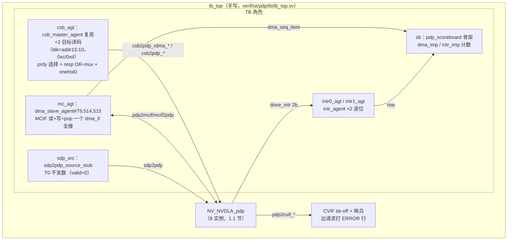

# PDP（平面池化单元）验证方案书

> **文档类型：验证方案书**（结构：① DUT 架构与代码列表 ② feature 功能特性清单
> ③ 测试点 ④ 验证框架，同 [csc-cmac-cacc.md](csc-cmac-cacc.md) 骨架）。
>
> 事实来源：outdir/nv_full/vmod/ 源码实读（2026-08-03，nv_full 配置，`developer`
> 分支）。所有 file:line 均按写稿时刻文件终态逐条核对；行号随代码演进会漂移，
> 修订时须重新核对。
> 修订记录：2026-08-03 首版——**环境搭建阶段（阶段4）**：UT 环境落地 + T0 寄存器面
> 冒烟核销（regress T0×2 seeds 全绿）；**feature 覆盖判定与测试点分解待后续 Wave**。

PDP（Planar Data Processor，平面数据处理器）对 W×H 平面做池化（pooling）：
max / min / average 三种方法，kernel 1-8、带 padding 与宽度切分（split）。数据入口
两条：on-flying（SDP 直连 sdp2pdp）与 off-flying（内置 RDMA 从 MCIF/CVIF 读内存）；
**结果没有直连出口，一律经内置 WDMA 写回内存**（MCIF 或 CVIF，按 dst_ram_type 选路）。

## 1. DUT 架构与代码列表

### 1.1 DUT 边界与实例

```mermaid
flowchart LR
  subgraph TB侧激励
    CSB[csb host ×2<br>0xc000 / 0xd000]
    SDPS[sdp2pdp_source_stub<br>on-flying 入口]
    MCM[dma_slave_agent<br>MCIF 读+写 内存模型]
  end
  subgraph DUT[NV_NVDLA_pdp（单模块 8 实例）]
    RDMA[u_rdma<br>PDP_RDMA：ig/cq/eg/reg]
    NAN[u_nan<br>NaN 预处理（fp16）]
    CORE[u_core<br>preproc→cal1d→cal2d]
    WDMA[u_wdma<br>dat/cmd/intr_fifo]
    REG[u_reg<br>PDP reg（单/双影子）]
    SLCG[u_slcg_core / u_slcg_wdma /<br>u_slcg_fp16（×3 门控）]
  end
  subgraph TB侧观测
    GLB[intr_agent ×2]
    CV[CVIF：tb tie-off + 哨兵]
  end
  CSB -->|csb2pdp_rdma_*| RDMA
  CSB -->|csb2pdp_*| REG
  MCM <-->|mcif2pdp/pdp2mcif 读| RDMA
  SDPS -->|sdp2pdp 256b| NAN
  RDMA --> NAN --> CORE --> WDMA
  WDMA <-->|pdp2mcif/mcif2pdp 写| MCM
  RDMA -.->|pdp2cvif 读（tie）.-> CV
  WDMA -.->|pdp2cvif 写（tie）.-> CV
  WDMA -->|pdp2glb_done_intr_pd 2b| GLB
```

**DUT = 1 个顶层模块 NV_NVDLA_pdp，内部 8 个实例**（例化点均在
outdir/nv_full/vmod/nvdla/pdp/NV_NVDLA_pdp.v）：

| # | 模块 | 实例名 | 例化点 | 说明 |
|---|---|---|---|---|
| 1 | NV_NVDLA_PDP_rdma | u_rdma | NV_NVDLA_pdp.v:208 | off-flying 读引擎；内含 u_slcg :108、u_ig :121（请求生成）、u_cq :158（命令队列）、u_eg :172（响应出口）、u_reg :198（**PDP_RDMA 寄存器终点在此**） |
| 2 | NV_NVDLA_PDP_slcg | u_slcg_core | NV_NVDLA_pdp.v:245 | core 域时钟门控（slcg_op_en[0]） |
| 3 | NV_NVDLA_PDP_slcg | u_slcg_wdma | NV_NVDLA_pdp.v:254 | wdma 域时钟门控（slcg_op_en[1]） |
| 4 | NV_NVDLA_PDP_slcg | u_slcg_fp16 | NV_NVDLA_pdp.v:263 | fp16 通路时钟门控（slcg_op_en[2]） |
| 5 | NV_NVDLA_PDP_nan | u_nan | NV_NVDLA_pdp.v:275 | 入口二选一汇聚 + fp16 NaN 清零/统计（int 通路直通） |
| 6 | NV_NVDLA_PDP_wdma | u_wdma | NV_NVDLA_pdp.v:295 | 写回引擎；内含 u_dat :700、u_cmd :953、u_intr_fifo :2246（**NV_NVDLA_PDP_WDMA_intr_fifo 定义在本文件 :3524，无独立文件**） |
| 7 | NV_NVDLA_PDP_core | u_core | NV_NVDLA_pdp.v:338 | 池化数据通路：u_preproc :223 → u_cal1d :244（水平 1D，unit1d×7）→ u_cal2d :298（垂直 2D） |
| 8 | NV_NVDLA_PDP_reg | u_reg | NV_NVDLA_pdp.v:402 | PDP 主寄存器终点（single + dual d0/d1 影子） |

> **DUT 边界注**：MCIF / CVIF / GLB（中断收集）/ SDP 均**不纳入 DUT**——TB 直连
> NV_NVDLA_pdp 的 45 个外部端口：MCIF 一组挂 dma_slave_agent 内存模型；CVIF 一组
> tie-off（本 UT 不测 CV 通路，出请求即报错，§4.6）；sdp2pdp 入口由 source stub
> 扮演 SDP 发送侧；中断 2 位挂 intr_agent 观测。真实芯片里 PDP 在 partition_o，
> CSB 由 csb_master 扇出（块号 0xc/0xd，verif/ut/common/base/ut_types.svh:28-29）。

### 1.2 源文件清单（按功能分组）

**全部 23 件，vmod/nvdla/pdp/（工具消费面 outdir/nv_full/vmod/nvdla/pdp/）**：

| 功能组 | 文件 | 角色 |
|---|---|---|
| 顶层 | NV_NVDLA_pdp.v | 端口 :53-97（45 个）；8 实例互连；slcg_op_en 分发 |
| RDMA | NV_NVDLA_PDP_rdma.v | 读引擎顶层（u_ig/u_cq/u_eg/u_reg/u_slcg） |
| RDMA | NV_NVDLA_PDP_RDMA_ig.v | 读请求生成：split/line/surf 地址推进；**kernel overlap 借位断言 :727（§5.1）** |
| RDMA | NV_NVDLA_PDP_RDMA_cq.v | 在途命令队列（请求信息侧带） |
| RDMA | NV_NVDLA_PDP_RDMA_eg.v | 读响应出口/解包，credit pop 源头 |
| RDMA 寄存器 | NV_NVDLA_PDP_RDMA_reg.v / NV_NVDLA_PDP_RDMA_REG_single.v / NV_NVDLA_PDP_RDMA_REG_dual.v | PDP_RDMA CSB 终点；S/D 分界 + d0/d1 乒乓（1.4 节） |
| 入口汇聚 | NV_NVDLA_PDP_nan.v | on/off-flying 二选一 + fp16 NaN flush-to-zero + inf/nan 计数 |
| 池化核心 | NV_NVDLA_PDP_core.v | u_preproc → u_cal1d → u_cal2d 串接 |
| 池化核心 | NV_NVDLA_PDP_CORE_preproc.v | 入流预处理（拍宽/通道整形） |
| 池化核心 | NV_NVDLA_PDP_CORE_cal1d.v | 水平 1D 池化：unit1d_0..6 七例 :2413-2551；overlap 复用控制 |
| 池化核心 | NV_NVDLA_PDP_CORE_unit1d.v | 1D 池化算子单体（max/min/sum）；内含 u_cal1d_fp16_pool_sum :387 |
| 池化核心 | NV_NVDLA_PDP_CORE_cal2d.v | 垂直 2D 池化 + average 乘 recip + 行缓存 |
| 池化核心 | cal1d_fp16_pool_sum.v / fp16_4add.v | fp16 求和算子（average/sum 用） |
| WDMA | NV_NVDLA_PDP_wdma.v | 写回顶层（u_dat/u_cmd/u_intr_fifo；intr_fifo 模块同文件 :3524） |
| WDMA | NV_NVDLA_PDP_WDMA_dat.v / NV_NVDLA_PDP_WDMA_cmd.v | 写数据打包 / 写命令（addr+size+require_ack）生成 |
| PDP 寄存器 | NV_NVDLA_PDP_reg.v / NV_NVDLA_PDP_REG_single.v / NV_NVDLA_PDP_REG_dual.v | PDP 主 CSB 终点 |
| 门控 | NV_NVDLA_PDP_slcg.v | SLCG 时钟门控单元（×3 例 + rdma 内 1 例） |

注：pdp 源**无 DW_\*/DESIGNWARE 引用**（2026-08 实测 grep 零命中）——UT filelist
不带 `+define+DESIGNWARE_NOEXIST`、不列 NV_DW_\* 替身（与 csc_cmac_cacc 不同）。
另：pdp 源端口声明带**行首空格**，grep 端口要用 `^\s*(input|output)`。

### 1.3 外部端口 6 组（TB 全部要接或观测；声明 NV_NVDLA_pdp.v:53-97）

| 组 | 信号 | 位宽 | 方向 | 端口声明 | TB 接法 |
|---|---|---|---|---|---|
| ① CSB ×2 | csb2pdp_req_{pvld,prdy,pd} / pdp2csb_resp_{valid,pd}（PDP，块 0xd） | 63b 请求 / 34b 响应 | in/out | :64-66 / :75-76 | csb master 面 2 目标译码（§4.1）；prdy 恒 1（NV_NVDLA_PDP_reg.v:839） |
| ① CSB ×2 | csb2pdp_rdma_req_\* / pdp_rdma2csb_resp_\*（PDP_RDMA，块 0xc） | 同上 | in/out | :61-63 / :92-93 | 同上；prdy 恒 1（NV_NVDLA_PDP_RDMA_reg.v:625） |
| ② MCIF 读 | pdp2mcif_rd_req_{valid,ready,pd[78:0]} / mcif2pdp_rd_rsp_{valid,ready,pd[513:0]} / pdp2mcif_rd_cdt_lat_fifo_pop | 79b 请求（addr64+size15）/ 514b 响应（data512+mask2）| out/in | :85-88 / :71-73 | dma_if#(79,514,515) 读通道 + pop（协议见 docs/spec/common/dma-if.md） |
| ② MCIF 写 | pdp2mcif_wr_req_{valid,ready,pd[514:0]} / mcif2pdp_wr_rsp_complete | 515b（[514]=id：0 cmd/1 data；cmd[77]=require_ack） | out/in | :89-91 / :74 | 同一 dma_if 写通道 |
| ③ CVIF 全组 | pdp2cvif_rd_req_\*、cvif2pdp_rd_rsp_\*、pdp2cvif_rd_cdt_lat_fifo_pop、pdp2cvif_wr_req_\*、cvif2pdp_wr_rsp_complete | 与 MCIF 同形 | out/in | :67-70 / :77-83 | **tie-off**：输入全 0、ready 全 0；哨兵监 pdp2cvif_\*_req_valid（§4.6） |
| ④ 直连入口 | sdp2pdp_{valid,ready,pd[255:0]} | 256b | in/out | :95-97 | sdp2pdp_if，源侧 stub 驱动（无直连出口，结果走 WDMA） |
| ⑤ 中断 | pdp2glb_done_intr_pd[1:0] | 2b | out | :84 | 逐位挂 intr_if ×2 |
| ⑥ 杂项 | nvdla_core_clk / nvdla_core_rstn；pwrbus_ram_pd[31:0]；dla_clk_ovr_on_sync / global_clk_ovr_on_sync / tmc2slcg_disable_clock_gating | — | in | :59-60 / :94 / :53-55 | 时钟 7ns 复位 101ns；pwrbus=0、ovr=0、disable_clock_gating=1（关门控） |

### 1.4 两 reg 块地址图（feature 表与 T0 的基础）

两块同构机制：S/D 分界为**块内偏移 0x008**（NV_NVDLA_PDP_reg.v:649-651：<0x008 走
single，≥0x008 按 producer 选 d0/d1；RDMA_reg 同构）；op_en 置位期间对应 D 组写保护
断言（PDP_reg.v:693/:740 "Write group registers when OP_EN is set"）；op_en 本体
在 regfile 外实现（REG_dual "to be implemented outside"，op_en_trigger 触发、
dp2reg_done 自动清零，PDP_reg.v:575/:593）；consumer 随 done 翻转（PDP_reg.v:479-489）。
**两块全部可写字段复位值均为 0**（PDP_REG_dual.v:470-516、RDMA_REG_dual.v:246-266）
——没有 ccc 那种 proc_precision=01 的非零复位特例。

**PDP 块（字节基址 0xd000；译码 NV_NVDLA_PDP_REG_dual.v:228-265，读拼装 :266-303）**：

| 字节地址 | 寄存器 | 可写字段位图（= T0 读回 mask） |
|---|---|---|
| 0xd000 | S_STATUS | 只读 {14'b0,status_1[1:0],14'b0,status_0[1:0]}（REG_single.v:57） |
| 0xd004 | S_POINTER | producer[0] 可写；consumer[16] 只读（REG_single.v:56） |
| 0xd008 | D_OP_ENABLE | op_en[0]（T0 不写） |
| 0xd00c/10/14 | D_DATA_CUBE_IN_WIDTH/HEIGHT/CHANNEL | cube_in_\*[12:0]，mask 0x1FFF |
| 0xd018/1c/20 | D_DATA_CUBE_OUT_WIDTH/HEIGHT/CHANNEL | cube_out_\*[12:0]，mask 0x1FFF |
| 0xd024 | D_OPERATION_MODE_CFG | split_num[15:8]、flying_mode[4]、pooling_method[1:0]，mask 0x0000FF13 |
| 0xd028 | D_NAN_FLUSH_TO_ZERO | nan_to_zero[0] |
| 0xd02c / 0xd030 | D_PARTIAL_WIDTH_IN / OUT | mid[29:20]、last[19:10]、first[9:0]，mask 0x3FFFFFFF |
| 0xd034 | D_POOLING_KERNEL_CFG | ksh[23:20]、ksw[19:16]、kh[11:8]、kw[3:0]，mask 0x00FF0F0F；**写值须守 §5.1 overlap 合同** |
| 0xd038 / 0xd03c | D_RECIP_KERNEL_WIDTH / HEIGHT | recip[16:0]，mask 0x1FFFF（avg 乘子） |
| 0xd040 | D_POOLING_PADDING_CFG | pad_bottom[14:12]、pad_right[10:8]、pad_top[6:4]、pad_left[2:0]，mask 0x7777 |
| 0xd044-0xd05c | D_POOLING_PADDING_VALUE_1..7_CFG | pad_value_Nx[18:0]，mask 0x7FFFF |
| 0xd060/64/68/6c | D_SRC_BASE_ADDR_LOW/HIGH、D_SRC_LINE/SURFACE_STRIDE | low/stride 存 [31:5]（mask 0xFFFFFFE0，32B 对齐）；high 全 32b |
| 0xd070/74/78/7c | D_DST_BASE_ADDR_LOW/HIGH、D_DST_LINE/SURFACE_STRIDE | 同上 |
| 0xd080 | D_DST_RAM_CFG | dst_ram_type[0]（1=MC 0=CV；**复位 0=CV，§4.6 坑**） |
| 0xd084 | D_DATA_FORMAT | input_data[1:0] |
| 0xd088/8c/90 | D_INF_INPUT_NUM、D_NAN_INPUT_NUM、D_NAN_OUTPUT_NUM | 只读计数（fp16 统计） |
| 0xd094 | D_PERF_ENABLE | dma_en[0] |
| 0xd098 | D_PERF_WRITE_STALL | 只读计数 |
| 0xd09c | D_CYA | cya[31:0] 全可写 |

**PDP_RDMA 块（字节基址 0xc000；译码 NV_NVDLA_PDP_RDMA_REG_dual.v:124-141，
读拼装 :142-159）**：

| 字节地址 | 寄存器 | 可写字段位图 |
|---|---|---|
| 0xc000 / 0xc004 / 0xc008 | S_STATUS / S_POINTER / D_OP_ENABLE | 同 PDP 块同构 |
| 0xc00c/10/14 | D_DATA_CUBE_IN_WIDTH/HEIGHT/CHANNEL | cube_in_\*[12:0]，mask 0x1FFF |
| 0xc018 | D_FLYING_MODE | flying_mode[0] |
| 0xc01c/20/24/28 | D_SRC_BASE_ADDR_LOW/HIGH、D_SRC_LINE/SURFACE_STRIDE | 同 PDP 块 src 组（[31:5]/全 32b） |
| 0xc02c | D_SRC_RAM_CFG | src_ram_type[0]（**复位 0=CV，§4.6 坑**） |
| 0xc030 | D_DATA_FORMAT | input_data[1:0] |
| 0xc034 | D_OPERATION_MODE_CFG | split_num[7:0]（**无 flying/method 字段，与 PDP 块同名不同位图**） |
| 0xc038 | D_POOLING_KERNEL_CFG | ksw[7:4]、kw[3:0]，mask 0xFF（**字段位置与 PDP 块不同**；写值守 §5.1 合同） |
| 0xc03c | D_POOLING_PADDING_CFG | pad_width[3:0] |
| 0xc040 | D_PARTIAL_WIDTH_IN | mid[29:20]、last[19:10]、first[9:0] |
| 0xc044 / 0xc048 | D_PERF_ENABLE / D_PERF_READ_STALL | dma_en[0] / 只读计数 |
| 0xc04c | D_CYA | cya[31:0] |

> T0 扫描范围依据：REG_single/REG_dual 读路径均为纯组合 case mux（REG_dual.v:349-465），
> **无读副作用寄存器**（计数器只读不清）；未译码偏移读回 32'h0（default 分支）。
> 故 PDP 块扫 0x000-0x09c、PDP_RDMA 块扫 0x000-0x04c 全程只读安全。

## 2. feature 功能特性清单（骨架——覆盖判定与测试点分解待后续 Wave）

表列说明：来源锚点给 reg 字段（1.4 节地址图）或机制代码；**"覆盖"列本阶段全部
"待定"、"测试点"列留空**，待测试点分解 Wave 定案。

### 2.1 F-MODE 入口与精度

| id | 名称 | 来源锚点 | 覆盖 | 测试点 |
|---|---|---|---|---|
| F-MODE-1 | on-flying 入口（flying_mode=1，SDP 直连 sdp2pdp，RDMA 旁路） | pdp/rdma D_OPERATION_MODE_CFG.flying_mode / D_FLYING_MODE；u_nan 入口选择 NV_NVDLA_pdp.v:275 | 待定 | |
| F-MODE-2 | off-flying 入口（flying_mode=0，RDMA 读内存） | 同上；u_rdma | 待定 | |
| F-MODE-3 | input_data 精度（int8/int16/fp16） | pdp/rdma D_DATA_FORMAT.input_data[1:0] | 待定 | |
| F-MODE-4 | 双块 flying/format 配置一致合同（PDP 与 PDP_RDMA 各存一份） | 1.4 节两块地址图 | 待定 | |

### 2.2 F-POOL 池化运算

| id | 名称 | 来源锚点 | 覆盖 | 测试点 |
|---|---|---|---|---|
| F-POOL-1 | pooling_method（avg/max/min） | pdp D_OPERATION_MODE_CFG.pooling_method[1:0]；unit1d 算子 | 待定 | |
| F-POOL-2 | kernel W/H 与 stride W/H（1D+2D 两级分解） | pdp D_POOLING_KERNEL_CFG；cal1d（水平）/cal2d（垂直） | 待定 | |
| F-POOL-3 | average 池化 recip 乘子（1/kernel 定点近似） | pdp D_RECIP_KERNEL_WIDTH/HEIGHT；cal2d | 待定 | |
| F-POOL-4 | padding：数量（pad_l/r/t/b、rdma pad_width）+ 增量补值 pad_value_1x..7x | pdp D_POOLING_PADDING_CFG/VALUE_\*、rdma D_POOLING_PADDING_CFG | 待定 | |
| F-POOL-5 | **kernel/stride overlap 合法性合同**（激励恒用合法值，§5.1） | NV_NVDLA_PDP_RDMA_ig.v:698/:727 | 待定（激励合同，T0 已按此执行） | |
| F-POOL-6 | fp16 NaN 通路：nan_to_zero + inf/nan 计数 | pdp D_NAN_FLUSH_TO_ZERO、D_INF/NAN_\*_NUM；u_nan | 待定 | |

### 2.3 F-GEO 数据几何

| id | 名称 | 来源锚点 | 覆盖 | 测试点 |
|---|---|---|---|---|
| F-GEO-1 | 输入立方 W/H/C（两块各一份，一致合同） | pdp/rdma D_DATA_CUBE_IN_\* | 待定 | |
| F-GEO-2 | 输出立方 W/H/C 与 kernel/stride/pad 几何一致合同 | pdp D_DATA_CUBE_OUT_\* | 待定 | |
| F-GEO-3 | 宽度切分 split_num + partial_width_in/out（first/mid/last） | pdp/rdma D_OPERATION_MODE_CFG.split_num、D_PARTIAL_WIDTH_IN/OUT | 待定 | |
| F-GEO-4 | 非切分整幅模式（split_num=0） | 同上 | 待定 | |

### 2.4 F-RDMA 读通路

| id | 名称 | 来源锚点 | 覆盖 | 测试点 |
|---|---|---|---|---|
| F-RDMA-1 | src 寻址：base low/high + line/surface stride（32B 对齐） | rdma D_SRC_\*；ig 地址推进 RDMA_ig.v:417-638 | 待定 | |
| F-RDMA-2 | src_ram_type MC/CV 选路（本 UT 只走 MC，CV tie-off 哨兵） | rdma D_SRC_RAM_CFG | 待定 | |
| F-RDMA-3 | 读请求 size 打包 + credit 归还（rd_cdt_lat_fifo_pop） | ig/cq/eg；pop 源头 RDMA_eg.v | 待定 | |
| F-RDMA-4 | 读地址越界监视（base_addr 加法进位断言群） | RDMA_ig.v:462/:536/:607/:677 | 待定 | |

### 2.5 F-WDMA 写通路

| id | 名称 | 来源锚点 | 覆盖 | 测试点 |
|---|---|---|---|---|
| F-WDMA-1 | dst 寻址：base low/high + line/surface stride | pdp D_DST_\*；WDMA_cmd | 待定 | |
| F-WDMA-2 | dst_ram_type MC/CV 选路 | pdp D_DST_RAM_CFG | 待定 | |
| F-WDMA-3 | 写命令/数据打包（cmd[77]=require_ack）与 wr_rsp_complete 消费 | WDMA_cmd/WDMA_dat；dma-if.md | 待定 | |
| F-WDMA-4 | 层完成：末笔写落地 → done → 中断（intr_fifo） | NV_NVDLA_PDP_wdma.v u_intr_fifo :2246 | 待定 | |

### 2.6 F-PP 乒乓与中断

| id | 名称 | 来源锚点 | 覆盖 | 测试点 |
|---|---|---|---|---|
| F-PP-1 | op_en 触发/done 自动清零（两块各自） | PDP_reg.v:575/:593；RDMA_reg 同构 | 待定 | |
| F-PP-2 | producer/consumer 乒乓 + S_STATUS 三态 + S/D 分界 0x008 | PDP_reg.v:479-489/:548-561/:649-651 | 待定（影子机制 T0 已冒烟） | |
| F-PP-3 | done 中断 2 位选位语义（interrupt_ptr） | PDP_reg.v:101 reg2dp_interrupt_ptr；wdma intr_fifo | 待定 | |
| F-PP-4 | op_en 置位期 D 组写保护 | PDP_reg.v:693/:740 断言 | 待定 | |

### 2.7 F-PERF 性能计数与杂项

| id | 名称 | 来源锚点 | 覆盖 | 测试点 |
|---|---|---|---|---|
| F-PERF-1 | perf 使能 dma_en + 读/写 stall 计数 | pdp D_PERF_ENABLE/WRITE_STALL、rdma D_PERF_ENABLE/READ_STALL | 待定 | |
| F-MISC-1 | CYA 后门字段（两块） | pdp/rdma D_CYA | 待定 | |
| F-MISC-2 | SLCG 门控（slcg_op_en 三域 + rdma 内 1 例） | NV_NVDLA_pdp.v:245-273、PDP_rdma.v:108 | 待定 | |

### 2.8 reg2dp 字段核对总表（验收硬标准：零遗漏）

两 reg 终点全部 reg2dp_\* 输出逐一核对（PDP 47 个：NV_NVDLA_PDP_reg.v:86-132；
PDP_RDMA 20 个：NV_NVDLA_PDP_RDMA_reg.v:53-72。合计 **67 个，下表全部出现，
零遗漏**；feature 映射列环境阶段可标待定）：

| 块 | 字段（位宽） | feature | 覆盖 |
|---|---|---|---|
| pdp | cube_in_channel[12:0] | F-GEO-1 | 待定 |
| pdp | cube_in_height[12:0] | F-GEO-1 | 待定 |
| pdp | cube_in_width[12:0] | F-GEO-1 | 待定 |
| pdp | cube_out_channel[12:0] | F-GEO-2 | 待定 |
| pdp | cube_out_height[12:0] | F-GEO-2 | 待定 |
| pdp | cube_out_width[12:0] | F-GEO-2 | 待定 |
| pdp | cya[31:0] | F-MISC-1 | 待定 |
| pdp | dma_en | F-PERF-1 | 待定 |
| pdp | dst_base_addr_high[31:0] | F-WDMA-1 | 待定 |
| pdp | dst_base_addr_low[26:0] | F-WDMA-1 | 待定 |
| pdp | dst_line_stride[26:0] | F-WDMA-1 | 待定 |
| pdp | dst_ram_type | F-WDMA-2 | 待定 |
| pdp | dst_surface_stride[26:0] | F-WDMA-1 | 待定 |
| pdp | flying_mode | F-MODE-1/2/4 | 待定 |
| pdp | input_data[1:0] | F-MODE-3 | 待定 |
| pdp | interrupt_ptr | F-PP-3 | 待定 |
| pdp | kernel_height[3:0] | F-POOL-2 | 待定 |
| pdp | kernel_stride_height[3:0] | F-POOL-2 | 待定 |
| pdp | kernel_stride_width[3:0] | F-POOL-2/5 | 待定 |
| pdp | kernel_width[3:0] | F-POOL-2/5 | 待定 |
| pdp | nan_to_zero | F-POOL-6 | 待定 |
| pdp | op_en | F-PP-1/4 | 待定 |
| pdp | pad_bottom[2:0] | F-POOL-4 | 待定 |
| pdp | pad_left[2:0] | F-POOL-4 | 待定 |
| pdp | pad_right[2:0] | F-POOL-4 | 待定 |
| pdp | pad_top[2:0] | F-POOL-4 | 待定 |
| pdp | pad_value_1x[18:0] | F-POOL-4 | 待定 |
| pdp | pad_value_2x[18:0] | F-POOL-4 | 待定 |
| pdp | pad_value_3x[18:0] | F-POOL-4 | 待定 |
| pdp | pad_value_4x[18:0] | F-POOL-4 | 待定 |
| pdp | pad_value_5x[18:0] | F-POOL-4 | 待定 |
| pdp | pad_value_6x[18:0] | F-POOL-4 | 待定 |
| pdp | pad_value_7x[18:0] | F-POOL-4 | 待定 |
| pdp | partial_width_in_first[9:0] | F-GEO-3 | 待定 |
| pdp | partial_width_in_last[9:0] | F-GEO-3 | 待定 |
| pdp | partial_width_in_mid[9:0] | F-GEO-3 | 待定 |
| pdp | partial_width_out_first[9:0] | F-GEO-3 | 待定 |
| pdp | partial_width_out_last[9:0] | F-GEO-3 | 待定 |
| pdp | partial_width_out_mid[9:0] | F-GEO-3 | 待定 |
| pdp | pooling_method[1:0] | F-POOL-1 | 待定 |
| pdp | recip_kernel_height[16:0] | F-POOL-3 | 待定 |
| pdp | recip_kernel_width[16:0] | F-POOL-3 | 待定 |
| pdp | split_num[7:0] | F-GEO-3/4 | 待定 |
| pdp | src_base_addr_high[31:0] | F-RDMA-1（pdp 侧副本） | 待定 |
| pdp | src_base_addr_low[26:0] | F-RDMA-1（pdp 侧副本） | 待定 |
| pdp | src_line_stride[26:0] | F-RDMA-1（pdp 侧副本） | 待定 |
| pdp | src_surface_stride[26:0] | F-RDMA-1（pdp 侧副本） | 待定 |
| pdp_rdma | cube_in_channel[12:0] | F-GEO-1 | 待定 |
| pdp_rdma | cube_in_height[12:0] | F-GEO-1 | 待定 |
| pdp_rdma | cube_in_width[12:0] | F-GEO-1 | 待定 |
| pdp_rdma | cya[31:0] | F-MISC-1 | 待定 |
| pdp_rdma | dma_en | F-PERF-1 | 待定 |
| pdp_rdma | flying_mode | F-MODE-1/2/4 | 待定 |
| pdp_rdma | input_data[1:0] | F-MODE-3 | 待定 |
| pdp_rdma | kernel_stride_width[3:0] | F-POOL-2/5 | 待定 |
| pdp_rdma | kernel_width[3:0] | F-POOL-2/5（**§5.1 断言载体**） | 待定 |
| pdp_rdma | op_en | F-PP-1 | 待定 |
| pdp_rdma | pad_width[3:0] | F-POOL-4 | 待定 |
| pdp_rdma | partial_width_in_first[9:0] | F-GEO-3 | 待定 |
| pdp_rdma | partial_width_in_last[9:0] | F-GEO-3 | 待定 |
| pdp_rdma | partial_width_in_mid[9:0] | F-GEO-3 | 待定 |
| pdp_rdma | split_num[7:0] | F-GEO-3/4 | 待定 |
| pdp_rdma | src_base_addr_high[31:0] | F-RDMA-1 | 待定 |
| pdp_rdma | src_base_addr_low[26:0] | F-RDMA-1 | 待定 |
| pdp_rdma | src_line_stride[26:0] | F-RDMA-1 | 待定 |
| pdp_rdma | src_ram_type | F-RDMA-2 | 待定 |
| pdp_rdma | src_surface_stride[26:0] | F-RDMA-1 | 待定 |

（另有只读回读字段：pdp 侧 dp2reg 的 inf_input_num / nan_input_num /
nan_output_num / perf_write_stall → F-POOL-6/F-PERF-1；rdma 侧 perf_read_stall →
F-PERF-1；两块 status/consumer/done → F-PP-2/3。）

## 3. 测试点（环境搭建阶段：仅 T0；其余待测试点分解）

| 测试 | 内容 | 状态 |
|---|---|---|
| T0 | **已核销：环境冒烟**（verif/ut/pdp/seqs/pdp_t0_reg_seq.svh），内容 = ① 两 reg 块复位值读（S_STATUS/S_POINTER/D_OP_ENABLE + 代表 D 寄存器，全 0）② 代表 D 寄存器 mask 化写读比对（期望=写值&字段 mask，mask 自 REG_dual 实读；kernel cfg 守 §5.1 合法值合同）③ S_POINTER 乒乓影子各一例（D_CYA 载体，d0/d1 独立保值）④ 块内偏移扫描读不挂（PDP 0x000-0x09c / PDP_RDMA 0x000-0x04c，1.4 节安全性论证）⑤ 双块互不串（同偏移 0x00c + D_CYA 交叉特征值互读）。全程不写 D_OP_ENABLE、全用 nposted 写 | **绿**（seed1/seed2 + regress，check 四连全过） |
| T1+ | 数据通路（off-flying MC 读→池化→MC 写）、on-flying、几何/方法扫、乒乓/中断、负面组 | 待测试点分解（后续 Wave） |

## 4. 验证框架

### 4.1 TB 结构



### 4.2 组件表（实例名与代码一致，verif/ut/pdp/ 与 verif/ut/common/）

| 组件（实例名） | 来源 | 说明 |
|---|---|---|
| csb_master_agent（csb_agt） | 复用 verif/ut/common/csb/ | 单 host 面；tb_top 组合逻辑做 2 目标译码（PDP_RDMA=0xc / PDP=0xd，枚举 ut_types.svh:28-29）、prdy 按块选择、两路 resp OR-mux + $onehot0 兜底（tb/tb_top.sv:89-118，收窄自 ccc tb 的 4 目标形态） |
| dma_slave_agent#(79,514,515)（mc_agt） | 复用 verif/ut/common/dma/（nvdla_ut_pkg.sv:50 已特化 dma_slave_agent_cdp_t） | MCIF 读+写+pop 全接一个 dma_if；config_db 键 "dma_vif" 按作用域 "uvm_test_top.env.mc_agt\*" set（照 cdma_cbuf 样板 tb_top.sv:314-321） |
| sdp2pdp_source_stub（sdp_src） | 复用 verif/ut/common/sdp2pdp/（阶段4 第 0 步落地） | sdp2pdp 入口源；vif 键 "sdp2pdp_vif"；T0 冒烟不发数 |
| intr_agent ×2（intr0_agt/intr1_agt） | 复用 verif/ut/common/intr/ | pdp2glb_done_intr_pd[0]/[1] 逐位；上升沿计数 + ap |
| pdp_scoreboard（sb） | 新建 verif/ut/pdp/env/pdp_scoreboard.svh | **阶段4 环境版占位**：dma_imp/intr_imp 只计数，check 留空；数据通路比对（pooling refmodel + WDMA 写流判分）待后续 Wave |
| pdp_env / seqs / tests | 新建 verif/ut/pdp/ | env 五角色 + csb base seq（防坑写法沿用 ccc）+ T0 seq + base/t0 test |
| common.mk / ut_base_test | 复用 verif/ut/common/ | check 四连：UVM_FATAL:0 / UVM_ERROR:0 / 无 `^ERROR :` / `UT RESULT: PASSED` |

### 4.3 BFM 规格

**dma_slave_responder（mc_agt.rsp，复用 verif/ut/common/dma/dma_slave_responder.svh）**：

- 读通道：size 为 0-based 32B 块数（n=size+1）；响应按 512b beat 紧凑打包，
  beat 数 = ceil(n/2)，末奇块 mask=2'b01（2'b10 永不出现）；多笔在途按请求序回数；
  未初始化地址回确定性 pattern `default_byte(addr)`（地址异或哈希），refmodel 可
  独立复算；预载 API `load_bytes()/load_data()`；
- 写通道：id=[514]（0=cmd 1=data），cmd[77]=require_ack 置 1 才回单拍
  wr_rsp_complete；data 变体按 64B 落盘本地 mem；
- credit：rd_cdt_lat_fifo_pop 脉冲直通计数（credit_returned）；
- 旋钮：rd_rsp_dly_min/max（每 beat 延迟，默认 0..2）、req_gap_pct/min/max
  （rd_req_prdy 背压，默认 0）、**rd_rsp_first_min=6**（首拍最小响应延迟，
  cdma_cbuf T3 实证的从设备隐性契约，PDP wave 期是否可放宽待实测）。

**sdp2pdp_source_stub（sdp_src，复用 verif/ut/common/sdp2pdp/sdp2pdp_source_stub.svh）**：

- API：`task send_beat(sdp2pdp_item tr)`——valid 拉高保持至 ready 握手，握手后按
  gap 旋钮插空拍（连续调用且 gap=0 背靠背）；
- 旋钮：gap_min/gap_max（config_db int unsigned "gap_min"/"gap_max"，默认 0）；
- 计数：n_beats；复位期间 valid 自动压 0；
- item：sdp2pdp_item 裸 pd[255:0] + 16×16b lane 视图（**pd 字段语义环境阶段未定案**，
  待 SDP 数据通路 wave 回写）。

### 4.4 激励顺序合同

占位：数据通路激励顺序（双块编程→op_en 顺序→入流/读流→等中断）待测试点分解 Wave
与首个数据通路测试一起定案。

### 4.5 refmodel 分层与判分

占位：pooling refmodel（唯一判分面预计 = WDMA 写流 addr+data）待后续 Wave 落地。

### 4.6 平台注记（阶段4 环境搭建实测）

- **ram_type 复位值坑（最重要）**：src_ram_type / dst_ram_type 复位值 0 = CV 通路，
  而本 UT CVIF 整组 tie-off（ready=0 + 哨兵报错）。**后续数据通路 wave 必须显式
  编程 rdma D_SRC_RAM_CFG=1 与 pdp D_DST_RAM_CFG=1 选 MC，否则读写全走被 tie 死的
  CVIF**——现象是请求挂死 + tb 哨兵刷 `ERROR : unexpected CVIF request`（该哨兵行
  以 `^ERROR :` 形态被 make check 第 3 条抓住，tb/tb_top.sv:136-140）；
- **kernel cfg 写值合同**：D_POOLING_KERNEL_CFG 两块都不可随意写全 1（§5.1 断言，
  T0 首跑实测踩中）；寄存器扫描/随机写恒用合法组合（T0 用 kw=7/ksw=7 与
  kw=8/ksw=F 两组覆盖全部字段位）；
- **tb_top 手写**：不复用 ccc 的 gen_tb_top.py（该生成器 ccc 专用硬编码，且端口
  正则不认 pdp 源的行首空格）；端口 45 个逐条对 NV_NVDLA_pdp.v:53-97 核对；
- **sdp2pdp_if.ready 双驱动编译告警**：tb 以连续赋值驱 `u_sdp2pdp_if.ready`（DUT
  输出回灌 interface），与 common/sdp2pdp/sdp2pdp_if.sv:24 sink_cb 的
  `output ready` 声明构成"结构+过程混合驱动"，VCS 报 warning（"will be upgraded
  to error in future releases"）。本 UT 未例化 sink 侧，功能无影响、编译运行全绿；
  common 已冻结不动，**若日后 VCS 升级为 error，需主循环裁决拆分 sink_cb**（§5.2）；
- filelist 不带 DESIGNWARE 宏、不列 NV_DW_\* 替身（1.2 节注，与 ccc filelist 的
  唯一结构差异）。

## 5. 与预研线索不符的发现 / 勘误（同步点用）

1. **kernel overlap 借位断言（T0 首跑实测踩中，设计合同非 bug）**：
   NV_NVDLA_PDP_RDMA_ig.v:698 组合式
   `{mon_overlap,overlap} = (kw < ksw) ? (ksw - {1'b0,kw[2:0]}) : ({1'b0,kw[2:0]} - ksw)`
   + :727 断言 `nv_assert_never("PDP-CORE: should not overflow", mon_overlap)`——
   **不含 op_en 门控**，寄存器一写立即生效（reg2dp 走 consumer 面 mux，复位
   consumer=0 即 d0 组直通）。kernel_width[3]=1 且 kw[2:0]<ksw 即借位触发（如全 1
   写：kw=0xF→kw[2:0]=7 < ksw=0xF）。注意报错文案挂 "PDP-CORE" 名头但触发点在
   RDMA ig。**PDP 主块同名断言永不触发**：NV_NVDLA_PDP_CORE_cal1d.v:1359 同式，但
   u_core 只接 `reg2dp_kernel_width[2:0]` 三位（NV_NVDLA_pdp.v:356 port map），
   {1'b0,kw[2:0]} 与 ksw 的两分支减法数学上均不借位——即该合同的实际约束面只在
   PDP_RDMA 块的 4 位 kernel_width 字段。激励规矩同 ccc D_BANK：扫描/随机写恒用
   合法组合（T0 实测定案：kw=7/ksw=7、kw=8/ksw=F 合法）。
2. **common/sdp2pdp/sdp2pdp_if.sv 的 sink_cb 与 tb 连续赋值混驱告警**（§4.6 第 4
   条）：现为 VCS warning 级、全绿可跑；common 冻结期本 UT 不动它，留给主循环
   裁决（可选修法：sink_cb 的 ready 改 modport 方向声明或拆独立 clocking）。
