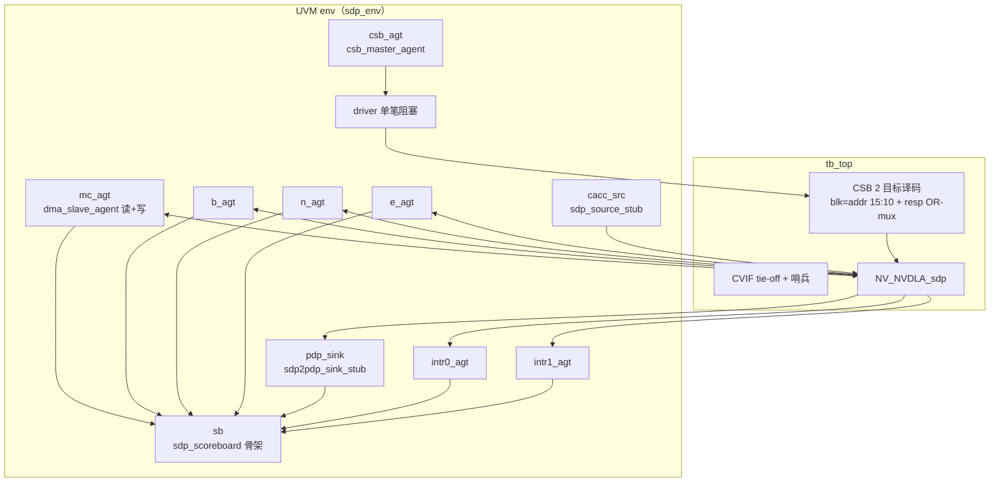

# SDP（后处理单元）验证方案书

> **文档类型：验证方案书**（结构：① DUT 架构与代码列表 ② feature 功能特性清单
> ③ 测试点核销 ④ 验证框架，见 [README](../README.md)）。
>
> 事实来源：outdir/nv_full/vmod/ 源码实读（2026-08-03，nv_full 配置，`developer` 分支）。
> 所有 file:line 均按写稿时刻文件终态逐条核对；行号随代码演进会漂移，修订时须重新核对。
> 修订记录：2026-08-03 初版——**环境搭建阶段（阶段4）**：UT 环境落地 + T0 寄存器面
> 冒烟核销（seed1/2 + regress 全绿）。**feature 覆盖判定与测试点分解待后续 Wave**。

SDP（Single Data Processor，单数据点处理器）是卷积输出的后处理单元：从 CACC 直连口
（on-flying）或内存（off-flying，经 MRDMA）取主数据，经 BS（bias）/BN（batchnorm）/
EW（element-wise，含 LUT）三级可旁路子单元做逐点运算，再经 CVT 精度转换，出口二选一
——WDMA 写回内存或 sdp2pdp 直连口喂 PDP。操作数侧另有 B/N/E 三路读 DMA 引擎。

## 1. DUT 架构与代码列表

### 1.1 DUT 边界与实例

```mermaid
flowchart LR
  subgraph TB侧激励
    CSB[csb host ×2<br>0xa000/0xb000]
    CACC[sdp_source_stub<br>cacc2sdp 514b]
    MC[dma responder ×4<br>MCIF main/b/n/e]
  end
  subgraph DUT[NV_NVDLA_sdp]
    RDMA[u_rdma<br>mrdma+brdma+nrdma+erdma]
    CORE[u_core<br>cmux + x（BS/BN）+ y（EW/LUT/CVT）]
    WDMA[u_wdma<br>写回引擎]
    REG[u_reg<br>SDP 主 reg 块 0xb000]
  end
  subgraph TB侧观测
    PDP[sdp2pdp_sink_stub<br>256b 恒 ready]
    GLB[intr 观测 ×2]
    CV[CVIF tie-off + 哨兵]
  end
  CSB -->|csb2sdp_rdma_req| RDMA
  CSB -->|csb2sdp_req| REG
  CACC -->|on-flying 入口| CORE
  MC -->|rd_rsp ×4| RDMA
  RDMA --> CORE
  CORE --> WDMA
  WDMA -->|sdp2mcif_wr_req 515b| MC
  CORE -->|sdp2pdp| PDP
  DUT -->|sdp2glb_done_intr_pd 2b| GLB
  DUT -.->|sdp*2cvif（不应出现）.-> CV
```

**DUT = NV_NVDLA_sdp 单模块、4 个子模块实例**（outdir/nv_full/vmod/nvdla/sdp/NV_NVDLA_sdp.v）：

| # | 子模块 | 实例名 | 例化点 | 说明 |
|---|---|---|---|---|
| 1 | NV_NVDLA_SDP_rdma | u_rdma | NV_NVDLA_sdp.v:322 | 4 读引擎（mrdma 主数据 + brdma/nrdma/erdma 操作数）+ SDP_RDMA reg 块（0xa000） |
| 2 | NV_NVDLA_SDP_wdma | u_wdma | NV_NVDLA_sdp.v:412 | 写回引擎（sdp2mcif/cvif wr 通道） |
| 3 | NV_NVDLA_SDP_core | u_core | NV_NVDLA_sdp.v:460 | cmux 入口选择 + x（BS/BN）+ y（EW/LUT/CVT）数据通路 |
| 4 | NV_NVDLA_SDP_reg  | u_reg  | NV_NVDLA_sdp.v:592 | SDP 主 reg 块（0xb000）+ LUT 访问口 |

> **DUT 边界注**：MCIF/CVIF 内存仲裁、glb 中断汇聚均不纳入 DUT——TB 直连 DUT 的
> 4 个 MCIF 客户端口（dma responder 扮演内存）、直连 sdp2glb_done_intr_pd；
> CVIF 侧 8 组端口整体 tie-off + 哨兵（本环境定死走 MC 路，§4.6）。真实芯片里
> sdp 到 nocif 有 RT 打拍（retiming/NV_NVDLA_RT_sdp2nocif），只影响延迟不纳入。

### 1.2 源文件清单（outdir/nv_full/vmod/nvdla/sdp/，56 件，按功能分组）

**RDMA（4 引擎 ×5-8 件 + 顶层/寄存器，共 27 件）**：

| 功能组 | 文件 | 角色 |
|---|---|---|
| rdma 顶层 | NV_NVDLA_SDP_rdma.v | 4 引擎汇聚 + reg 块挂接 |
| mrdma（主数据） | NV_NVDLA_SDP_mrdma.v、MRDMA_ig.v、MRDMA_eg.v、MRDMA_cq.v、MRDMA_EG_cmd.v、MRDMA_EG_din.v、MRDMA_EG_dout.v、MRDMA_gate.v | ig 发读请求 / cq 在途队列 / eg 收响应重排出数 / gate 门控 |
| brdma（bias） | NV_NVDLA_SDP_brdma.v、BRDMA_ig.v、BRDMA_eg.v、BRDMA_cq.v、BRDMA_EG_ro.v、BRDMA_gate.v | 结构同上（EG_ro 为重排单元） |
| nrdma（batchnorm） | NV_NVDLA_SDP_nrdma.v、NRDMA_ig.v、NRDMA_eg.v、NRDMA_cq.v、NRDMA_EG_ro.v、NRDMA_gate.v | 同上 |
| erdma（element-wise） | NV_NVDLA_SDP_erdma.v、ERDMA_ig.v、ERDMA_eg.v、ERDMA_cq.v、ERDMA_EG_ro.v、ERDMA_gate.v | 同上 |
| rdma 寄存器 | NV_NVDLA_SDP_RDMA_reg.v、RDMA_REG_single.v、RDMA_REG_dual.v | SDP_RDMA reg 块（0xa000）；S/D 分界 0x008（RDMA_reg.v:672） |

**WDMA（7 件）**：NV_NVDLA_SDP_wdma.v、WDMA_cmd.v、WDMA_dat.v、WDMA_DAT_in.v、
WDMA_DAT_out.v、WDMA_dmaif.v、WDMA_gate.v——写命令生成 / 数据打包 / mcif-cvif 二选一。

**CORE（12 件）**：

| 功能组 | 文件 | 角色 |
|---|---|---|
| core 顶层 | NV_NVDLA_SDP_core.v | cmux + x + y 串接 |
| 入口选择 | NV_NVDLA_SDP_cmux.v | on-flying（cacc2sdp）/ off-flying（mrdma）二选一 |
| x 级（BS/BN） | NV_NVDLA_SDP_CORE_x.v（6.1 万行）、CORE_c.v、CORE_gate.v | bias/batchnorm ALU+MUL+ReLU（bs/bn 双例共用 x 结构） |
| y 级（EW/LUT/CVT） | NV_NVDLA_SDP_CORE_y.v、CORE_Y_core.v、CORE_Y_inp.v、CORE_Y_idx.v、CORE_Y_lut.v、CORE_Y_cvt.v、CORE_Y_dpunpack.v、CORE_Y_dppack.v、CORE_Y_dmapack.v | element-wise ALU/MUL + LUT 查表 + 出口精度转换 + 打包（pdp 256b / wdma） |

**主寄存器（3 件）**：NV_NVDLA_SDP_reg.v、REG_single.v、REG_dual.v——SDP 主 reg 块
（0xb000）；S/D 分界 0x038（NV_NVDLA_SDP_reg.v:956）；LUT 内部访问指针在 wrapper
（NV_NVDLA_SDP_reg.v:1685-1695）。

**顶层（1 件）**：NV_NVDLA_sdp.v（端口 :101-187）。

> 实测注：sdp 全部源文件**无 DW_\*/DESIGNWARE 引用**（2026-08-03 grep 确认），
> UT filelist 不带 +define+DESIGNWARE_NOEXIST、不列 NV_DW_* 替身（与 ccc UT 不同）。

### 1.3 外部端口分组（TB 全部要接或观测）

| 组 | 信号（NV_NVDLA_sdp.v 行号） | 方向/形状 | TB 接法 |
|---|---|---|---|
| CSB×2 | csb2sdp_req_{pvld,prdy,pd[62:0]} + sdp2csb_resp_{valid,pd[33:0]}（:109-111/:139-140，主块）；csb2sdp_rdma_req_* + sdp_rdma2csb_resp_*（:106-108/:183-184，RDMA 块） | req 63b/resp 34b | 单 csb master 面 + blk=addr[15:10] 双目标译码（0xa/0xb），resp OR-mux + onehot0 |
| MCIF 读 ×4 | sdp2mcif_rd_req_*[78:0] + mcif2sdp_rd_rsp_*[513:0] + sdp2mcif_rd_cdt_lat_fifo_pop（main，:149-152/:134-136）；sdp_b2mcif_*（:163-166/:125-127）；sdp_n2mcif_*（:179-182/:131-133）；sdp_e2mcif_*（:171-174/:128-130） | req 79b/rsp 514b | 4 个 dma_if#(79,514,515) 挂 dma_slave_agent |
| MCIF 写 ×1 | sdp2mcif_wr_req_{valid,ready,pd[514:0]} + mcif2sdp_wr_rsp_complete（:153-155/:137） | wr 515b | 与 main 读共用 u_mc_if（sdp2mcif 前缀同带读写） |
| CVIF ×8 组 | sdp2cvif_rd/wr_req、sdp_b/n/e2cvif_rd_req、cvif2sdp*_rd_rsp、cvif2sdp_wr_rsp_complete、各 pop（:112-124/:141-147/:159-162/:167-170/:175-178） | 同 MCIF | 全 tie-off（输入 0）+ 哨兵（req valid 拉高打 "ERROR :"） |
| 直连入口 | cacc2sdp_{valid,ready,pd[513:0]}（:103-105） | 514b 握手 | sdp_if + sdp_source_stub（TB 扮演 cacc） |
| 直连出口 | sdp2pdp_{valid,ready,pd[255:0]}（:156-158） | 256b 握手 | sdp2pdp_if + sdp2pdp_sink_stub |
| 中断 | sdp2glb_done_intr_pd[1:0]（:148） | 2b 电平 | intr_if ×2 按位挂 intr_agent |
| 杂项 | nvdla_core_clk/rstn（:101-102）、pwrbus_ram_pd[31:0]（:138）、dla/global_clk_ovr_on_sync、tmc2slcg_disable_clock_gating（:185-187） | - | 单时钟 7ns；pwrbus=0、ovr=0、disable_gating=1 |

### 1.4 寄存器地址图（两 reg 块，从 REG RTL 实读）

**SDP_RDMA 块（字节基址 0xa000；S/D 分界 0x008，NV_NVDLA_SDP_RDMA_reg.v:672；
D 组写被 op_en 反锁 :676-677）**：

| 字节地址 | 寄存器 | 字段位图（可写位） | 复位值 | 属性 |
|---|---|---|---|---|
| 0xa000 | S_STATUS | status_1[17:16], status_0[1:0] | 0x0 | RO |
| 0xa004 | S_POINTER | consumer[16](RO), producer[0] | 0x0 | RW |
| 0xa008 | D_OP_ENABLE | op_en[0]（flop 在 wrapper） | 0x0 | RW（T0 不写） |
| 0xa00c/10/14 | D_DATA_CUBE_WIDTH/HEIGHT/CHANNEL | [12:0] | 0x0 | RW |
| 0xa018/1c | D_SRC_BASE_ADDR_LOW/HIGH | LOW [31:5]（读回 <<5 补 0）/ HIGH [31:0] | 0x0 | RW |
| 0xa020/24 | D_SRC_LINE/SURFACE_STRIDE | [31:5] | 0x0 | RW |
| 0xa028 | D_BRDMA_CFG | ram_type[5], data_mode[4], data_size[3], data_use[2:1], disable[0] | 0x0 | RW |
| 0xa02c/30 | D_BS_BASE_ADDR_LOW/HIGH | 同 SRC | 0x0 | RW |
| 0xa034/38/3c | D_BS_LINE/SURFACE/BATCH_STRIDE | [31:5] | 0x0 | RW |
| 0xa040 | D_NRDMA_CFG | 同 BRDMA_CFG | 0x0 | RW |
| 0xa044/48/4c/50/54 | D_BN_BASE_LOW/HIGH + LINE/SURF/BATCH | 同 BS 组 | 0x0 | RW |
| 0xa058 | D_ERDMA_CFG | 同 BRDMA_CFG | 0x0 | RW |
| 0xa05c/60/64/68/6c | D_EW_BASE_LOW/HIGH + LINE/SURF/BATCH | 同 BS 组 | 0x0 | RW |
| 0xa070 | D_FEATURE_MODE_CFG | batch_number[12:8], out_precision[7:6], proc_precision[5:4], in_precision[3:2], winograd[1], flying_mode[0] | **0x14**（in=proc=2'b01） | RW |
| 0xa074 | D_SRC_DMA_CFG | src_ram_type[0]（1=MC 0=CV） | 0x0 | RW |
| 0xa078/7c | D_STATUS_NAN/INF_INPUT_NUM | [31:0] | 0x0 | RO |
| 0xa080 | D_PERF_ENABLE | nan_inf_count_en[1], dma_en[0] | 0x0 | RW |
| 0xa084/88/8c/90 | D_PERF_MRDMA/BRDMA/NRDMA/ERDMA_READ_STALL | [31:0] | 0x0 | RO |

**SDP 主块（字节基址 0xb000；S/D 分界 0x038，NV_NVDLA_SDP_reg.v:956；
D 组写被 op_en 反锁 :960-961）**：

| 字节地址 | 寄存器 | 字段位图（可写位） | 复位值 | 属性 |
|---|---|---|---|---|
| 0xb000 | S_STATUS | status_1[17:16], status_0[1:0] | 0x0 | RO |
| 0xb004 | S_POINTER | consumer[16](RO), producer[0] | 0x0 | RW |
| 0xb008 | S_LUT_ACCESS_CFG | access_type[17], table_id[16], addr[9:0]；**写触发 lut_addr_trigger**（REG_single.v:166） | 0x0 | RW+触发 |
| 0xb00c | S_LUT_ACCESS_DATA | data[15:0]；**写/读均使 LUT 内部指针自增**（SDP_reg.v:1674、:1691-1693），读回 dp2reg_lut_data | 0x0 | RW+副作用（T0 扫描跳过） |
| 0xb010 | S_LUT_CFG | hybrid_pri[6], oflow_pri[5], uflow_pri[4], le_function[0] | 0x0 | RW |
| 0xb014 | S_LUT_INFO | lo_index_select[23:16], le_index_select[15:8], le_index_offset[7:0] | 0x0 | RW |
| 0xb018/1c | S_LUT_LE_START/END | [31:0] | 0x0 | RW |
| 0xb020/24 | S_LUT_LO_START/END | [31:0] | 0x0 | RW |
| 0xb028/2c | S_LUT_LE_SLOPE_SCALE/SHIFT | SCALE {oflow[31:16],uflow[15:0]}；SHIFT {oflow[9:5],uflow[4:0]} | 0x0 | RW |
| 0xb030/34 | S_LUT_LO_SLOPE_SCALE/SHIFT | 同上 | 0x0 | RW |
| 0xb038 | D_OP_ENABLE | op_en[0] | 0x0 | RW（T0 不写） |
| 0xb03c/40/44 | D_DATA_CUBE_WIDTH/HEIGHT/CHANNEL | [12:0] | 0x0 | RW |
| 0xb048/4c | D_DST_BASE_ADDR_LOW/HIGH | LOW [31:5] / HIGH [31:0] | 0x0 | RW |
| 0xb050/54 | D_DST_LINE/SURFACE_STRIDE | [31:5] | 0x0 | RW |
| 0xb058 | D_DP_BS_CFG | relu_bypass[6], mul_prelu[5], mul_bypass[4], alu_algo[3:2], alu_bypass[1], bypass[0] | 0x0 | RW |
| 0xb05c | D_DP_BS_ALU_CFG | shift_value[13:8], src[0] | 0x0 | RW |
| 0xb060 | D_DP_BS_ALU_SRC_VALUE | operand[15:0] | 0x0 | RW |
| 0xb064 | D_DP_BS_MUL_CFG | shift_value[15:8], src[0] | 0x0 | RW |
| 0xb068 | D_DP_BS_MUL_SRC_VALUE | operand[15:0] | 0x0 | RW |
| 0xb06c-0x07c | D_DP_BN_CFG/ALU_CFG/ALU_SRC/MUL_CFG/MUL_SRC | 同 BS 组 | 0x0 | RW |
| 0xb080 | D_DP_EW_CFG | lut_bypass[6], mul_prelu[5], mul_bypass[4], alu_algo[3:2], alu_bypass[1], bypass[0] | 0x0 | RW |
| 0xb084 | D_DP_EW_ALU_CFG | cvt_bypass[1], src[0] | 0x0 | RW |
| 0xb088 | D_DP_EW_ALU_SRC_VALUE | operand[31:0] | 0x0 | RW |
| 0xb08c/90/94 | D_DP_EW_ALU_CVT_OFFSET/SCALE/TRUNCATE | [31:0]/[15:0]/[5:0] | 0x0 | RW |
| 0xb098 | D_DP_EW_MUL_CFG | cvt_bypass[1], src[0] | 0x0 | RW |
| 0xb09c/a0/a4/a8 | D_DP_EW_MUL_SRC/CVT_OFFSET/SCALE/TRUNCATE | [31:0]/[31:0]/[15:0]/[5:0] | 0x0 | RW |
| 0xb0ac | D_DP_EW_TRUNCATE_VALUE | ew_truncate[9:0] | 0x0 | RW |
| 0xb0b0 | D_FEATURE_MODE_CFG | batch_number[12:8], nan_to_zero[3], winograd[2], output_dst[1], flying_mode[0] | 0x0 | RW |
| 0xb0b4 | D_DST_DMA_CFG | dst_ram_type[0]（1=MC 0=CV） | 0x0 | RW |
| 0xb0b8 | D_DST_BATCH_STRIDE | [31:5] | 0x0 | RW |
| 0xb0bc | D_DATA_FORMAT | out_precision[3:2], proc_precision[1:0] | **0x0**（注意：与 RDMA 块 0x14 不同） | RW |
| 0xb0c0/c4/c8 | D_CVT_OFFSET/SCALE/SHIFT | [31:0]/[15:0]/[5:0] | 0x0 | RW |
| 0xb0cc | D_STATUS | status_unequal[0] | 0x0 | RO |
| 0xb0d0/d4/d8 | D_STATUS_NAN_INPUT/INF_INPUT/NAN_OUTPUT_NUM | [31:0] | 0x0 | RO |
| 0xb0dc | D_PERF_ENABLE | nan_inf_count_en[3], sat_en[2], lut_en[1], dma_en[0] | 0x0 | RW |
| 0xb0e0-0xb0f8 | D_PERF_WDMA_WRITE_STALL / LUT_UFLOW / LUT_OFLOW / OUT_SATURATION / LUT_HYBRID / LUT_LE_HIT / LUT_LO_HIT | [31:0] | 0x0 | RO |

## 2. feature 功能特性清单（骨架；覆盖判定待后续 Wave）

> 环境搭建阶段仅列 feature 分组与来源锚点，**覆盖列全标"待定"、测试点列留空**，
> 待测试点分解 Wave 补全。

### 2.1 F-CSB 双寄存器块

| id | 名称 | 来源锚点 | 覆盖 | 测试点 |
|---|---|---|---|---|
| F-CSB-1 | 双块独立译码（0xa/0xb）与响应 | NV_NVDLA_SDP_reg.v:1141-1162 / RDMA_reg.v 同构 | T0 已触及（判定待定） | |
| F-CSB-2 | S_POINTER 乒乓影子（d0/d1 独立保值） | SDP_reg.v:956-964 / RDMA_reg.v:672-677 | T0 已触及（判定待定） | |
| F-CSB-3 | op_en 反锁 D 组写 + 断言 | SDP_reg.v:960-961/:1000/:1047 | 待定 | |
| F-CSB-4 | LUT 访问口（addr 触发、data 读写自增指针） | SDP_reg.v:1674-1695、REG_single.v:166-167 | 待定 | |

### 2.2 F-RDMA 四读引擎

| id | 名称 | 来源锚点 | 覆盖 | 测试点 |
|---|---|---|---|---|
| F-RDMA-1 | mrdma 主数据取数（off-flying） | NV_NVDLA_SDP_mrdma.v + MRDMA_ig/eg | 待定 | |
| F-RDMA-2 | brdma/nrdma/erdma 操作数取数与 disable | SDP_brdma/nrdma/erdma.v；D_*RDMA_CFG disable 位 | 待定 | |
| F-RDMA-3 | data_use/data_size/data_mode 组合 | RDMA_REG_dual.v:272 字段 | 待定 | |
| F-RDMA-4 | ram_type MC/CV 选路 | RDMA_REG_dual.v src/每引擎 ram_type | 待定 | |
| F-RDMA-5 | credit（rd_cdt_lat_fifo_pop）归还 | NV_NVDLA_sdp.v:149/:163/:171/:179 | 待定 | |

### 2.3 F-CORE 数据通路

| id | 名称 | 来源锚点 | 覆盖 | 测试点 |
|---|---|---|---|---|
| F-CORE-1 | cmux on-flying/off-flying 入口选择（flying_mode） | NV_NVDLA_SDP_cmux.v | 待定 | |
| F-CORE-2 | BS 级 ALU/MUL/ReLU 与逐级 bypass | CORE_x.v；D_DP_BS_* | 待定 | |
| F-CORE-3 | BN 级同构 | CORE_x.v；D_DP_BN_* | 待定 | |
| F-CORE-4 | EW 级 ALU/MUL/prelu + cvt | CORE_y.v；D_DP_EW_* | 待定 | |
| F-CORE-5 | LUT 查表（le/lo 双表、hybrid/oflow/uflow 优先级） | CORE_Y_lut.v、S_LUT_* | 待定 | |
| F-CORE-6 | 出口 CVT（offset/scale/shift、饱和计数） | CORE_Y_cvt.v；D_CVT_*、D_PERF_OUT_SATURATION | 待定 | |
| F-CORE-7 | 精度组合（proc/out int8/int16/fp16） | D_DATA_FORMAT、RDMA D_FEATURE_MODE_CFG | 待定 | |

### 2.4 F-OUT 出口与中断

| id | 名称 | 来源锚点 | 覆盖 | 测试点 |
|---|---|---|---|---|
| F-OUT-1 | output_dst 二选一（0=pdp 直连 1=内存） | D_FEATURE_MODE_CFG[1]；CORE_Y_dppack/dmapack | 待定 | |
| F-OUT-2 | wdma 写回（cmd/data 打包、require_ack） | WDMA_cmd/dat；sdp2mcif_wr_req_pd[514:0] | 待定 | |
| F-OUT-3 | sdp2pdp 256b 握手与背压 | NV_NVDLA_sdp.v:156-158 | 待定 | |
| F-OUT-4 | done 中断（2b，乒乓组对应） | sdp2glb_done_intr_pd；SDP_reg.v:1662 interrupt_ptr | 待定 | |
| F-OUT-5 | 性能计数（dma stall/lut 命中/饱和/nan-inf） | 两块 D_PERF_*、D_STATUS_* | 待定 | |

### 2.5 reg2dp 字段核对总表（两块全字段；feature 映射待定）

> 逐字段抄自 REG_dual/single.v 写逻辑与 wrapper 输出（NV_NVDLA_SDP_reg.v /
> NV_NVDLA_SDP_RDMA_reg.v 的 reg2dp_* 端口）。d0_/d1_ 影子对与 *_trigger/_w/_ori/_reg
> 中间线不重复列；dp2reg_*（RO 回读）单独一节。feature 映射列待测试点分解补。

**SDP_RDMA 块 reg2dp 字段（RDMA_REG_dual.v + RDMA_REG_single.v + wrapper）**：

| 字段 | 宽度 | 寄存器（偏移） | feature 映射 |
|---|---|---|---|
| producer | 1 | S_POINTER(0x004)[0] | 待定 |
| op_en（wrapper 合成 d0/d1） | 1 | D_OP_ENABLE(0x008)[0] | 待定 |
| width / height / channel | 13×3 | D_DATA_CUBE_*(0x00c/10/14)[12:0] | 待定 |
| src_base_addr_low | 27 | D_SRC_BASE_ADDR_LOW(0x018)[31:5] | 待定 |
| src_base_addr_high | 32 | D_SRC_BASE_ADDR_HIGH(0x01c) | 待定 |
| src_line_stride / src_surface_stride | 27×2 | 0x020/0x024 [31:5] | 待定 |
| brdma_disable / data_use / data_size / data_mode / ram_type | 1+2+1+1+1 | D_BRDMA_CFG(0x028)[0]/[2:1]/[3]/[4]/[5] | 待定 |
| bs_base_addr_low / high | 27+32 | 0x02c/0x030 | 待定 |
| bs_line_stride / bs_surface_stride / bs_batch_stride | 27×3 | 0x034/38/3c [31:5] | 待定 |
| nrdma_disable / data_use / data_size / data_mode / ram_type | 同 brdma | D_NRDMA_CFG(0x040) | 待定 |
| bn_base_addr_low / high | 27+32 | 0x044/0x048 | 待定 |
| bn_line_stride / bn_surface_stride / bn_batch_stride | 27×3 | 0x04c/50/54 [31:5] | 待定 |
| erdma_disable / data_use / data_size / data_mode / ram_type | 同 brdma | D_ERDMA_CFG(0x058) | 待定 |
| ew_base_addr_low / high | 27+32 | 0x05c/0x060 | 待定 |
| ew_line_stride / ew_surface_stride / ew_batch_stride | 27×3 | 0x064/68/6c [31:5] | 待定 |
| flying_mode / winograd | 1+1 | D_FEATURE_MODE_CFG(0x070)[0]/[1] | 待定 |
| in_precision / proc_precision / out_precision | 2×3 | 0x070 [3:2]/[5:4]/[7:6]（in/proc 复位 2'b01） | 待定 |
| batch_number | 5 | 0x070 [12:8] | 待定 |
| src_ram_type | 1 | D_SRC_DMA_CFG(0x074)[0] | 待定 |
| perf_dma_en / perf_nan_inf_count_en | 1+1 | D_PERF_ENABLE(0x080)[0]/[1] | 待定 |

RDMA 块 dp2reg（RO 回读）：consumer、status_0/1（S 面）、status_nan_input_num(0x078)、
status_inf_input_num(0x07c)、mrdma/brdma/nrdma/erdma_stall(0x084-0x090)。

**SDP 主块 reg2dp 字段（REG_dual.v + REG_single.v + wrapper）**：

| 字段 | 宽度 | 寄存器（偏移） | feature 映射 |
|---|---|---|---|
| producer | 1 | S_POINTER(0x004)[0] | 待定 |
| lut_access_type / lut_table_id / lut_addr | 1+1+10 | S_LUT_ACCESS_CFG(0x008)[17]/[16]/[9:0] | 待定 |
| lut_addr_trigger / lut_data_trigger | 1+1 | 0x008/0x00c 写脉冲（REG_single.v:166-167） | 待定 |
| lut_data（reg2dp_lut_int_data 经 wrapper） | 16 | S_LUT_ACCESS_DATA(0x00c)[15:0] | 待定 |
| lut_int_addr（wrapper 内部自增指针） | 10 | SDP_reg.v:1685-1695 | 待定 |
| lut_hybrid_priority / lut_oflow_priority / lut_uflow_priority / lut_le_function | 1×4 | S_LUT_CFG(0x010)[6]/[5]/[4]/[0] | 待定 |
| lut_le_index_offset / lut_le_index_select / lut_lo_index_select | 8×3 | S_LUT_INFO(0x014)[7:0]/[15:8]/[23:16] | 待定 |
| lut_le_start / lut_le_end / lut_lo_start / lut_lo_end | 32×4 | 0x018/1c/20/24 | 待定 |
| lut_le_slope_oflow/uflow_scale | 16×2 | 0x028 [31:16]/[15:0] | 待定 |
| lut_le_slope_oflow/uflow_shift | 5×2 | 0x02c [9:5]/[4:0] | 待定 |
| lut_lo_slope_oflow/uflow_scale | 16×2 | 0x030 [31:16]/[15:0] | 待定 |
| lut_lo_slope_oflow/uflow_shift | 5×2 | 0x034 [9:5]/[4:0] | 待定 |
| op_en（wrapper 合成 d0/d1） | 1 | D_OP_ENABLE(0x038)[0] | 待定 |
| width / height / channel | 13×3 | D_DATA_CUBE_*(0x03c/40/44)[12:0] | 待定 |
| dst_base_addr_low / dst_base_addr_high | 27+32 | 0x048 [31:5] / 0x04c | 待定 |
| dst_line_stride / dst_surface_stride | 27×2 | 0x050/0x054 [31:5] | 待定 |
| bs_bypass / bs_alu_bypass / bs_alu_algo / bs_mul_bypass / bs_mul_prelu / bs_relu_bypass | 1+1+2+1+1+1 | D_DP_BS_CFG(0x058)[0]/[1]/[3:2]/[4]/[5]/[6] | 待定 |
| bs_alu_src / bs_alu_shift_value | 1+6 | D_DP_BS_ALU_CFG(0x05c)[0]/[13:8] | 待定 |
| bs_alu_operand | 16 | D_DP_BS_ALU_SRC_VALUE(0x060)[15:0] | 待定 |
| bs_mul_src / bs_mul_shift_value | 1+8 | D_DP_BS_MUL_CFG(0x064)[0]/[15:8] | 待定 |
| bs_mul_operand | 16 | D_DP_BS_MUL_SRC_VALUE(0x068)[15:0] | 待定 |
| bn_bypass / bn_alu_bypass / bn_alu_algo / bn_mul_bypass / bn_mul_prelu / bn_relu_bypass | 同 bs | D_DP_BN_CFG(0x06c) | 待定 |
| bn_alu_src / bn_alu_shift_value / bn_alu_operand | 1+6+16 | 0x070/0x074 | 待定 |
| bn_mul_src / bn_mul_shift_value / bn_mul_operand | 1+8+16 | 0x078/0x07c | 待定 |
| ew_bypass / ew_alu_bypass / ew_alu_algo / ew_mul_bypass / ew_mul_prelu / ew_lut_bypass | 1+1+2+1+1+1 | D_DP_EW_CFG(0x080)[0]/[1]/[3:2]/[4]/[5]/[6] | 待定 |
| ew_alu_src / ew_alu_cvt_bypass | 1+1 | D_DP_EW_ALU_CFG(0x084)[0]/[1] | 待定 |
| ew_alu_operand | 32 | D_DP_EW_ALU_SRC_VALUE(0x088) | 待定 |
| ew_alu_cvt_offset / scale / truncate | 32+16+6 | 0x08c/0x090/0x094 | 待定 |
| ew_mul_src / ew_mul_cvt_bypass | 1+1 | D_DP_EW_MUL_CFG(0x098)[0]/[1] | 待定 |
| ew_mul_operand | 32 | D_DP_EW_MUL_SRC_VALUE(0x09c) | 待定 |
| ew_mul_cvt_offset / scale / truncate | 32+16+6 | 0x0a0/0x0a4/0x0a8 | 待定 |
| ew_truncate | 10 | D_DP_EW_TRUNCATE_VALUE(0x0ac)[9:0] | 待定 |
| flying_mode / output_dst / winograd / nan_to_zero / batch_number | 1+1+1+1+5 | D_FEATURE_MODE_CFG(0x0b0)[0]/[1]/[2]/[3]/[12:8] | 待定 |
| dst_ram_type | 1 | D_DST_DMA_CFG(0x0b4)[0] | 待定 |
| dst_batch_stride | 27 | D_DST_BATCH_STRIDE(0x0b8)[31:5] | 待定 |
| proc_precision / out_precision | 2+2 | D_DATA_FORMAT(0x0bc)[1:0]/[3:2]（复位 0，注意与 RDMA 块不同） | 待定 |
| cvt_offset / cvt_scale / cvt_shift | 32+16+6 | D_CVT_*(0x0c0/c4/c8) | 待定 |
| perf_dma_en / perf_lut_en / perf_sat_en / perf_nan_inf_count_en | 1×4 | D_PERF_ENABLE(0x0dc)[0]/[1]/[2]/[3] | 待定 |
| interrupt_ptr（= dp2reg_consumer） | 1 | wrapper 派生（SDP_reg.v:1662） | 待定 |
| slcg 控制组：bcore/ncore/ecore/wdma_slcg_op_en、lut_slcg_en | - | wrapper 派生（门控，非寄存器字段） | 待定 |

主块 dp2reg（RO 回读）：consumer、status_0/1、lut_data(0x00c 读侧)、
status_unequal(0x0cc)、status_nan_input_num(0x0d0)、status_inf_input_num(0x0d4)、
status_nan_output_num(0x0d8)、wdma_stall(0x0e0)、lut_uflow(0x0e4)、lut_oflow(0x0e8)、
out_saturation(0x0ec)、lut_hybrid(0x0f0)、lut_le_hit(0x0f4)、lut_lo_hit(0x0f8)。

## 3. 测试点核销

### 3.0 测试序列定义

| 序列 | 内容 | 状态 |
|---|---|---|
| T0 sdp_t0_reg_test | 纯 CSB 面环境冒烟：① 两块复位值读（S_STATUS/S_POINTER/D_OP_ENABLE + 代表 D 寄存器，含 RDMA D_FEATURE_MODE_CFG=0x14 与主块 D_DATA_FORMAT=0 的差异断言）② 代表 D 寄存器 mask 化写读（期望=写值&字段 mask，mask 从 REG_dual.v 实读）③ S_POINTER 乒乓影子各一例（d0/d1 独立保值双向验证）④ 块内偏移扫描读不挂（RDMA 0x000-0x090 全扫；主块 0x000-0x0f8 跳 0x00c）⑤ 双块互不串（D_DATA_CUBE_WIDTH 各写特征值互读 + 反向复读）。全程不写 D_OP_ENABLE、全 nposted 写 | **已核销：环境冒烟**（seed1/2 + regress 全绿，2026-08-03） |
| T1+ 数据通路（on-flying/off-flying、BS/BN/EW、LUT、WDMA、中断…） | 待测试点分解 | 待测试点分解 |

其余小节（寄存器面全量 / 数据通路 / 背压 / 负面）**待测试点分解**。

## 4. 验证框架

### 4.1 TB 结构



### 4.2 组件表（实例名与 env/tb 代码一致）

| 实例名 | 类型 | 复用/新建 | 落地路径 | 说明 |
|---|---|---|---|---|
| csb_agt | csb_master_agent | 复用 | verif/ut/common/csb/ | 单口 CSB 面，vif 键 "csb_vif" |
| mc_agt | dma_slave_agent#(79,514,515) | 复用（typedef dma_slave_agent_cdp_t） | verif/ut/common/dma/ | MCIF main：mrdma 读 + wdma 写共用，vif 键 "dma_vif" 作用域 mc_agt* |
| b_agt / n_agt / e_agt | 同上 | 复用 | 同上 | 只读客户端（tb 内写通道绑 0） |
| cacc_src | sdp_source_stub | 复用（阶段4 前置新组件） | verif/ut/common/sdp/sdp_source_stub.svh | cacc2sdp 驱动，vif 键 "sdp_vif"；冒烟不发数 |
| pdp_sink | sdp2pdp_sink_stub | 复用（阶段4 前置新组件） | verif/ut/common/sdp2pdp/sdp2pdp_sink_stub.svh | 出口 sink，vif 键 "sdp2pdp_vif"，默认恒 ready |
| intr0_agt / intr1_agt | intr_agent | 复用 | verif/ut/common/intr/ | sdp2glb_done_intr_pd 逐位 |
| sb | sdp_scoreboard | 新建（骨架） | verif/ut/sdp/env/sdp_scoreboard.svh | 三 imp（dma/pdp/intr）只计数；判分待后续 Wave |
| （tb 内联） | CSB 双目标译码 / CVIF tie-off+哨兵 | 新建 | verif/ut/sdp/tb/tb_top.sv | 收窄自 ccc 四目标形态 |

用例文件：verif/ut/sdp/{Makefile,filelist.f,sdp_ut_pkg.sv,tb/tb_top.sv,
env/{sdp_env,sdp_scoreboard}.svh,seqs/{sdp_csb_base_seq,sdp_t0_reg_seq}.svh,
tests/sdp_test_lib.svh}。

### 4.3 BFM 规格

**dma_slave_responder**（verif/ut/common/dma/dma_slave_responder.svh，复用）：
读 size 为 0-based 32B 块数、响应 512b beat 紧凑打包、mask 只有 2'b11/2'b01；
多笔在途按序回数；旋钮 rd_rsp_dly_min/max、req_gap_pct/min/max、
rd_rsp_first_min（默认 6 拍最小首拍延迟契约）；load_bytes()/load_data() 预载镜像、
default_byte() 确定性 pattern。写通道 cmd/data 变体按 pd[514] 区分，
require_ack=pd[77] 才回 wr_rsp_complete。

**sdp_source_stub**（cacc2sdp 驱动）：`task send_beat(sdp_item)`——valid 保持至
ready 握手；gap_min/gap_max 旋钮（config_db "gap_min"/"gap_max"，握手后插空拍）；
n_beats 计数；复位期间自动压 0。

**sdp2pdp_sink_stub**（出口 sink）：ap（analysis port，valid&ready 拍事务化
sdp2pdp_item）；背压旋钮 ready_gap_pct/min/max；`hold_ready_low(n)` 长停；n_beats。

### 4.4 激励顺序合同

占位：数据通路激励合同（编程→op_en→发数/收数→intr）待测试点分解 Wave 定义。

### 4.5 refmodel 分层与判分

占位：BS/BN/EW/CVT 参考模型与 wdma 落盘 / pdp 出口判分待后续 Wave。

### 4.6 平台实现注记（环境搭建实测）

1. **编译耗时**：SDP_CORE_x.v 6.1 万行，vcs 编译约 27s（ccc UT 约数秒量级），
   排障时避免无谓 clean 重编（common.mk 已有增量依赖，改 seq/test 只重编不重解析
   是错觉——vcs 全量重编，但 27s 可接受，勿加 clean）。
2. **LUT 扫描回避决策**：主块偏移扫描跳过 0x00c（S_LUT_ACCESS_DATA）——读该
   offset 触发 lut_int_data_rd_trigger 使 LUT 内部指针自增
   （NV_NVDLA_SDP_reg.v:1674、:1691-1693），且有断言 "WRITE on LUT_ADDR need be
   NPOST before LUT_DATA READ"（:1724）。0x008（S_LUT_ACCESS_CFG）只有写触发器，
   读安全不跳。扫描上界：主块 0x0f8、RDMA 块 0x090（各自末寄存器）。
3. **CVIF tie-off 策略与哨兵**：CVIF 8 组端口输入侧全 0（rsp valid/pd/complete、
   req ready），DUT 输出侧留 wire；tb 哨兵 always 块在出复位后任一 sdp*2cvif req
   valid 拉高即打 `ERROR :` 行，被 make check 第 3 条判据直接抓死。
4. **ram_type 复位值坑**：src_ram_type（0xa074）/dst_ram_type（0xb0b4）及四引擎
   *rdma_ram_type **复位值全 0 = CV 路**。本环境 CVIF 已 tie 死，后续数据通路
   wave **必须显式编程全部用到的 ram_type=1 选 MC**，否则请求撞 CVIF 哨兵或挂死
   在 ready=0。
5. **两块 reg 差异备忘**：S/D 分界不同（主块 0x038 / RDMA 0x008）；precision 复位
   不同（RDMA D_FEATURE_MODE_CFG=0x14，主块 D_DATA_FORMAT=0x0）——T0 已按此断言。
6. **common/ 命名区别**：`common/sdp/`（sdp_if 等）实为 **cacc2sdp 链路协议**组件
   （历史上先给 ccc UT 的出口用，阶段4 加 src_cb 反向复用）；`common/sdp2pdp/` 按
   链路命名，是 SDP 出口 → PDP 入口协议。别按目录名望文生义。
7. **VCS 多驱动告警（无害）**：sdp_if/sdp2pdp_if 信号裸 logic + 双向 clocking
   （src_cb/sink_cb 各驱一侧），tb 的 assign 与未用侧 clocking 输出会报
   "variable driven by multiple structural drivers" 告警（本环境 tb_top.sv 挂接
   u_pdp_if.valid 处）。仿真语义正确（未用 clocking 不驱动）；VCS 提示未来版本
   升级为 error，届时需在接口内拆方向或加 modport。
8. **filelist 与 ccc 的差异**：sdp 源无 DW 引用，不带 +define+DESIGNWARE_NOEXIST、
   不列 NV_DW_* 三件；其余（vlibs 断言闭包、-y 兜底、interface 全集）照抄。

## 5. 与预研线索不符的发现

暂无（环境搭建阶段未触数据通路；T0 范围内 RTL 行为与 REG RTL 实读预期完全一致）。
